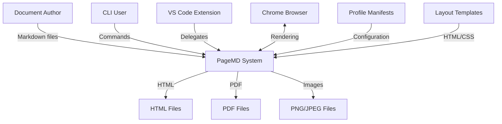
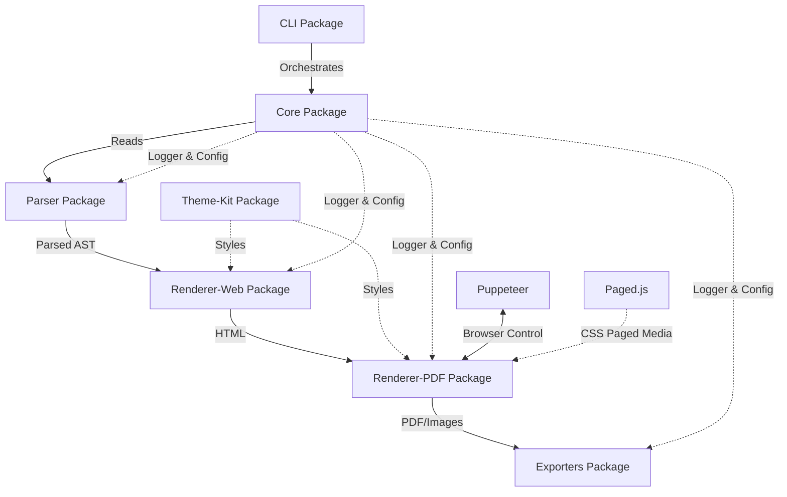
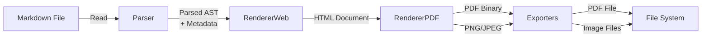

# Architecture

System design and data flow for PageMD core pipeline.

## Overview

PageMD uses a modular pipeline architecture where Markdown documents flow through sequential transformations: parsing, HTML assembly, PDF rendering, and output packaging. Each stage is handled by isolated packages that communicate through well-defined interfaces. The system prioritizes layout fidelity and profile-driven configuration over runtime performance.

## Contents

- [C4 Context Diagram](#c4-context-diagram)
- [C4 Container Diagram](#c4-container-diagram)
- [Data Flow](#data-flow)
- [Package Responsibilities](#package-responsibilities)
- [Browser Handling](#browser-handling)
- [See Also](#see-also)

## C4 Context Diagram

External systems and users interacting with PageMD.

**External Actors:**
- **Document Author:** Writes Markdown with frontmatter metadata
- **CLI User:** Runs `pagemd build`, `pagemd validate`, `pagemd list-profiles`
- **VS Code Extension:** Thin client providing preview and export commands
- **Chrome Browser:** System Chrome preferred, Chromium fallback for PDF rendering
- **Profile Manifests:** JSON/YAML config files controlling layout and validation
- **Layout Templates:** HTML/CSS artifacts defining document structure

## C4 Container Diagram

Internal package structure within PageMD system.

**Internal Packages:**
- **CLI:** Entry point for command-line operations
- **Core:** Logger, config, path resolution, profile loading
- **Parser:** Markdown parsing, frontmatter extraction, metadata normalization
- **Renderer-Web:** HTML assembly from templates and content
- **Renderer-PDF:** PDF generation via Paged.js + Puppeteer orchestration
- **Exporters:** Output packaging, naming, target directories
- **Theme-Kit:** Shared styles and layout resources

## Data Flow

Sequential transformation stages from Markdown to final outputs.

**Stage Details:**

1. **Parser**
   - Input: Markdown file path
   - Process: Extract frontmatter, parse Markdown to AST, normalize metadata
   - Output: Parsed document object with metadata and content AST

2. **Renderer-Web**
   - Input: Parsed document + profile manifest
   - Process: Select layout template, inject content, apply CSS
   - Output: Complete HTML document

3. **Renderer-PDF**
   - Input: HTML document + profile settings
   - Process: Launch Puppeteer, apply Paged.js polyfill, render to PDF
   - Output: PDF binary (and optional PNG/JPEG screenshots)

4. **Exporters**
   - Input: Rendered outputs + output modes config
   - Process: Package files, resolve output paths, apply naming conventions
   - Output: Final files written to target directories

## Package Responsibilities

### parser
- Markdown + frontmatter parsing via `markdown-it` and `gray-matter`
- Metadata normalization (dates, aliases, tags)
- AST generation for downstream rendering
- No HTML generation or layout decisions

### renderer-web
- HTML assembly from templates and parsed content
- CSS layer management and injection
- Template variable substitution
- Outputs standalone HTML suitable for browser rendering or PDF conversion

### renderer-pdf
- Paged.js + Puppeteer orchestration
- Browser detection: system Chrome preferred, Chromium fallback
- PDF generation from HTML input
- Optional PNG/JPEG screenshot export
- Paged.js mode: in-browser default, optional CLI prepass via `--pagedjs`

### exporters
- Output packaging and file naming
- Target directory resolution (Markdown dir → config dir → project folder)
- Output mode handling: `ACTIVE_ONLY`, `ALWAYS`, `DISABLED`
- Format conversion coordination (PDF → PNG, PDF → JPEG)

### theme-kit
- Shared CSS styles (`primary.css`)
- Layout resource management
- Asset resolution helpers
- No rendering logic, only style artifacts

### cli
- Command-line interface: `build`, `validate`, `list-profiles`
- Argument parsing and validation
- Pipeline orchestration across packages
- Status reporting and error handling

## Browser Handling

PageMD uses Puppeteer for PDF rendering with intelligent browser detection:

1. **System Chrome Detection**
   - Search common install locations (OS-specific paths)
   - Validate executable exists and is functional
   - Prefer system Chrome for better font/rendering support

2. **Chromium Fallback**
   - Use Puppeteer bundled Chromium if system Chrome unavailable
   - Automatic download on first use
   - Consistent rendering across environments

3. **Configuration**
   - Browser path configurable via profile manifest
   - Explicit override via CLI flag `--browser-path`
   - Status logged during renderer initialization

4. **Error Handling**
   - Clear error messages if no browser available
   - Suggest installation steps for missing Chrome
   - Graceful degradation for non-PDF outputs

## See Also

- [[Reference]] - API documentation for all packages
- [[Developer-Guide]] - Contributing and extending PageMD
