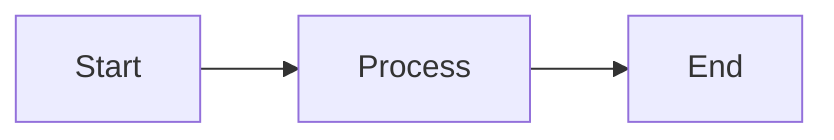
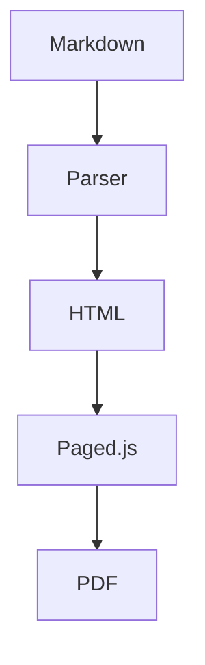
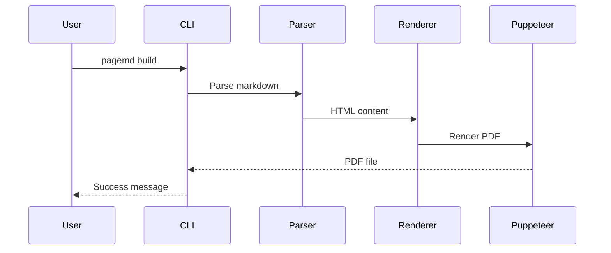
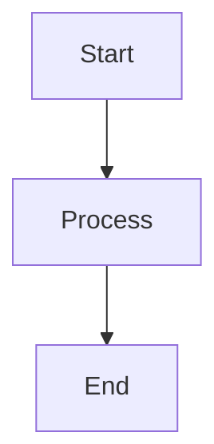
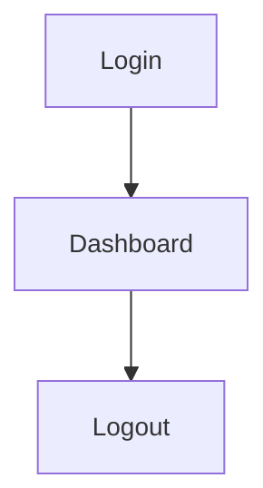
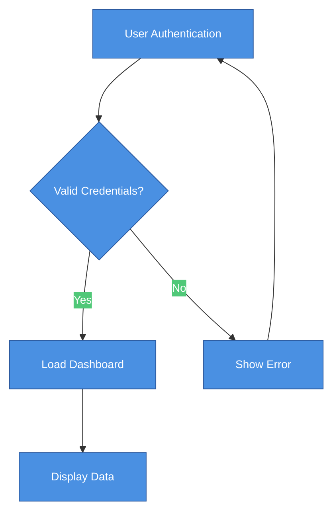

# Extended Syntax Guide

> **Section:** Styling & Syntax

PageMD extends standard Markdown with directives for TOC, Mermaid diagrams, and back-of-book index.

## Overview

Beyond standard Markdown, PageMD supports special directives that enable document features like automatic table of contents, diagrams, and indexing.

## Automatic Heading IDs

PageMD automatically generates HTML `id` attributes for all headings, enabling anchor links for navigation.

### How It Works

When you write:
```markdown
## My Section Title
```

PageMD generates:
```html
<h2 id="my-section-title" tabindex="-1">My Section Title</h2>
```

The ID is created by:
1. Converting text to lowercase
2. Replacing spaces with hyphens
3. Removing special characters
4. Ensuring uniqueness (duplicate headings get `-1`, `-2` suffixes)

### Why This Matters

Automatic heading IDs enable:
- **TOC links** - Table of Contents entries link to sections
- **Internal navigation** - `[Jump to section](#my-section-title)` works
- **Bookmark sharing** - URLs like `document.html#my-section-title` link directly to sections
- **PDF navigation** - PDF readers can use anchors for navigation

### Manual TOC with Anchor Links

You can create manual table of contents that link to sections:

```markdown
## Contents

1. [Introduction](#introduction)
2. [Getting Started](#getting-started)
3. [Advanced Usage](#advanced-usage)

## Introduction

Welcome to the guide...

## Getting Started

First, install the dependencies...

## Advanced Usage

For power users...
```

All links work because headings automatically get matching IDs.

### ID Generation Rules

| Heading Text | Generated ID |
|--------------|--------------|
| `## Hello World` | `hello-world` |
| `## 1. Introduction` | `1-introduction` |
| `## What's New?` | `what-s-new` |
| `## System Access & Passwords` | `system-access--passwords` |
| `## Hello World` (second occurrence) | `hello-world-1` |

**Note:** The ` & ` pattern (space-ampersand-space) produces a double hyphen (`--`) in the ID. This matches common manual TOC link conventions.

### Linking to Headings

```markdown
<!-- Internal link to heading in same document -->
See the [installation guide](#installation) for setup instructions.

<!-- Reference specific section -->
As mentioned in [Performance Tips](#performance-tips), caching improves speed.
```

### Compatibility

- Works in HTML, PDF, and static bundle exports
- Compatible with GitHub-style heading anchors
- Consistent with Obsidian and other markdown tools

---

## Table of Contents

Generate an automatic table of contents from your document headings.

### Auto TOC via Frontmatter

The simplest way to add a TOC is with `toc: true` in frontmatter. The TOC is automatically placed after the first `<h1>` heading:

```yaml
---
title: My Document
toc: true
---
```

No directive needed - the TOC auto-generates in the right position.

### TOC Directive

For explicit placement, use the directive where you want the TOC to appear:

```markdown
<!-- ::TOC -->
```

**What it generates:** A linked list of headings in your document. By default, H1 is excluded (only H2-H3 are shown).

### TOC with Options

Control which headings appear and how:

```markdown
<!-- ::TOC levels=4 min="1" -->
```

| Parameter | Type | Description | Default | Example |
|-----------|------|-------------|---------|---------|
| `levels` | number | Maximum heading depth to include | `3` | `levels=4` |
| `min` | number | Minimum heading level (1=H1, 2=H2) | `2` | `min="1"` |
| `pages` | string | Show page numbers (PDF only) | `"true"` | `pages="false"` |
| `pageLevels` | number | Which levels get page numbers | same as `levels` | `pageLevels=2` |
| `section` | flag | Scope TOC to current section only | _(off)_ | `section` |

**Note:** `levels` and `pageLevels` are single numbers (max depth), not ranges.

### H1 Exclusion

By default, H1 headings are excluded from the TOC (since H1 is typically the document title). To include H1:

**Via frontmatter:**
```yaml
---
toc: true
toc_min_level: 1
---
```

**Via directive:**
```markdown
<!-- ::TOC min="1" -->
```

### Section TOC

Generate a TOC scoped to a specific section. Place the directive immediately after a heading - it collects only sub-headings within that section (until the next heading at the same or higher level):

```markdown
## Chapter 1
<!-- ::TOC section -->

### Section 1.1
### Section 1.2

## Chapter 2
```

The section TOC after "Chapter 1" will only list "Section 1.1" and "Section 1.2" - it stops at "Chapter 2" because H2 is the same level as the boundary heading.

Section TOCs have no title heading and use the CSS class `toc-section` for separate styling.

### Frontmatter Configuration

Set TOC defaults in frontmatter:

```yaml
---
title: My Document
toc: true
toc_levels: 4
toc_min_level: 2
toc_title: "Contents"
toc_page_numbers: true
toc_page_levels: 3
---
```

| Field | Type | Description | Default |
|-------|------|-------------|---------|
| `toc` | boolean | Enable auto TOC generation | `false` |
| `toc_levels` | number | Maximum heading depth | `3` |
| `toc_min_level` | number | Minimum heading level (1=H1) | `2` |
| `toc_title` | string | TOC section title | `"Contents"` |
| `toc_page_numbers` | boolean | Show page numbers in PDF | `true` |
| `toc_page_levels` | number | Which levels get page numbers | `3` |

**Directive parameters override frontmatter values** when both are present.

### Example Output

```markdown
## Contents

- [Introduction](#introduction) .............. 1
  - [Background](#background) ................ 1
  - [Scope](#scope) .......................... 2
- [Implementation](#implementation) .......... 3
```

**Note:** Page numbers only appear in PDF output. HTML shows links only.

---

## Fancy Lists

Enable advanced list numbering with letters and Roman numerals (opt-in feature).

### Overview

Fancy lists extend standard ordered lists with:
- Letter numbering (A, B, C or a, b, c)
- Roman numerals (I, II, III or i, ii, iii)
- Custom start values
- Automatic continuation with `#`

**Disabled by default.** Must be enabled via frontmatter, profile, or environment variable.

### Enable via Frontmatter

```yaml
---
fancy_lists: true
---
```

### Quick Examples

```markdown
A.  First item (uppercase needs TWO spaces)
B.  Second item

i. Legal clause one (lowercase needs one space)
ii. Legal clause two

I.  Introduction (uppercase Roman needs TWO spaces)
II.  Background
```

**Full documentation:** See [Fancy Lists](Fancy-Lists.md) for complete syntax reference and use cases.

---

## Advanced Tables

PageMD extends standard GFM (GitHub Flavored Markdown) tables with features from the [MultiMarkdown table specification](https://fletcher.github.io/MultiMarkdown-6/syntax/tables.html). These extensions add cell merging, multiline content, headerless tables, and captions — features commonly needed in document authoring.

### Column Spanning (Colspan)

Merge cells horizontally by adding trailing empty pipes `||` after the cell content. Each additional `|` merges one more column to the right.

````markdown
|   | Grouping ||
| A | B | C |
|---|---|---|
| Content | *Spans two columns* ||
````

The first header row shows "Grouping" spanning columns B and C. The body row shows content spanning two columns with italic formatting preserved.

### Row Spanning (Rowspan)

Merge cells vertically by placing `^^` in a cell. This merges the cell upward into the cell above it.

````markdown
| A | B |
|---|---|
| Spans down | Row 1 data |
| ^^ | Row 2 data |
| ^^ | Row 3 data |
````

The "Spans down" cell occupies three rows. Each `^^` below it extends the span by one row.

### Multiline Cell Content

End a row with `\` (backslash) to continue its content on the next line. This lets you write longer cell content across multiple source lines.

````markdown
| Feature | Description |
|---------|-------------|
| Multiline \
  support | Content can span \
  multiple source lines |
````

### Headerless Tables

Start a table with the separator line (no header row above it) to create a table without headers. This is useful for data grids, chessboards, or layout tables.

````markdown
|---|---|---|
| A | B | C |
| D | E | F |
````

### Table Captions

Add a caption below a table using `Table:` or `:` prefix on the line after the table (separated by a blank line).

````markdown
| Metric | Value |
|--------|-------|
| Users  | 1,234 |
| Growth | 15%   |

Table: Monthly performance metrics
````

The caption renders as a `<caption>` element below the table. You can also use the short form:

````markdown
: Monthly performance metrics
````

### Combining with Inline Attributes

Advanced table features work alongside [inline attributes](../reference/Inline-Attributes.md). Add CSS classes, IDs, or styles using `{.class #id}` syntax after the table.

````markdown
| A | B | C |
|---|---|---|
| Content | *Spanning* ||
{.compact .striped}
````

### Table Utility Classes

Apply these built-in classes via inline attributes:

| Class | Effect |
|-------|--------|
| `.striped` | Alternating row background colors (zebra striping) |
| `.compact` | Reduced cell padding and smaller font size |
| `.no-border` | Remove cell borders (keeps header bottom border) |
| `.auto-width` | Table width fits content instead of 100% |
| `.small` | Smaller font size (0.85em) |

---

## Mermaid Diagrams

Create diagrams using Mermaid syntax, rendered to SVG at build time.

### Basic Diagram

````markdown

````

**What you'll see:** An SVG flowchart embedded in your document.

### Supported Diagram Types

| Type | Syntax | Use For |
|------|--------|---------|
| Flowchart | `graph LR` | Process flows, decisions |
| Sequence | `sequenceDiagram` | Interactions over time |
| Class | `classDiagram` | Object relationships |
| State | `stateDiagram-v2` | State machines |
| ER | `erDiagram` | Database schemas |
| Gantt | `gantt` | Project timelines |
| Pie | `pie` | Proportions |

### Flowchart Example

````markdown

````

### Sequence Diagram Example

````markdown

````

### Controlling Diagram Size

Mermaid diagrams can be configured using initialization blocks to control their size and appearance.

#### Prevent Width Stretching

By default, Mermaid diagrams may stretch to fill the full container width. To use the diagram's natural size:

````markdown

````

#### Set Explicit Dimensions

For precise control over diagram dimensions:

````markdown

````

#### Configuration Options Reference

**Top-Level Options**

| Option | Type | Purpose | Values | Example |
|--------|------|---------|--------|---------|
| `theme` | string | Visual theme | `base`, `dark`, `forest`, `neutral`, `default` | `'theme': 'base'` |
| `look` | string | Visual rendering style | `classic`, `handDrawn` | `'look': 'handDrawn'` |
| `themeVariables` | object | Customize theme colors and styles | See Theme Variables below | `'themeVariables': {...}` |
| `flowchart` | object | Flowchart-specific settings | See Flowchart Options below | `'flowchart': {...}` |
| `securityLevel` | string | Control script execution | `strict`, `loose`, `antiscript` | `'securityLevel': 'loose'` |
| `startOnLoad` | boolean | Auto-render on page load | `true`, `false` | `'startOnLoad': false` |
| `logLevel` | number | Debug logging level | `1` (error), `2` (warn), `3` (info), `5` (debug) | `'logLevel': 1` |

**Flowchart Options**

| Option | Type | Purpose | Default | Example |
|--------|------|---------|---------|---------|
| `useMaxWidth` | boolean | Stretch to container width | `true` | `'useMaxWidth': false` |
| `width` | string | Explicit diagram width | `undefined` | `'width': '800px'` |
| `height` | string | Explicit diagram height | `undefined` | `'height': '600px'` |
| `htmlLabels` | boolean | Use HTML in node labels | `true` | `'htmlLabels': true` |
| `curve` | string | Edge curve style | `basis` | `'curve': 'linear'` |
| `padding` | number | Padding around diagram (px) | `15` | `'padding': 20` |
| `nodeSpacing` | number | Space between nodes (px) | `50` | `'nodeSpacing': 75` |
| `rankSpacing` | number | Space between ranks (px) | `50` | `'rankSpacing': 100` |
| `diagramPadding` | number | Outer diagram padding (px) | `8` | `'diagramPadding': 10` |
| `wrappingWidth` | number | Max width before text wraps (px) | `200` | `'wrappingWidth': 150` |

**Curve Style Values**

| Value | Description |
|-------|-------------|
| `basis` | Smooth curved lines (default) |
| `linear` | Straight lines |
| `cardinal` | Smooth curves with tension |
| `monotoneX` | Monotonic in X direction |
| `monotoneY` | Monotonic in Y direction |
| `natural` | Natural cubic spline |
| `step` | Step function |
| `stepAfter` | Step after each point |
| `stepBefore` | Step before each point |

**Theme Variables**

Common theme customization options:

| Variable | Purpose | Example Value |
|----------|---------|---------------|
| `primaryColor` | Main diagram color | `'#ff6b6b'` |
| `primaryTextColor` | Text on primary elements | `'#ffffff'` |
| `primaryBorderColor` | Border of primary elements | `'#c92a2a'` |
| `secondaryColor` | Secondary element color | `'#4ecdc4'` |
| `tertiaryColor` | Tertiary element color | `'#ffe66d'` |
| `background` | Diagram background | `'#f8f9fa'` |
| `mainBkg` | Main node background | `'#ffffff'` |
| `nodeBorder` | Node border color | `'#333333'` |
| `clusterBkg` | Subgraph background | `'#ffffde'` |
| `clusterBorder` | Subgraph border | `'#aaaa33'` |
| `lineColor` | Edge/arrow color | `'#333333'` |
| `edgeLabelBackground` | Label background on edges | `'#ffffff'` |
| `fontSize` | Base font size | `'16px'` |
| `fontFamily` | Font family | `'Arial, sans-serif'` |

**Sequence Diagram Options**

| Option | Type | Purpose | Default | Example |
|--------|------|---------|---------|---------|
| `diagramMarginX` | number | Horizontal margin (px) | `50` | `'diagramMarginX': 30` |
| `diagramMarginY` | number | Vertical margin (px) | `10` | `'diagramMarginY': 20` |
| `actorMargin` | number | Space between actors (px) | `50` | `'actorMargin': 75` |
| `width` | number | Diagram width (px) | `150` | `'width': 200` |
| `height` | number | Actor height (px) | `65` | `'height': 80` |
| `boxMargin` | number | Box margin (px) | `10` | `'boxMargin': 15` |
| `boxTextMargin` | number | Text margin in boxes (px) | `5` | `'boxTextMargin': 8` |
| `noteMargin` | number | Note margin (px) | `10` | `'noteMargin': 12` |
| `messageMargin` | number | Message spacing (px) | `35` | `'messageMargin': 45` |

**Gantt Diagram Options**

| Option | Type | Purpose | Default | Example |
|--------|------|---------|---------|---------|
| `leftPadding` | number | Left padding (px) | `75` | `'leftPadding': 100` |
| `gridLineStartPadding` | number | Grid start padding (px) | `35` | `'gridLineStartPadding': 40` |
| `fontSize` | number | Base font size (px) | `11` | `'fontSize': 14` |
| `sectionFontSize` | number | Section header size (px) | `11` | `'sectionFontSize': 16` |
| `numberSectionStyles` | number | Section style variations | `4` | `'numberSectionStyles': 6` |
| `axisFormat` | string | Date format | `'%Y-%m-%d'` | `'axisFormat': '%m/%d'` |
| `topPadding` | number | Top padding (px) | `50` | `'topPadding': 60` |
| `barHeight` | number | Task bar height (px) | `20` | `'barHeight': 25` |
| `barGap` | number | Gap between bars (px) | `4` | `'barGap': 6` |
| `topAxis` | boolean | Show top axis | `false` | `'topAxis': true` |

#### Comprehensive Configuration Example

A fully customized flowchart using multiple configuration options:

````markdown

````

#### Quick Reference: Common Use Cases

**Compact Diagram (Tight Spacing)**
```
%%{init: {'flowchart': {'nodeSpacing': 30, 'rankSpacing': 40, 'padding': 10}}}%%
```

**Large, Readable Diagram**
```
%%{init: {'themeVariables': {'fontSize': '18px'}, 'flowchart': {'nodeSpacing': 100, 'rankSpacing': 120}}}%%
```

**Dark Theme**
```
%%{init: {'theme': 'dark', 'themeVariables': {'darkMode': true}}}%%
```

**Natural Width (No Stretching)**
```
%%{init: {'flowchart': {'useMaxWidth': false}}}%%
```

**Straight Lines (No Curves)**
```
%%{init: {'flowchart': {'curve': 'linear'}}}%%
```

**Hand-Drawn Style**
```
%%{init: {'theme': 'base', 'look': 'handDrawn'}}%%
```

**Custom Brand Colors**
```
%%{init: {'themeVariables': {
  'primaryColor': '#your-brand-color',
  'primaryBorderColor': '#your-border-color',
  'lineColor': '#your-line-color'
}}}%%
```

**Custom Background Color**
```
%%{init: {'themeVariables': {'background': '#f0f0f0'}}}%%
```

**Combined: Hand-Drawn, Small Font, Tight Spacing, Custom Background**
```
%%{init: {
  'theme': 'base',
  'look': 'handDrawn',
  'themeVariables': { 'fontSize': '12px', 'background': '#f0f0f0' },
  'flowchart': { 'nodeSpacing': 20, 'rankSpacing': 30, 'padding': 8 }
}}%%
```

#### Fence Attributes

You can add HTML attributes (classes, IDs, inline styles) directly to the mermaid code fence. These are applied to the `<figure>` wrapper element around the rendered SVG.

**Attributes on the opening fence:**

````markdown
```mermaid {.custom-class #fig-1 style="max-width: 400px; margin: 0 auto;"}
graph LR
    A --> B
```
````

**Attributes on the closing fence:**

````markdown
```mermaid
graph LR
    A --> B
``` {style="max-width: 400px;"}
````

**Supported attribute syntax:**

| Syntax | What It Does | Example |
|--------|-------------|---------|
| `.class-name` | Adds CSS class (in addition to `mermaid-diagram`) | `{.flow-chart}` |
| `#id-name` | Sets HTML ID on the figure | `{#fig-architecture}` |
| `key="value"` | Sets any HTML attribute | `{style="max-width: 300px;"}` |
| Combined | Multiple attributes together | `{.centered #fig-1 style="max-width: 500px;"}` |

**Precedence:** If attributes appear on both the opening and closing fence, both are merged. For conflicts (duplicate keys or IDs), the opening fence takes precedence. Classes from both are combined.

**Note:** Fence attributes control the `<figure>` wrapper element. To control the SVG content itself (font size, node colors, spacing), use the `%%{init: {...}}%%` directive inside the code block instead. The two approaches complement each other — use init directives for diagram content and fence attributes for container styling.

#### Combined with CSS

For additional control beyond Mermaid configuration, style the diagram container in your profile CSS:

```css
/* Prevent stretching and center diagrams */
figure.mermaid-diagram {
  width: auto;
  max-width: 100%;
  margin: 1rem auto;
  display: flex;
  justify-content: center;
}

/* Ensure SVG respects container */
figure.mermaid-diagram svg {
  max-width: 100%;
  height: auto;
}

/* Add subtle shadow (optional) */
figure.mermaid-diagram svg {
  filter: drop-shadow(0 2px 4px rgba(0,0,0,0.1));
}

/* Responsive sizing */
@media print {
  figure.mermaid-diagram {
    page-break-inside: avoid;
  }
}
```

**Where to add CSS:**
- Profile styles: `.pagemd/styles/your-profile.css`
- Layout styles: `.pagemd/layouts/your-layout.css`

**CSS Class Reference:**
- `figure.mermaid-diagram` - The wrapper element
- `.mermaid-diagram svg` - The actual diagram
- `.node` - Individual nodes (if targeting with CSS)
- `.edgePath` - Connection lines
- `.edgeLabel` - Labels on edges

### Disabling Mermaid

If Mermaid causes issues, disable it:

```bash
PAGEMD_MERMAID=0 pagemd build document.md -o pdf
```

---

## Back-of-Book Index

Create an alphabetized index with page references (PDF only).

### Marking Index Terms

Add markers where terms appear in your document:

```markdown
The <!-- ::INDEX term="authentication" --> process validates user credentials.

Users must <!-- ::INDEX term="login" --> before accessing the dashboard.
```

### Generating the Index

Add this directive where you want the index to appear (usually at the end):

```markdown
## Index

<!-- ::INDEX -->
```

### Index Output

```markdown
## Index

**A**
- authentication .............. 3, 7, 12

**L**
- login ....................... 4, 8
```

### Frontmatter Configuration

```yaml
---
title: Technical Manual
index: true
index_title: "Subject Index"
---
```

### Index Best Practices

- Mark terms on first significant use
- Use consistent term names (case-sensitive)
- Place index section at document end
- Index appears only in PDF (not HTML)

---

## Layout Directives

Control page layout within your document.

### Page Break

Force a new page:

```markdown
<!-- ::BREAK -->
```

**Tip:** `<!-- ::BREAK -->` also restarts list numbering. Use it to break a list and start fresh:

```markdown
a. First item
b. Second item

<!-- ::BREAK -->

a. New list starts at a
```

See [Fancy Lists - Restarting List Numbering](Fancy-Lists.md#restarting-list-numbering) for more details.

### Named Page Layouts

Switch to a different page layout:

```markdown
<!-- ::LAYOUT(landscape) -->

[Wide content here]

<!-- ::LAYOUT(default) -->
```

**Note:** Landscape orientation has [known limitations](https://github.com/pagedjs/pagedjs/issues/6) in browser preview. Works best in final PDF output.

---

## Figure Directives

Insert images with automatic figure numbering, captions, and sizing options.

### Basic Syntax

```markdown
<!-- ::FIGURE src="image.png" caption="Figure caption text" -->
```

**Output:** A `<figure>` element with the image, caption, and auto-generated figure number.

### Available Parameters

#### Core Parameters

| Parameter | Type | Required | Description | Values | Example |
|-----------|------|----------|-------------|--------|---------|
| `src` | string | No* | Image file path | Any relative or absolute path | `src="./images/diagram.png"` |
| `caption` | string | No** | Figure caption text | Any text (newlines not supported) | `caption="System Architecture"` |
| `id` | string | No | HTML id for cross-references | Valid HTML id | `id="fig-architecture"` |
| `width` | string | No | Figure width sizing | `full`, `half`, `third`, `quarter` | `width="half"` |

***Note on src:** If omitted, PageMD expects an image on the next line using standard markdown syntax: ``

****Note on caption:** While optional for basic figures, the caption is required for figures to receive automatic numbering in the output.

#### Accessibility & Performance Parameters

| Parameter | Type | Description | Values | Example |
|-----------|------|-------------|--------|---------|
| `alt` | string | Alt text for screen readers (separate from caption) | Descriptive text | `alt="Bar chart showing Q3 revenue growth"` |
| `loading` | string | Native lazy loading for images below the fold | `lazy`, `eager` | `loading="lazy"` |
| `link` | string | Wrap image in clickable anchor tag | URL or path | `link="/images/full-size.png"` |

**Note on alt:** If omitted, the `caption` value is used as alt text. For accessibility, provide descriptive alt text that describes what the image shows, while caption provides context for sighted readers.

**Note on link:** External links (starting with `http://` or `https://`) automatically add `target="_blank"` and `rel="noopener noreferrer"` for security. Dangerous URL schemes (`javascript:`, `data:`, `vbscript:`) are blocked.

#### Image Cropping Parameters

Control how images are cropped and sized using CSS `object-fit` and `object-position`.

**How Cropping Works:**
- When crop parameters are present, PageMD automatically applies default dimensions (800px × 500px max)
- Combined with `width` classes, crop dimensions adjust automatically (half → 400px, third → 350px, quarter → 300px)
- Override defaults with explicit `height` parameter for precise control

| Parameter | Type | Description | Values | Default | Example |
|-----------|------|-------------|--------|---------|---------|
| `crop-fit` | string | How image fits in container | `cover`, `contain`, `fill`, `scale-down` | `cover`* | `crop-fit="cover"` |
| `crop-x` | number | Horizontal focus point (%) | `0`-`100` | `50` | `crop-x="70"` |
| `crop-y` | number | Vertical focus point (%) | `0`-`100` | `50` | `crop-y="30"` |
| `height` | CSS length | Explicit figure height | `300px`, `50vh`, `80%`, `auto` | (auto) | `height="400px"` |

*Auto-defaults to `cover` when `crop-x` or `crop-y` is specified

**Crop-fit Values:**
- `cover` - Image covers entire container, may be cropped (best for photos)
- `contain` - Entire image visible, may have letterboxing
- `fill` - Stretches to fill container (may distort)
- `scale-down` - Like `contain`, but never scales up smaller images

**When Cropping Works:**

Cropping is **automatically enabled** when you add crop parameters. PageMD applies default dimensions so you see results immediately:

- ✅ `crop-fit`, `crop-x`, or `crop-y` present → Default dimensions applied (800px × 500px)
- ✅ `width` class + crop → Adjusted dimensions for width class
- ✅ `height` parameter → Overrides default height with your custom value

**No CSS Required:** Just add crop parameters and PageMD handles the rest.

### Width Parameter

Control how the figure displays within the page layout:

| Width Value | CSS Width | Layout | Use Case |
|-------------|-----------|--------|----------|
| `full` | 100% | Full-width | Wide diagrams, flowcharts, large screenshots |
| `half` | 50% (centered) | Medium, inset | Regular photos, medium diagrams |
| `third` | 33.333% (centered) | Narrow, inset | Small supporting images |
| `quarter` | 25% (centered) | Thumbnail | Tiny reference images |
| *(omitted)* | auto (inline) | Inline sizing | Use image's natural dimensions |

### Figure Numbering

Figures are **automatically numbered sequentially** (Figure 1, Figure 2, etc.) when they have a caption.

- Numbering counter resets when you render/build
- Numbering includes both `<!-- ::FIGURE -->` directives AND `::: annotated-image :::` containers
- Figures without captions do not receive numbers

**Shared Counter Example:**
```markdown
<!-- ::FIGURE src="fig1.png" caption="Architecture" -->     <!-- → Figure 1 -->

Some text here.

::: annotated-image ./screenshot.png
options:
  caption: "Main Interface"
:::                                                          <!-- → Figure 2 -->

<!-- ::FIGURE src="fig3.png" caption="Process Flow" -->     <!-- → Figure 3 -->
```

### Examples

**Example 1: Basic Figure with Inline Image**
```markdown
<!-- ::FIGURE src="./assets/diagram.png" caption="System Architecture" -->
```

**Output:**
```
Figure 1: System Architecture
[diagram image]
```

**Example 2: Half-Width with ID**
```markdown
<!-- ::FIGURE src="dashboard.png" caption="Dashboard Overview" id="fig-dashboard" width="half" -->
```

Creates a 50%-width, centered figure that can be referenced as `#fig-dashboard`.

**Example 3: Legacy Syntax (Image on Next Line)**
```markdown
<!-- ::FIGURE caption="Process Flow Diagram" -->

```

If no `src` attribute, the image markdown on the **immediately following line** is used. Alt text from the markdown becomes the figure's alt attribute.

**Example 4: Full Document with Multiple Figures**
```markdown
# Report

## Section 1

<!-- ::FIGURE src="chart1.png" caption="Q1 Revenue" id="fig-q1" width="full" -->

Text describing the chart.

## Section 2

<!-- ::FIGURE src="chart2.png" caption="Q2 Revenue" id="fig-q2" width="half" -->

More analysis here.
```

Both figures are auto-numbered (Figure 1, Figure 2) and can be referenced by ID in cross-links.

**Example 5: Accessible Figure with Separate Alt Text**
```markdown
<!-- ::FIGURE src="chart.png" alt="Bar chart showing 45% revenue increase" caption="Q3 Financial Results" -->
```

The `alt` text describes the image for screen readers, while the caption provides context for all readers.

**Example 6: Lazy Loading for Performance**
```markdown
<!-- ::FIGURE src="large-photo.jpg" caption="High-res photo" loading="lazy" -->
```

Images with `loading="lazy"` are only loaded when they scroll into view, improving page load time.

**Example 7: Clickable Image (Link to Full Size)**
```markdown
<!-- ::FIGURE src="thumbnail.png" caption="Click to enlarge" link="/images/full-size.png" -->
```

Wraps the image in an anchor tag. Click opens the full-size image.

**Example 8: External Link**
```markdown
<!-- ::FIGURE src="preview.png" caption="Visit project site" link="https://example.com" -->
```

External links automatically add `target="_blank"` and security attributes.

**Example 9: Cropped Portrait Photo (Auto-Default)**
```markdown
<!-- ::FIGURE src="photo.jpg" caption="Team Lead" crop-y="30" -->
```

Focuses on the upper portion (30% from top). `crop-fit` automatically defaults to `cover`. Image auto-sized to 800px × 500px for visible cropping.

**Example 10: Explicit Height Control**
```markdown
<!-- ::FIGURE src="chart.png" caption="Revenue Chart" height="300px" crop-x="20" -->
```

Custom height (300px) with focus on left 20% of chart. `crop-fit` auto-defaults to `cover`.

**Example 11: Width Class with Crop**
```markdown
<!-- ::FIGURE src="wide-screenshot.png" caption="Dashboard" width="half" crop-y="40" -->
```

Half-width figure, auto-sized to 50% width × 400px height (default for `width="half"` + crop).

**Example 12: Full-Featured Figure**
```markdown
<!-- ::FIGURE
  src="dashboard.png"
  alt="Analytics dashboard showing user metrics"
  caption="User Analytics Dashboard"
  id="fig-dashboard"
  width="full"
  height="500px"
  loading="lazy"
  link="/images/dashboard-full.png"
  crop-fit="cover"
  crop-y="20"
-->
```

Combines all features: accessibility, performance, linking, cropping, and precise dimensions.

### HTML Output

**Basic Directive:**
```markdown
<!-- ::FIGURE src="arch.png" caption="System Design" id="fig-arch" width="full" -->
```

**Generated HTML:**
```html
<figure id="fig-arch" class="width-full">
  
  <figcaption>Figure <span class="fig-num">1</span>: System Design</figcaption>
</figure>
```

**With New Parameters:**
```markdown
<!-- ::FIGURE src="photo.jpg" alt="Portrait photo" caption="Team Lead" loading="lazy" link="/full.jpg" crop-fit="cover" crop-x="50" crop-y="30" -->
```

**Generated HTML:**
```html
<figure style="--crop-fit: cover; --crop-x: 50%; --crop-y: 30%;">
  <a href="/full.jpg">
    
  </a>
  <figcaption>Figure <span class="fig-num">1</span>: Team Lead</figcaption>
</figure>
```

**External Link (with security attributes):**
```markdown
<!-- ::FIGURE src="preview.png" caption="Visit site" link="https://example.com" -->
```

**Generated HTML:**
```html
<figure>
  <a href="https://example.com" target="_blank" rel="noopener noreferrer">
    
  </a>
  <figcaption>Figure <span class="fig-num">1</span>: Visit site</figcaption>
</figure>
```

### Styling Hooks

Apply custom CSS to figures via classes or inline styles:

**Built-in Classes:**
- `.width-full` - Full-width (100%) sizing
- `.width-half` - Half-width (50%) centered
- `.width-third` - Third-width (33%) centered
- `.width-quarter` - Quarter-width (25%) centered
- `.fig-num` - Span containing the figure number (inside `<figcaption>`)

**Custom Styling Example:**

Define in `.pagemd/styles/custom.css`:
```css
figure {
  border: 1px solid #ccc;
  padding: 1rem;
  border-radius: 8px;
}

figure img {
  box-shadow: 0 2px 8px rgba(0,0,0,0.1);
}

figcaption {
  font-weight: 500;
  margin-top: 1rem;
  text-align: left;
}

.fig-num {
  background-color: #f0f0f0;
  padding: 2px 6px;
  border-radius: 3px;
}
```

Then reference in frontmatter:
```yaml
---
title: My Document
styles:
  - custom.css
---
```

### Print Behavior (PDF)

Figures are optimized for print output:

- **Never split across pages** - `break-inside: avoid` prevents figures from breaking
- **Centered by default** - Full and partial-width figures are centered
- **Proportional scaling** - Images scale to fit figure width while maintaining aspect ratio
- **Caption always visible** - Figure captions appear on the same page as the image

### Limitations

1. **Caption Text Only** - Captions are treated as plain text, not markdown
   - ✅ Works: `caption="Bold text: here"`
   - ❌ Doesn't work: `caption="**Bold** text"`

2. **Width Values are Fixed** - Only four preset widths are supported
   - ✅ Works: `width="half"`
   - ❌ Doesn't work: `width="70%"` or `width="500px"`
   - If you need custom width, use inline attributes on the following line or apply custom CSS classes

3. **Single Image Per Directive** - One figure per `<!-- ::FIGURE -->` block

4. **src and Legacy Syntax are Mutually Exclusive** - You can't have both:
   - ✅ `<!-- ::FIGURE src="img.png" caption="..." -->`
   - ✅ Legacy: `<!-- ::FIGURE caption="..." -->\n`
   - ❌ Mixed: `<!-- ::FIGURE src="img.png" -->` with image on next line

### Comparison: FIGURE vs Annotated Images

| Feature | FIGURE | Annotated Image |
|---------|--------|-----------------|
| **Syntax** | `<!-- ::FIGURE ... -->` | `::: annotated-image path :::` |
| **Simple images** | ✅ Ideal | Overkill |
| **Overlay annotations** | ❌ Not supported | ✅ Overlays with markers |
| **Marker legend** | ❌ None | ✅ Auto-legend |
| **Figure numbering** | ✅ Auto-numbered | ✅ Shares same counter |
| **Configuration** | Simple attributes | YAML-based |
| **Use case** | General figures, charts, diagrams | Screenshots with callouts |

### Troubleshooting FIGURE Crop

#### Crop parameters not working?

**Check:**
1. **Spelling:** `crop-fit`, `crop-x`, `crop-y` (with hyphens)
2. **Valid values:**
   - `crop-fit`: `cover`, `contain`, `fill`, or `scale-down`
   - `crop-x`, `crop-y`: 0-100 (numbers only, no % sign)
3. **HTML output:** Inspect `<figure>` for `style="--crop-fit: cover"` and `` for `object-fit`/`object-position`

**Solutions:**
- Crop parameters alone should work (default 800px × 500px applied automatically)
- Add `height="300px"` for explicit height control
- Use `width="half"` to make figures smaller with crop

#### Image too large/small?

**Adjust dimensions:**
```markdown
<!-- Use explicit height -->
<!-- ::FIGURE src="..." height="300px" crop-fit="cover" -->

<!-- Or use width class -->
<!-- ::FIGURE src="..." width="half" crop-fit="cover" -->
```

#### Cropping wrong area?

**Adjust focus point:**
- `crop-x="0"` = left edge, `crop-x="100"` = right edge (default: 50)
- `crop-y="0"` = top edge, `crop-y="100"` = bottom edge (default: 50)

**Example:** Face at top of portrait
```markdown
<!-- ::FIGURE src="portrait.jpg" crop-y="30" -->
```
Shows top 30% of image (face visible).

#### Want full image visible?

**Use contain instead of cover:**
```markdown
<!-- ::FIGURE src="..." crop-fit="contain" height="400px" -->
```
Full image visible with letterboxing if needed.

---

## GFM Alerts (GitHub Flavored Markdown)

Create standard alert boxes using GitHub Flavored Markdown syntax. This is the standard Markdown syntax used by GitHub, GitLab, and other platforms.

### Basic Syntax

```markdown
> [!NOTE]
> This is a note.

> [!WARNING]
> Be careful with this.

> [!TIP]
> Here's a helpful tip.

> [!IMPORTANT]
> This is critically important.

> [!CAUTION]
> Exercise caution here.
```

### Available Alert Types

| Type | Icon | Use For | CSS Class |
|------|------|---------|-----------|
| `NOTE` | ℹ️ | General information | `.markdown-alert-note` |
| `TIP` | 💡 | Helpful suggestions | `.markdown-alert-tip` |
| `IMPORTANT` | ⚠️ | Critical information | `.markdown-alert-important` |
| `WARNING` | ⚠️ | Potential problems | `.markdown-alert-warning` |
| `CAUTION` | 🛑 | Safety-related warnings | `.markdown-alert-caution` |

### Examples

**Example 1: Simple NOTE**

```markdown
> [!NOTE]
> This is important information the reader should notice.
```

**HTML Output:**
```html
<div class="markdown-alert markdown-alert-note">
  <p class="markdown-alert-title">
    <svg><!-- GitHub icon --></svg> Note
  </p>
  <p>This is important information the reader should notice.</p>
</div>
```

**Example 2: Multi-paragraph WARNING**

```markdown
> [!WARNING]
> **Be careful!** This action cannot be undone.
>
> Make sure you have a backup before proceeding with this step.
>
> See [backup guide](./backup.md) for instructions.
```

**Example 3: Complex Content with Lists**

```markdown
> [!IMPORTANT]
> Follow these steps in order:
>
> 1. Read the documentation
> 2. Set up your environment
> 3. Run the initialization script
> 4. Verify the installation
```

**Example 4: CAUTION with Emphasis**

```markdown
> [!CAUTION]
> **Risk of data loss!**
>
> This operation will delete all unsaved changes. Make backups first.
```

**Example 5: TIP with Code**

```markdown
> [!TIP]
> You can optimize this with:
>
> ```bash
> npm install --save-dev package-name
> ```
```

### HTML Output Structure

All GFM alerts generate a consistent structure:

```html
<div class="markdown-alert markdown-alert-{TYPE}">
  <p class="markdown-alert-title">
    <svg class="octicon octicon-{icon}"><!-- GitHub SVG icon --></svg>
    {Type Name}
  </p>
  <!-- Alert content -->
</div>
```

**CSS Classes Generated:**
- `.markdown-alert` - Applied to all alerts
- `.markdown-alert-note` - NOTE alerts
- `.markdown-alert-warning` - WARNING alerts
- `.markdown-alert-tip` - TIP alerts
- `.markdown-alert-important` - IMPORTANT alerts
- `.markdown-alert-caution` - CAUTION alerts

### Styling Hooks

Apply custom styling to alerts:

```css
/* All alerts */
.markdown-alert {
  padding: 1rem;
  margin: 1rem 0;
  border-left: 4px solid;
}

/* Specific alert types */
.markdown-alert-note {
  border-left-color: #0969da;
  background-color: #f6f8fa;
}

.markdown-alert-tip {
  border-left-color: #1a7f37;
  background-color: #f0f9f4;
}

.markdown-alert-warning {
  border-left-color: #d1343b;
  background-color: #fef2f2;
}

.markdown-alert-important {
  border-left-color: #8250df;
  background-color: #f6f3ff;
}

.markdown-alert-caution {
  border-left-color: #9e6a03;
  background-color: #fff8f3;
}
```

### Print Behavior (PDF)

- ✅ Alerts render as styled divs in PDF
- ✅ Border and background colors are preserved
- ✅ SVG icons are embedded in the PDF
- ✅ Multi-paragraph content breaks appropriately
- ✅ Works with page breaks

### Common Mistakes

**❌ Forgetting `>` on continuation lines:**
```markdown
> [!NOTE]
This won't render as an alert - missing >
```

**✅ Correct - every line needs `>`:**
```markdown
> [!NOTE]
> This renders as an alert.
```

**❌ Missing `>` on empty lines:**
```markdown
> [!NOTE]
> Paragraph 1

> Paragraph 2 - this breaks the alert
```

**✅ Correct - empty lines need `> `:**
```markdown
> [!NOTE]
> Paragraph 1
>
> Paragraph 2 - now it works
```

**❌ Invalid alert type:**
```markdown
> [!INFO]
> This type doesn't exist - uses only NOTE, TIP, IMPORTANT, WARNING, CAUTION
```

### Use Cases

- **Documentation:** Highlight important notes, warnings, and tips
- **Release notes:** Call out breaking changes with `[!IMPORTANT]`
- **API docs:** Warn about deprecated features with `[!WARNING]`
- **Installation guides:** Provide tips with `[!TIP]` and safety warnings with `[!CAUTION]`
- **Changelogs:** Highlight critical updates with `[!IMPORTANT]`

### Comparison: GFM Alerts vs Custom Callouts

| Feature | GFM Alerts `> [!NOTE]` | Custom Callouts `[[NOTE]]` | Named Containers `::: note :::` |
|---------|----------------------|---------------------------|--------------------------------|
| **Standard** | ✅ GitHub Flavored Markdown | ❌ PageMD proprietary | ❌ Proprietary |
| **Syntax** | Blockquote-based | Block wrapper | Container block |
| **Built-in icons** | ✅ GitHub-style SVG icons | ❌ No icons | ❌ No icons |
| **Cross-platform** | ✅ Works everywhere | ❌ PageMD only | ❌ PageMD only |
| **Best for** | Standard alerts | Custom styling | Flexible containers |
| **CSS classes** | `.markdown-alert-*` | `.container-*` | `.container-*` |

### Limitations

1. **Blockquote syntax required** - Every line must start with `> `
2. **Type names are restricted** - Only the 5 standard types are recognized
3. **Cannot be nested** - Alerts cannot contain other alerts
4. **Icons are always included** - Cannot be disabled per-document
5. **Inline usage not supported** - Must be block-level

---

## Callout Blocks

Create highlighted callout boxes:

```markdown
[[NOTE]]
This is important information the reader should notice.
[[/NOTE]]

[[WARNING]]
Be careful when performing this action.
[[/WARNING]]

[[TIP]]
Here's a helpful suggestion.
[[/TIP]]
```

### Available Callout Types

| Type | Use For |
|------|---------|
| `NOTE` | General important information |
| `WARNING` | Cautions and potential issues |
| `TIP` | Helpful suggestions |
| `INFO` | Additional context |
| `CAUTION` | Safety-related warnings |

---

## Annotated Images

Overlay numbered markers, arrows, boxes, and text notes on screenshots for UI documentation without image editing.

### Basic Syntax

```markdown
::: annotated-image ./assets/dashboard.png
- { id: 1, x: 10, y: 20, label: "Navigation menu" }
- { id: 2, x: 85, y: 10, label: "Settings button" }
- { id: 3, x: 50, y: 90, label: "Status bar" }
:::
```

**Output:** Screenshot with numbered circles at specified coordinates, plus auto-generated legend below.

### With Options

```markdown
::: annotated-image ./assets/workpackage.png
options:
  caption: "APN 58 Interface"
  markerColor: "#0066cc"
  legendColumns: 4
  id: "fig-workpackage"
markers:
  - { id: 1, x: 10, y: 20, label: "Save button" }
  - { id: 2, x: 85, y: 10, label: "Settings menu" }
:::
```

### Marker Parameters

| Parameter | Type | Required | Description |
|-----------|------|----------|-------------|
| `id` | number/string | Yes | Marker number (displayed in circle) |
| `x` | number | Yes | Horizontal position (0-100, percentage from left) |
| `y` | number | Yes | Vertical position (0-100, percentage from top) |
| `label` | string | Yes | Description shown in legend |

### Block Options

| Option | Default | Description |
|--------|---------|-------------|
| `caption` | (none) | Figure caption (enables figure numbering) |
| `id` | (none) | HTML id for cross-references |
| `markerColor` | `#cc0000` | Marker circle background color |
| `legendColumns` | `3` | Number of columns in legend grid (whole number, 1-12) |

### Shapes: Arrows, Boxes, and Text

Besides point markers, a block can contain `arrows:`, `boxes:`, and `text:` lists. All coordinates and sizes use the same 0-100 percentage system as markers. Each list must be a YAML list; entries missing a required field (or using non-numeric coordinates) are skipped silently.

```markdown
::: annotated-image ./assets/workpackage.png
options:
  caption: "Workpackage screen"
markers:
  - { id: 1, x: 12, y: 8, label: "Search field" }
arrows:
  - { id: 2, x1: 60, y1: 60, x2: 40, y2: 40, label: "Save button", color: "#0a7d00" }
boxes:
  - { id: 3, x: 5, y: 50, width: 30, height: 20, label: "Task list", fill: "rgba(0,102,204,0.12)" }
text:
  - { x: 55, y: 80, text: "Click here", color: "#ffffff", background: "#333333" }
:::
```

#### Arrow Parameters

| Parameter | Type | Required | Default | Description |
|-----------|------|----------|---------|-------------|
| `x1`, `y1` | number | Yes | - | Start point (0-100) |
| `x2`, `y2` | number | Yes | - | End point; arrowhead is drawn here (0-100) |
| `color` | string | No | `#cc0000` | Line and arrowhead color |
| `strokeWidth` | number | No | `2` | Line thickness in px (max 20) |
| `id` | number/string | No | - | Badge number; with `label`, adds a legend entry |
| `label` | string | No | - | Legend text (requires `id`) |

#### Box Parameters

| Parameter | Type | Required | Default | Description |
|-----------|------|----------|---------|-------------|
| `x`, `y` | number | Yes | - | Top-left corner (0-100) |
| `width`, `height` | number | Yes | - | Size (0-100); trimmed so the box stays inside the image |
| `color` | string | No | `#0066cc` | Border color |
| `fill` | string | No | `none` | Fill color (use `rgba(...)` for translucency) |
| `strokeWidth` | number | No | `2` | Border thickness in px (max 20) |
| `id` | number/string | No | - | Badge number; with `label`, adds a legend entry |
| `label` | string | No | - | Legend text (requires `id`) |

#### Text Parameters

| Parameter | Type | Required | Default | Description |
|-----------|------|----------|---------|-------------|
| `x`, `y` | number | Yes | - | Top-left corner of the text (0-100) |
| `text` | string | Yes | - | Text to display (HTML-escaped, not interpreted) |
| `fontSize` | number | No | `14` | Font size in px (max 96) |
| `color` | string | No | `#000000` | Text color |
| `background` | string | No | (none) | Background color behind the text |

#### Legend and Badges

- Markers are always in the legend. Arrows and boxes are added only when they have **both** `id` and `label`.
- All legend entries share one list, sorted by `id` (numeric IDs numerically, otherwise alphabetically). Use unique IDs across markers, arrows, and boxes.
- Badge positions: markers at `(x, y)`; arrows at the midpoint of the line; boxes 3% in from the top-left corner (less for very small boxes, so the badge stays inside).
- Text overlays never appear in the legend.

#### Rendering Notes

- Arrows and boxes are drawn in an SVG (Scalable Vector Graphics) layer with `viewBox="0 0 100 100"` and `preserveAspectRatio="none"`, so percentages map directly onto the image at any aspect ratio. Lines use `vector-effect="non-scaling-stroke"` so they keep an even thickness on wide or tall images.
- Each distinct arrow color gets its own arrowhead, so arrowheads always match their line.
- Text overlays are HTML elements (class `annotation-text`), not SVG text, so they are never stretched. Their size is fixed in px and does **not** scale with the image.
- Colors that contain `;`, `{`, or `}` are rejected and the default is used. `strokeWidth`, `fontSize`, and `legendColumns` must be numbers; other values fall back to the default.

#### HTML Output (shapes)

```html
<div class="image-wrapper" style="--marker-color: #cc0000;">
  
  <span class="marker" style="left: 50%; top: 50%;">2</span>
  <svg class="annotation-shapes" viewBox="0 0 100 100" preserveAspectRatio="none" aria-hidden="true">
    <defs>
      <marker id="arrowhead-annotated-1" ...><polygon ... fill="#0a7d00" /></marker>
    </defs>
    <rect x="5" y="50" width="30" height="20" stroke="#0066cc" fill="rgba(0,102,204,0.12)" ... />
    <line x1="60" y1="60" x2="40" y2="40" stroke="#0a7d00" marker-end="url(#arrowhead-annotated-1)" ... />
  </svg>
  <span class="annotation-text" style="left: 55%; top: 80%; font-size: 14px; color: #ffffff; background: #333333;">Click here</span>
</div>
```

**Styling hooks:** `.annotation-shapes` (SVG layer, `z-index: 5`), `.annotation-text` (text overlays, `z-index: 8`), `.marker` (badges, `z-index: 10`).

See the [Annotate Screenshots guide](Annotate-Screenshots.md#arrows) for step-by-step examples.

### Coordinate System

Coordinates use percentages from top-left corner:
- `x: 0, y: 0` = Top-left corner
- `x: 100, y: 0` = Top-right corner
- `x: 50, y: 50` = Center of image
- `x: 100, y: 100` = Bottom-right corner

**Finding coordinates:** Open image in any viewer, note cursor position as percentage of width/height.

### Figure Numbering

Add `caption` to include in document figure numbering:

```markdown
::: annotated-image ./assets/main-screen.png
options:
  caption: "Main Application Interface"
markers:
  - { id: 1, x: 10, y: 20, label: "Navigation" }
:::
```

- **Without caption:** No figure number
- **With caption:** Numbered as "Figure X: Caption" (shares counter with `<!-- ::FIGURE -->`)

### Color Schemes

```markdown
options:
  markerColor: "#0066cc"   # Blue for informational
  markerColor: "#28a745"   # Green for success
  markerColor: "#fd7e14"   # Orange for warnings
```

---

## Wikilinks (Obsidian-style Links)

Create internal links and embed images using Obsidian-style wiki syntax - ideal for knowledge bases and wiki-style documentation.

### Basic Syntax

```markdown
[[Page Name]]
[[Page Name|Display Text]]
![[image.png]]
![[path/to/image.jpg]]
```

### Available Options

| Option | Type | Default | Description | Example |
|--------|------|---------|-------------|---------|
| `baseUrl` | string | `''` | URL prefix for links | `/docs`, `/wiki` |
| `linkClass` | string | `'wikilink'` | CSS class for links | `'internal-link'` |
| `imageBaseUrl` | string | `''` | URL prefix for images | `/assets`, `/images` |
| `imageClass` | string | `'embedded-image'` | CSS class for images | `'embedded'` |

### Examples

**Example 1: Simple Wikilink**

```markdown
See [[Getting Started]] for instructions.
```

**HTML Output:**
```html
<p>See <a href="Getting Started" class="wikilink">Getting Started</a> for instructions.</p>
```

**Example 2: Wikilink with Display Text**

```markdown
Check [[Documentation|our docs]] for more details.
```

**HTML Output:**
```html
<p>Check <a href="Documentation" class="wikilink">our docs</a> for more details.</p>
```

**Example 3: Multiple Links**

```markdown
Topics: [[Basics]], [[Intermediate]], [[Advanced]]
```

**Example 4: Embedded Image**

```markdown
# Architecture

![[system-architecture.png]]

See [[System Design]] for details.
```

**HTML Output:**
```html
<h1>Architecture</h1>
<p></p>
<p>See <a href="System Design" class="wikilink">System Design</a> for details.</p>
```

**Example 5: Image with Path**

```markdown
![[assets/diagrams/api-flow.png]]
```

**HTML Output:**
```html
<p></p>
```

**Example 6: Knowledge Base Structure**

```markdown
# Python Basics

Related topics:
- [[Python Data Types]]
- [[Python Functions]]
- [[Python Modules]]

See the reference diagram:

![[python-reference.png]]
```

### HTML Output Structure

**Wikilink:**
```html
<a href="PAGE_NAME" class="wikilink">DISPLAY_TEXT</a>
```

**Image Embed:**
```html

```

### CSS Classes Generated

- `.wikilink` - Applied to all wikilinks (customizable)
- `.embedded-image` - Applied to all embedded images (customizable)

### Styling Hooks

```css
/* Style wikilinks */
a.wikilink {
  color: #0969da;
  text-decoration: none;
}

a.wikilink:hover {
  text-decoration: underline;
}

/* Style embedded images */
img.embedded-image {
  max-width: 100%;
  height: auto;
  border: 1px solid #ddd;
}
```

### Print Behavior (PDF)

- ✅ Links render as standard `<a>` elements with href
- ✅ Images render as standard `` elements
- ✅ PDF readers can click links to navigate (if supported)
- ✅ Images embedded in PDF with alt text

### Common Mistakes

**❌ Single Brackets (don't work):**
```markdown
[Page]  # This is NOT a wikilink
```

**✅ Double Brackets (correct):**
```markdown
[[Page]]  # This IS a wikilink
```

**❌ Nested Brackets (don't work):**
```markdown
[[Page [with] brackets]]
```

**✅ Use display text instead:**
```markdown
[[PageName|Page [with] brackets]]
```

**❌ Missing exclamation for images:**
```markdown
[[image.png]]  # This is a link, not an image embed
```

**✅ Use exclamation for images:**
```markdown
![[image.png]]  # This embeds the image
```

### Use Cases

- **Knowledge bases** - Link between related topics
- **Documentation systems** - Internal cross-references
- **Wiki-style content** - Non-linear, interconnected documents
- **Personal wikis** - Note-taking with backlinks
- **Research repositories** - Citation networks

### Comparison: Wikilinks vs Standard Markdown

| Feature | Wikilinks | Standard Markdown |
|---------|-----------|-------------------|
| **Link Syntax** | `[[Page]]` | `[Text](url)` |
| **Display Text** | `[[Page\|Text]]` | `[Text](url)` |
| **Image Syntax** | `![[image]]` | `` |
| **Best For** | Internal links | External URLs |
| **Knowledge Bases** | ✅ Ideal | ❌ Verbose |
| **User-friendly** | ✅ No URL needed | ❌ URL required |

### Limitations

1. **No nested brackets** - Cannot include brackets in page names (use display text instead)
2. **Single pipe only** - Only one `|` allowed (first is used for display text)
3. **No URL fragments** - Cannot link to `#sections`
4. **No custom alt text for images** - Alt text always uses filename
5. **Case sensitive** - `[[Page]]` and `[[page]]` are different links

---

## File Inclusion Directive

Include external markdown files to reuse content across documents - ideal for shared headers, footers, disclaimers, and DRY documentation.

### Basic Syntax

```markdown
&#33;&#33;&#33;include(./path/to/file.md)&#33;&#33;&#33;
```

**Three exclamation marks** on each side, with file path in parentheses.

### Configuration Option

| Option | Type | Default | Description | Example |
|--------|------|---------|-------------|---------|
| `includeRoot` | string | `'.'` | Root directory for path resolution | `'./docs/shared'` |

### How It Works

1. Parser encounters `&#33;&#33;&#33;include(path)&#33;&#33;&#33;`
2. Resolves path relative to `includeRoot`
3. Reads file from filesystem
4. Renders content as markdown (inline with document)

### Examples

**Example 1: Shared Header and Footer**

Directory structure:
```
docs/
  ├─ guide.md
  └─ shared/
      ├─ header.md
      └─ footer.md
```

**guide.md:**
```markdown
&#33;&#33;&#33;include(./shared/header.md)&#33;&#33;&#33;

# Main Content

This is the main documentation.

&#33;&#33;&#33;include(./shared/footer.md)&#33;&#33;&#33;
```

**shared/header.md:**
```markdown
> **Document Version:** 1.0
> **Last Updated:** 2026-01-12
```

**Result:**
```html
<blockquote>
  <p><strong>Document Version:</strong> 1.0<br />
  <strong>Last Updated:</strong> 2026-01-12</p>
</blockquote>
<h1>Main Content</h1>
<p>This is the main documentation.</p>
<!-- footer content -->
```

**Example 2: Reusable Disclaimer**

**shared/disclaimer.md:**
```markdown
⚠️ **DISCLAIMER**

This software is provided "as-is" without warranty.
See LICENSE for full terms.
```

**Any document:**
```markdown
# API Documentation

&#33;&#33;&#33;include(./shared/disclaimer.md)&#33;&#33;&#33;

## Getting Started

[Documentation content...]
```

**Example 3: Documentation Assembly**

Combine multiple chapters into one document:

```markdown
# Complete Guide

&#33;&#33;&#33;include(./chapters/01-introduction.md)&#33;&#33;&#33;

&#33;&#33;&#33;include(./chapters/02-getting-started.md)&#33;&#33;&#33;

&#33;&#33;&#33;include(./chapters/03-core-concepts.md)&#33;&#33;&#33;

&#33;&#33;&#33;include(./chapters/04-advanced-topics.md)&#33;&#33;&#33;

&#33;&#33;&#33;include(./appendix/glossary.md)&#33;&#33;&#33;
```

**Example 4: Release Notes from Templates**

```markdown
# Version 2.0 Release Notes

&#33;&#33;&#33;include(./releases/v2.0-summary.md)&#33;&#33;&#33;

## New Features

&#33;&#33;&#33;include(./releases/v2.0-features.md)&#33;&#33;&#33;

## Bug Fixes

&#33;&#33;&#33;include(./releases/v2.0-bugfixes.md)&#33;&#33;&#33;

## Breaking Changes

&#33;&#33;&#33;include(./releases/v2.0-breaking.md)&#33;&#33;&#33;
```

**Example 5: Legal Documents**

```markdown
# Terms of Service

&#33;&#33;&#33;include(./legal/intro.md)&#33;&#33;&#33;

## Usage Terms

&#33;&#33;&#33;include(./legal/usage.md)&#33;&#33;&#33;

&#33;&#33;&#33;include(./legal/liability.md)&#33;&#33;&#33;

&#33;&#33;&#33;include(./legal/dispute-resolution.md)&#33;&#33;&#33;
```

**Example 6: Nested Includes**

Included files can themselves contain includes:

**chapters/chapter1.md:**
```markdown
## Chapter 1: Basics

&#33;&#33;&#33;include(./section1.md)&#33;&#33;&#33;

&#33;&#33;&#33;include(./section2.md)&#33;&#33;&#33;
```

When chapter1.md is included, its nested includes are also processed.

### Path Resolution

Paths are resolved **relative to `includeRoot`** option:

**Configuration:**
```javascript
const md = createParser({
  includeRoot: './docs/shared'  // Base directory
});
```

**Path Examples:**

| Include Syntax | Resolves To |
|----------------|-------------|
| `&#33;&#33;&#33;include(./header.md)&#33;&#33;&#33;` | `./docs/shared/header.md` |
| `&#33;&#33;&#33;include(./footer.md)&#33;&#33;&#33;` | `./docs/shared/footer.md` |
| `&#33;&#33;&#33;include(../legal/tos.md)&#33;&#33;&#33;` | `./docs/legal/tos.md` |

**Default (includeRoot = '.'):**
```javascript
const md = createParser();
// &#33;&#33;&#33;include(./file.md)&#33;&#33;&#33; resolves to ./file.md
```

### File Requirements

Included files must be:
- ✅ **Markdown format** (.md files)
- ✅ **UTF-8 encoded**
- ✅ **Valid markdown syntax**
- ✅ **Readable** by the application

**Content can include:**
- ✅ Any markdown elements (headings, paragraphs, lists, tables, code blocks)
- ✅ PageMD extended syntax (other directives, figures, etc.)
- ✅ Nested includes (file A includes B, B includes C)

### Print Behavior (PDF)

- ✅ Included content renders as regular PDF content
- ✅ No visual indicators of included sections
- ✅ Works seamlessly in multi-page documents
- ✅ Nested includes fully supported in PDF

### Common Mistakes

**❌ Wrong Syntax (only 2 exclamation marks):**
```markdown
!!include(./file.md)!!
```

**✅ Correct (exactly 3 on each side):**
```markdown
&#33;&#33;&#33;include(./file.md)&#33;&#33;&#33;
```

**❌ File doesn't exist:**
```markdown
&#33;&#33;&#33;include(./missing.md)&#33;&#33;&#33;  # Will cause error or placeholder
```

**✅ Verify file exists:**
```markdown
&#33;&#33;&#33;include(./existing-file.md)&#33;&#33;&#33;
```

**❌ Path outside includeRoot:**
```markdown
# If includeRoot is './docs'
&#33;&#33;&#33;include(/etc/passwd)&#33;&#33;&#33;  # Security boundary - won't work
```

**✅ Use relative paths within includeRoot:**
```markdown
# If includeRoot is './docs'
&#33;&#33;&#33;include(./shared/file.md)&#33;&#33;&#33;  # ✅ Resolves to ./docs/shared/file.md
```

### Use Cases

- **Shared Headers/Footers** - Common to multiple documents
- **Reusable Disclaimers** - Legal notices, safety warnings
- **Documentation Assembly** - Build books from chapter files
- **Release Notes** - Templated version notes
- **API Documentation** - Endpoint docs from templates
- **DRY Principle** - Single source of truth for repeated content
- **Keeping Examples Fresh** - Pull code examples from actual source files

### Comparison: Includes vs Alternatives

| Feature | Include | Wikilink | External Link |
|---------|---------|----------|----------------|
| **Embed Content** | ✅ Content merged | ❌ Link only | ❌ Link only |
| **Single File Build** | ✅ Combined | ❌ Separate | ❌ Separate |
| **Reusable Content** | ✅ Perfect | ⚠️ Okay | ❌ No |
| **Shared Content** | ✅ Ideal | ❌ Not ideal | ❌ Not ideal |
| **DRY Principle** | ✅ Yes | ❌ No | ❌ No |
| **URL Needed** | ❌ No | ❌ No | ✅ Yes |

### Limitations

1. **Entire file included** - Cannot select portions (include all or none)
2. **No parameters** - Cannot pass arguments to included content
3. **Static resolution** - Includes resolved at render time, not dynamically
4. **File must exist** - Missing files cause errors/placeholders
5. **Circular includes** - Avoid file A including B while B includes A
6. **No encoding options** - Files must be UTF-8
7. **Pre-parse processing** - Includes are processed before markdown parsing (see below)

### Escaping Include Syntax in Documentation

The include directive uses regex on raw text **before** markdown parsing. This means code blocks do NOT protect include syntax from being processed.

**Problem:** When documenting include syntax, examples get processed:
```markdown
# This will try to include the file!
&#33;&#33;&#33;include(./example.md)&#33;&#33;&#33;
```

**Solution:** Use HTML entities to escape exclamation marks:
- Replace `!` with `&#38;#33;` (HTML entity for `!`)
- The text renders correctly as the include syntax but won't be processed

**Example - Safe documentation:**
```
&#38;#33;&#38;#33;&#38;#33;include(./path/to/file.md)&#38;#33;&#38;#33;&#38;#33;
```

Renders as the include directive syntax (three exclamation marks on each side)

**When to use escaping:**
- Writing documentation that shows include syntax
- Creating tutorials or guides about file inclusion
- Any time you want to display the syntax without triggering it

> **Note:** This page uses escaped examples throughout the File Inclusion section.

### Best Practices

1. **Organize in dedicated directory:**
   ```
   project/
     ├─ docs/
     │  ├─ pages/
     │  └─ shared/
     │      ├─ header.md
     │      ├─ footer.md
     │      └─ disclaimer.md
   ```

2. **Set includeRoot in configuration:**
   ```javascript
   includeRoot: './docs/shared'
   ```

3. **Use simple relative paths:**
   ```markdown
   &#33;&#33;&#33;include(./header.md)&#33;&#33;&#33;
   ```

4. **Document your includes with comments:**
   ```markdown
   <!-- Includes shared header from docs/shared/header.md -->
   &#33;&#33;&#33;include(./header.md)&#33;&#33;&#33;
   ```

5. **Use meaningful filenames:**
   - ✅ `header.md`, `footer.md`, `disclaimer.md`
   - ❌ `file1.md`, `tmp.md`

---

## Sections Wrapper Directive

Wrap content in semantic `<div>` containers with optional CSS classes and HTML IDs for styling and layout control.

### Basic Syntax

```markdown
<!-- ::SECTION_START class="container" id="main" -->

Content here...

<!-- ::SECTION_END -->
```

### Available Parameters

| Parameter | Type | Required | Description | Example |
|-----------|------|----------|-------------|---------|
| `class` | string | No | CSS class for div | `class="highlight"` |
| `id` | string | No | HTML ID for div | `id="section-1"` |

### Examples

**Example 1: Section with CSS Class**

```markdown
<!-- ::SECTION_START class="highlight" -->

This section is highlighted with CSS.

<!-- ::SECTION_END -->
```

**HTML Output:**
```html
<div class="highlight">
  <p>This section is highlighted with CSS.</p>
</div>
```

**Example 2: Section with ID for Linking**

```markdown
<!-- ::SECTION_START id="installation" -->

## Installation Instructions

Follow these steps to install...

<!-- ::SECTION_END -->
```

**HTML Output:**
```html
<div id="installation">
  <h2>Installation Instructions</h2>
  <p>Follow these steps to install...</p>
</div>
```

**Example 3: Section with Class and ID**

```markdown
<!-- ::SECTION_START class="important-section" id="important" -->

⚠️ **Important Note**

This is critical information.

<!-- ::SECTION_END -->
```

**Example 4: Multiple Sections**

```markdown
<!-- ::SECTION_START class="intro" id="intro" -->

## Introduction

Context and overview here.

<!-- ::SECTION_END -->

<!-- ::SECTION_START class="main-content" id="content" -->

## Main Content

Detailed information here.

<!-- ::SECTION_END -->

<!-- ::SECTION_START class="conclusion" id="conclusion" -->

## Conclusion

Summary here.

<!-- ::SECTION_END -->
```

**Example 5: Nested Sections**

```markdown
<!-- ::SECTION_START class="outer-box" -->

Outer section content.

<!-- ::SECTION_START class="inner-box" -->

Inner section content (nested).

<!-- ::SECTION_END -->

More outer content.

<!-- ::SECTION_END -->
```

**HTML Output:**
```html
<div class="outer-box">
  <p>Outer section content.</p>
  <div class="inner-box">
    <p>Inner section content (nested).</p>
  </div>
  <p>More outer content.</p>
</div>
```

**Example 6: Document Layout Structure**

```markdown
<!-- ::SECTION_START class="document-header" id="header" -->

# Document Title

**Version:** 1.0
**Date:** 2026-01-12

<!-- ::SECTION_END -->

<!-- ::SECTION_START class="document-body" id="main" -->

## Chapter 1

Content here...

## Chapter 2

More content...

<!-- ::SECTION_END -->

<!-- ::SECTION_START class="document-footer" id="footer" -->

---

**Footer Information**

Copyright and legal notices...

<!-- ::SECTION_END -->
```

### HTML Output Structure

**Input:**
```markdown
<!-- ::SECTION_START class="my-section" id="sec-1" -->

Content here

<!-- ::SECTION_END -->
```

**Output:**
```html
<div class="my-section" id="sec-1">
  <p>Content here</p>
</div>
```

### CSS Classes Generated

CSS classes are user-defined through the `class` parameter:
- Any valid CSS class name can be used
- Multiple classes supported (space-separated)
- Example: `class="highlight important"`

### Styling Hooks

```css
/* Style sections with specific classes */
.highlight {
  background-color: #fff8dc;
  padding: 1rem;
  border-left: 4px solid #ff9800;
}

.important-section {
  background-color: #ffe0e0;
  border: 2px solid #d32f2f;
  padding: 1rem;
}

.document-header {
  text-align: center;
  padding: 2rem;
  border-bottom: 2px solid #ddd;
}

.document-footer {
  text-align: center;
  border-top: 2px solid #ddd;
  padding: 1rem;
  font-size: 0.9em;
  color: #666;
}

/* Page breaks for PDF */
.page-break-after {
  page-break-after: always;
}
```

### Print Behavior (PDF)

- ✅ Sections render as regular divs in PDF
- ✅ CSS classes and styling applied
- ✅ IDs preserved for PDF navigation
- ✅ Nesting works in PDF
- ✅ Can use CSS `page-break-after` for PDF page breaks

**Example: Page Breaks in PDF**

```markdown
<!-- ::SECTION_START class="page-break-after" -->

Content for first page.

<!-- ::SECTION_END -->

<!-- ::SECTION_START -->

Content for next page.

<!-- ::SECTION_END -->
```

### Common Mistakes

**❌ Wrong opening syntax:**
```markdown
<!-- ::SECTION class="bad" -->  # Missing _START
```

**✅ Correct:**
```markdown
<!-- ::SECTION_START class="good" -->
```

**❌ Missing closing tag:**
```markdown
<!-- ::SECTION_START -->

Content...

<!-- Missing the ::SECTION_END -->
```

**✅ Complete:**
```markdown
<!-- ::SECTION_START -->

Content...

<!-- ::SECTION_END -->
```

**❌ Wrong parameter syntax:**
```markdown
<!-- ::SECTION_START "classname" -->  # Wrong format
```

**✅ Correct parameter syntax:**
```markdown
<!-- ::SECTION_START class="classname" -->
```

### Use Cases

- **Document Layout** - Separate document into header, body, footer sections
- **Visual Styling** - Apply CSS classes to content groups
- **Linking** - Use IDs for table of contents anchors
- **Semantic Structure** - Wrap related content logically
- **PDF Control** - Use CSS for page breaks and layout
- **Multi-column Layouts** - With flexbox/grid CSS

### Comparison: SECTIONS vs Other Wrappers

| Feature | Sections | Wikilinks | Containers |
|---------|----------|-----------|-----------|
| **Wraps Content** | ✅ Yes | ❌ No | ✅ Yes |
| **CSS Classes** | ✅ Yes | ❌ No | ✅ Yes |
| **HTML IDs** | ✅ Yes | ❌ No | ✅ Yes |
| **Block Syntax** | Comment | Bracket | Marker |
| **Best For** | Layout control | Internal links | Named containers |

### Limitations

1. **Parameters only in opening tag** - Cannot set params on closing tag
2. **Comment-based syntax** - Cannot contain comment markers inside
3. **Requires proper closing** - Must close with matching `::SECTION_END`
4. **Nesting limit** - Theoretically unlimited but practically limited by HTML depth
5. **No inline nesting** - Sections are block-level only

---

## Cover Pages Directive

Create title pages or cover pages for documents - perfect for reports, books, theses, and formal documents.

### Basic Syntax

```markdown
<!-- ::COVER_START -->

# Document Title

**Author:** Name

<!-- ::COVER_END -->
```

### How It Works

The COVER_START/COVER_END directives:
- Create a semantic `<div class="cover-page">` container
- Automatically styled as centered, full-height page
- Perfect for PDF title pages with built-in page break
- Renders all markdown content inside

### Examples

**Example 1: Simple Title Page**

```markdown
<!-- ::COVER_START -->

# My Document

**Date:** January 12, 2026

<!-- ::COVER_END -->
```

**HTML Output:**
```html
<div class="cover-page">
  <h1>My Document</h1>
  <p><strong>Date:</strong> January 12, 2026</p>
</div>
```

**Example 2: Book Cover**

```markdown
<!-- ::COVER_START -->

# The Complete Guide

## To Advanced Topics

**By John Smith**

**Publisher:** Knowledge Press

**Year:** 2026

<!-- ::COVER_END -->
```

**Example 3: Academic Thesis**

```markdown
<!-- ::COVER_START -->

# Machine Learning in Healthcare

A Thesis Submitted to the Graduate Faculty

**University of Technology**

**In Partial Fulfillment of Requirements**

**Master of Science in Computer Science**

**By**

**Jane Doe**

**May 2026**

<!-- ::COVER_END -->

# Abstract

[Thesis content begins...]
```

**Example 4: Annual Report**

```markdown
<!-- ::COVER_START -->

# Annual Report 2026

**Acme Corporation**

Financial Performance & Strategic Overview

**Fiscal Year Ending December 31, 2026**

<!-- ::COVER_END -->

# Letter to Shareholders

[Report content...]
```

**Example 5: Product Documentation**

```markdown
<!-- ::COVER_START -->

# Product Installation Guide

**SoftwareX v2.0**

Quick Start & Technical Reference

**© 2026 Company Name**

All Rights Reserved

<!-- ::COVER_END -->

# Getting Started

[Installation instructions...]
```

**Example 6: Legal Document**

```markdown
<!-- ::COVER_START -->

# Terms of Service

**Effective Date:** January 1, 2026

**Last Updated:** January 12, 2026

**Company:** Acme Inc.

<!-- ::COVER_END -->

# 1. Definitions

[Legal content...]
```

### HTML Output Structure

**Input:**
```markdown
<!-- ::COVER_START -->

# Title

**Subtitle**

<!-- ::COVER_END -->
```

**Output:**
```html
<div class="cover-page">
  <h1>Title</h1>
  <p><strong>Subtitle</strong></p>
</div>
```

### CSS Class Generated

- `.cover-page` - Applied automatically to cover wrapper

### Default Styling

The `.cover-page` class provides:
- Flexbox centering (vertical and horizontal)
- Full viewport height (`min-height: 100vh`)
- Centered text alignment
- Page break after (for PDF)

### Styling Hooks

```css
/* Override default cover styling */
.cover-page {
  display: flex;
  flex-direction: column;
  justify-content: center;
  align-items: center;
  text-align: center;
  min-height: 100vh;
  padding: 2rem;
  page-break-after: always;  /* New page after cover */
}

/* Custom cover styling example */
.cover-page {
  background: linear-gradient(135deg, #667eea 0%, #764ba2 100%);
  color: white;
  font-family: Georgia, serif;
}

.cover-page h1 {
  font-size: 3em;
  margin-bottom: 1rem;
  font-weight: bold;
}

.cover-page h2 {
  font-size: 1.5em;
  font-weight: normal;
  margin-bottom: 2rem;
}

.cover-page p {
  font-size: 1.1em;
  margin: 0.5rem 0;
  line-height: 1.6;
}
```

### Print Behavior (PDF)

- ✅ Cover page renders on its own page
- ✅ `page-break-after: always` separates cover from content
- ✅ Centering and styling preserved
- ✅ Images embedded in PDF
- ✅ Fonts and colors applied
- ✅ Perfect for professional documents

**Example: PDF with Cover**

```markdown
<!-- ::COVER_START -->

# Annual Report 2026

Company Name

<!-- ::COVER_END -->

# Contents

- Financial Summary
- Strategic Overview

# Financial Summary

[Content on page 2...]
```

**Result in PDF:**
- Page 1: Cover page (centered, styled)
- Page 2+: Document content

### Common Mistakes

**❌ Wrong opening syntax:**
```markdown
<!-- ::COVER -->  # Missing _START
```

**✅ Correct:**
```markdown
<!-- ::COVER_START -->
```

**❌ Missing closing tag:**
```markdown
<!-- ::COVER_START -->

Cover content...

<!-- Missing ::COVER_END -->
```

**✅ Complete:**
```markdown
<!-- ::COVER_START -->

Cover content...

<!-- ::COVER_END -->
```

**❌ Not forcing page break:**
```markdown
<!-- ::COVER_START -->

Cover...

<!-- ::COVER_END -->
Main content on same page  # Might appear on same page without CSS
```

**✅ With page break CSS:**
```css
.cover-page {
  page-break-after: always;  /* Forces new page in PDF */
}
```

### Use Cases

- **Reports** - Annual reports, quarterly reports, white papers
- **Books** - Cover page, title page for ebooks/PDFs
- **Academic** - Thesis cover pages, research paper title pages
- **Formal Documents** - Contracts, proposals, official letters
- **Manuals** - Product guides, technical documentation
- **Marketing** - Product launches, promotional documents

### Content Support

Cover pages can contain:
- ✅ Headings (H1-H6)
- ✅ Paragraphs and text
- ✅ Lists (bullet and numbered)
- ✅ Bold, italic, code formatting
- ✅ Images (with  syntax)
- ✅ Horizontal rules
- ✅ Tables

### Comparison: COVER PAGES vs Other Directives

| Feature | Cover Pages | Sections | Layout |
|---------|------------|----------|--------|
| **Purpose** | Title/cover page | Content wrapping | Page structure |
| **CSS Class** | `.cover-page` (auto) | Custom (user-defined) | Custom |
| **Centering** | Built-in | Manual (CSS) | Manual (CSS) |
| **Page Break** | Built-in (PDF) | Manual (CSS) | Manual (CSS) |
| **Best For** | Title pages | Content organization | Layout control |
| **Parameters** | None | class, id | Various |

### Limitations

1. **No parameters** - Cannot customize class name (always `.cover-page`)
2. **Requires closing tag** - Must properly close with `::COVER_END`
3. **Block-level only** - Cannot use inline with text
4. **Styling via CSS only** - Must use CSS for customization
5. **Single purpose** - Designed specifically for cover pages

### Best Practices

1. **Place at document start:**
   ```markdown
   <!-- ::COVER_START -->
   # Title Page
   <!-- ::COVER_END -->

   # Main Content
   ```

2. **Use for formal documents:**
   - Reports ✅
   - Books ✅
   - Theses ✅
   - Manuals ✅

3. **Add CSS page break:**
   ```css
   .cover-page {
     page-break-after: always;
   }
   ```

4. **Style appropriately:**
   ```css
   .cover-page {
     background-color: #f5f5f5;
     color: #333;
   }
   ```

5. **Include relevant information:**
   - Document title
   - Author/organization
   - Date
   - Version
   - Any legal notices

---

## Inline Callouts (Badge Alerts)

Add quick inline alert badges to text for brief notifications - different from block-level alerts.

### Basic Syntax

```markdown
This is important [!IMPORTANT] and needs attention.

Be careful [!WARNING] when doing this.

Use this [!TIP] for better performance.
```

### Available Alert Types

| Type | Syntax | Use For | Badge Display |
|------|--------|---------|----------------|
| NOTE | `[!NOTE]` | General information | Info badge |
| TIP | `[!TIP]` | Helpful suggestions | Tip badge |
| IMPORTANT | `[!IMPORTANT]` | Critical information | Alert badge |
| WARNING | `[!WARNING]` | Potential problems | Warning badge |
| CAUTION | `[!CAUTION]` | Safety-related warnings | Danger badge |

### How It Works

Inline callouts:
- Appear inline with surrounding text
- Render as styled badge elements
- Cannot contain markdown formatting
- Short, impactful visual indicators

### Examples

**Example 1: Simple Inline Badge**

```markdown
This feature is experimental [!WARNING] and may change.
```

**HTML Output:**
```html
<p>This feature is experimental <span class="markdown-callout markdown-callout-warning">Warning</span> and may change.</p>
```

**Example 2: Multiple Badges in Sentence**

```markdown
Always [!IMPORTANT] back up data [!WARNING] before upgrading.
```

**Example 3: Documentation Style**

```markdown
Use the new API [!TIP] for better performance [!IMPORTANT].
The old API [!WARNING] is deprecated [!NOTE] as of v2.0.
```

**Example 4: Safety Warnings**

```markdown
Do not modify system files [!CAUTION] without admin rights [!WARNING].
```

**Example 5: API Documentation**

```markdown
This endpoint is slow [!WARNING] on large datasets.
Consider using [!TIP] pagination [!IMPORTANT] for production.
Breaking change [!CAUTION] in v2.0 - see migration guide.
```

**Example 6: README Installation**

```markdown
This project requires Node 18+ [!IMPORTANT].
Linux and macOS are tested [!NOTE].
Windows support is experimental [!WARNING].
Use the latest npm [!TIP] to avoid issues.
```

### HTML Output Structure

**Input:**
```markdown
This is critical [!IMPORTANT] information.
```

**Output:**
```html
<p>This is critical <span class="markdown-callout markdown-callout-important">Important</span> information.</p>
```

**Input (multiple):**
```markdown
Read docs [!IMPORTANT] and test [!WARNING].
```

**Output:**
```html
<p>Read docs <span class="markdown-callout markdown-callout-important">Important</span> and test <span class="markdown-callout markdown-callout-warning">Warning</span>.</p>
```

### CSS Classes Generated

- `.markdown-callout` - Applied to all callout badges
- `.markdown-callout-note` - NOTE type
- `.markdown-callout-tip` - TIP type
- `.markdown-callout-important` - IMPORTANT type
- `.markdown-callout-warning` - WARNING type
- `.markdown-callout-caution` - CAUTION type

### Styling Hooks

```css
/* Default badge styling */
.markdown-callout {
  display: inline-block;
  padding: 0.25em 0.5em;
  border-radius: 0.25em;
  font-weight: bold;
  font-size: 0.85em;
  margin: 0 0.25em;
  line-height: 1.2;
}

/* Specific badge colors */
.markdown-callout-note {
  background-color: #e7f3ff;
  color: #0969da;
  border: 1px solid #0969da;
}

.markdown-callout-tip {
  background-color: #f6f8fa;
  color: #1f6feb;
  border: 1px solid #1f6feb;
}

.markdown-callout-important {
  background-color: #fff8c5;
  color: #9a6700;
  border: 1px solid #d4af37;
}

.markdown-callout-warning {
  background-color: #fff0f6;
  color: #d1343b;
  border: 1px solid #d1343b;
}

.markdown-callout-caution {
  background-color: #fff8c5;
  color: #9e6a03;
  border: 1px solid #d4af37;
}
```

### Print Behavior (PDF)

- ✅ Badges render with styling in PDF
- ✅ Colors and borders preserved
- ✅ Inline layout maintained
- ✅ Text wraps normally around badges
- ✅ Scaling adjusted for print

### Common Mistakes

**❌ Missing exclamation mark:**
```markdown
This is important [WARNING]  # Wrong - no !
```

**✅ Correct:**
```markdown
This is important [!WARNING]  # Correct - has !
```

**❌ Wrong case:**
```markdown
This is important [!warning]  # Wrong - lowercase
```

**✅ Correct case:**
```markdown
This is important [!WARNING]  # Correct - uppercase
```

**❌ Invalid type:**
```markdown
This is [!INFO] not a valid type
```

**✅ Valid types only:**
```markdown
[!NOTE]      # ✓
[!TIP]       # ✓
[!IMPORTANT] # ✓
[!WARNING]   # ✓
[!CAUTION]   # ✓
```

### Use Cases

- **Documentation** - Mark deprecated features, experimental APIs
- **Instructions** - Highlight important steps, warnings
- **README** - Note requirements, compatibility information
- **API Docs** - Flag slow endpoints, breaking changes
- **Tutorials** - Quick tips, safety warnings
- **Release Notes** - Call out breaking changes

### Comparison: Inline Callouts vs Block Callouts

| Feature | Inline Callouts | Block Alerts (GFM) | Custom Callouts |
|---------|-----------------|-------------------|-----------------|
| **Syntax** | `[!TYPE]` in text | `> [!TYPE]` block | `[[TYPE]]...[[/TYPE]]` |
| **Display** | Inline badge | Full block | Custom box |
| **Space** | Minimal | Full block | Full block |
| **Content** | Single keyword | Multi-paragraph | Custom content |
| **Use** | Quick badges | Important alerts | Styled containers |
| **Best For** | Quick visual cues | Prominent messages | Custom styling |

### Limitations

1. **No markdown** - Cannot contain bold, italic, or other formatting
2. **Single line** - Cannot span multiple lines
3. **Inline only** - Must be within text flow
4. **Fixed types** - Only the 5 standard types (NOTE, TIP, IMPORTANT, WARNING, CAUTION)
5. **No nesting** - Cannot nest callouts within each other

### Best Practices

1. **Use sparingly** - Too many badges is distracting
2. **Consistent placement** - Typically at sentence end
3. **Choose right type** - Match badge to importance level
4. **Avoid stacking** - One or two per line maximum
5. **Support readability** - Don't use for main content, only emphasis

**Good:**
```markdown
This feature is experimental [!WARNING] in v1.0.
```

**Avoid:**
```markdown
[!WARNING] [!IMPORTANT] [!CAUTION] Too many badges!
```

---

## Named Containers

Create styled content blocks using predefined semantic container types.

### Basic Syntax

```markdown
:::type
Content here
:::

:::type Optional Title
Content with title
:::
```

### Available Container Types

PageMD includes 15 predefined container types, each with built-in styling and semantic meaning:

| Type | Purpose | Use Case |
|------|---------|----------|
| `warning` | Warning messages | Alert users about potential issues |
| `caution` | Caution notices | Safety-related warnings |
| `note` | Information notes | Important information |
| `important` | Important notices | Critical information |
| `tip` | Tips and hints | Helpful suggestions |
| `details` | Expandable content | Show/hide additional details |
| `summary` | Summary blocks | Overview sections |
| `aside` | Sidebar content | Supplementary information |
| `columns` | Multi-column layout | Two-column text distribution |
| `spoiler` | Hidden content | Movie/book spoilers |
| `document-header` | Document title area | Opening/cover section |
| `title-block` | Title block | Main title styling |
| `applicability-box` | Applicability information | Scope and applicability notes |
| `approval-block` | Approval section | Signature and approval area |
| `footer-notice` | Footer notices | Document closing section |

### How It Works

When you write:

```markdown
:::warning
Do not proceed without confirmation!
:::
```

PageMD generates:

```html
<div class="container container-warning">
  <p>Do not proceed without confirmation!</p>
</div>
```

The container automatically:
- Wraps content in a `<div>` element
- Applies `container` class (base styling)
- Applies `container-{type}` class (type-specific styling)
- Processes nested markdown (headings, lists, formatting)

### Named Container Examples

#### Warning Message

```markdown
:::warning
This operation cannot be undone. Please proceed with caution.
:::
```

**Output:**
```html
<div class="container container-warning">
  <p>This operation cannot be undone. Please proceed with caution.</p>
</div>
```

**Rendered as:** Red-tinted box with warning styling

#### Aside (Sidebar Information)

```markdown
:::aside
**Pro Tip:** You can also use the keyboard shortcut Ctrl+S to save.
:::
```

**Output:**
```html
<div class="container container-aside">
  <p><strong>Pro Tip:</strong> You can also use the keyboard shortcut Ctrl+S to save.</p>
</div>
```

#### Expandable Details

```markdown
:::details Click to expand

## Detailed Information

This content is hidden by default and can be expanded by the user.

- Point 1
- Point 2
- Point 3

:::
```

**Output:**
```html
<div class="container container-details">
  <h2>Detailed Information</h2>
  <p>This content is hidden by default and can be expanded by the user.</p>
  <ul>
    <li>Point 1</li>
    <li>Point 2</li>
    <li>Point 3</li>
  </ul>
</div>
```

#### Multi-Column Layout

```markdown
:::columns
## Column Layout Example

This text is automatically balanced into two columns. The container-columns CSS rule uses CSS column properties to split content efficiently. Very useful for long paragraphs that benefit from narrower line length.

## Second Column

Content flows automatically into the second column, creating a balanced two-column layout for better readability.

:::
```

**Output:**
```html
<div class="container container-columns">
  <h2>Column Layout Example</h2>
  <p>This text is automatically balanced into two columns...</p>
  <h2>Second Column</h2>
  <p>Content flows automatically into the second column...</p>
</div>
```

#### Spoiler with Title

```markdown
:::spoiler Movie Ending

The main character realizes they were the villain all along.

:::
```

**Output:**
```html
<div class="container container-spoiler" data-title="Movie Ending">
  <p>The main character realizes they were the villain all along.</p>
</div>
```

**CSS renders:** Title appears before content via `::before` pseudo-element with `attr(data-title)`

#### Tip Container

```markdown
:::tip Performance Optimization

Use CSS `will-change: transform;` on animated elements to trigger GPU acceleration and improve performance significantly.

:::
```

**Output:**
```html
<div class="container container-tip">
  <p>Use CSS <code>will-change: transform;</code> on animated elements to trigger GPU acceleration and improve performance significantly.</p>
</div>
```

### CSS Styling for Named Containers

```css
/* Base container styles applied to all types */
.container {
  padding: 1rem;
  margin: 1rem 0;
  border-radius: 6px;
  background: #f9fafb;
  border: 1px solid #e5e7eb;
}

/* Warning container - red theme */
.container-warning {
  background: #fef2f2;
  border-color: #fecaca;
  border-left: 4px solid #dc2626;
}

.container-warning p {
  color: #991b1b;
}

/* Caution container - orange theme */
.container-caution {
  background: #fffbeb;
  border-color: #fce7b0;
  border-left: 4px solid #d97706;
}

/* Note container - blue theme */
.container-note {
  background: #f0f9ff;
  border-color: #bfdbfe;
  border-left: 4px solid #0284c7;
}

/* Important container - yellow theme */
.container-important {
  background: #fef9c3;
  border-color: #fef08a;
  border-left: 4px solid #ca8a04;
}

/* Tip container - green theme */
.container-tip {
  background: #f0fdf4;
  border-color: #bbf7d0;
  border-left: 4px solid #22c55e;
}

/* Aside container - amber theme */
.container-aside {
  background: #fefce8;
  border-color: #fde68a;
  border-left: 4px solid #f59e0b;
}

/* Details container - light blue */
.container-details {
  background: #f0f9ff;
  border-color: #bfdbfe;
}

/* Columns container - enable two-column layout */
.container-columns {
  column-count: 2;
  column-gap: 2rem;
  column-rule: 1px solid #e5e7eb;
}

@media (max-width: 768px) {
  .container-columns {
    column-count: 1;  /* Single column on mobile */
  }
}

/* Spoiler container with title display */
.container-spoiler {
  background: #f3f4f6;
  border-color: #d1d5db;
}

.container-spoiler::before {
  content: "Spoiler: " attr(data-title);
  display: block;
  font-weight: 600;
  margin: -1rem -1rem 0.5rem -1rem;
  padding: 0.5rem 1rem;
  background: #d1d5db;
  color: #111827;
  border-radius: 6px 6px 0 0;
  border-bottom: 1px solid #9ca3af;
}
```

### Common Mistakes

**❌ Missing Container Type:**
```markdown
:::
Content without type
:::
```

**✅ Correct:**
```markdown
:::note
Content with type
:::
```

**❌ Invalid Type Name:**
```markdown
:::error
Invalid type!
:::
```

**✅ Valid Types Only:**
```markdown
:::warning   # ✓ Valid
:::tip       # ✓ Valid
:::note      # ✓ Valid
```

### Use Cases

- **Documentation** - Highlight warnings and important notes
- **Instructions** - Call out critical steps
- **API Reference** - Mark deprecated or experimental features
- **Blog Posts** - Add tips and cautions
- **Reports** - Use title blocks and headers
- **Formal Documents** - Use approval blocks and notices

---

## Attribute Containers

Create custom styled divs by specifying CSS classes and HTML IDs directly in markdown.

### Basic Syntax

```markdown
::: {.classname}
Content here
:::

::: {.class1 .class2 #section-id}
Content with multiple classes and ID
:::

::: {#unique-id}
Content with just an ID
:::
```

### How It Works

When you write:

```markdown
::: {.highlight #intro}
Important introduction
:::
```

PageMD generates:

```html
<div class="highlight" id="intro">
  <p>Important introduction</p>
</div>
```

The container:
- Creates a `<div>` element
- Applies the specified CSS classes
- Sets the HTML ID if provided
- Processes nested markdown fully

### Supported Attribute Syntax

| Syntax | Purpose | Example |
|--------|---------|---------|
| `.classname` | Apply single CSS class | `::: {.highlight}` |
| `.class1 .class2` | Multiple classes (space-separated) | `::: {.box .shadow}` |
| `#idname` | Set HTML element ID | `::: {#section-1}` |
| Combined | Classes and ID together | `::: {.box #main}` |

### Attribute Container Examples

#### Single Class

```markdown
::: {.blue-box}
This content has the class "blue-box" applied.
:::
```

**Output:**
```html
<div class="blue-box">
  <p>This content has the class "blue-box" applied.</p>
</div>
```

**You provide CSS:**
```css
.blue-box {
  background-color: #e7f5ff;
  border: 2px solid #339af0;
  padding: 1.5rem;
  border-radius: 8px;
}
```

#### Multiple Classes

```markdown
::: {.alert .alert-danger .important}
This content combines three CSS classes for sophisticated styling.
:::
```

**Output:**
```html
<div class="alert alert-danger important">
  <p>This content combines three CSS classes for sophisticated styling.</p>
</div>
```

**Your CSS:**
```css
.alert {
  padding: 1.5rem;
  border-radius: 6px;
  margin: 1rem 0;
}

.alert-danger {
  background-color: #fee;
  border: 1px solid #fcc;
  color: #933;
}

.important {
  font-weight: 600;
  box-shadow: 0 4px 8px rgba(0, 0, 0, 0.1);
}
```

#### With ID for Linking

```markdown
::: {.featured-section #best-practices}

## Best Practices

You can link to this section: [Jump to best practices](#best-practices)

- Always validate input
- Use semantic HTML
- Test across browsers

:::
```

**Output:**
```html
<div class="featured-section" id="best-practices">
  <h2>Best Practices</h2>
  <p>You can link to this section: <a href="#best-practices">Jump to best practices</a></p>
  <ul>
    <li>Always validate input</li>
    <li>Use semantic HTML</li>
    <li>Test across browsers</li>
  </ul>
</div>
```

#### Complex Styled Card

```markdown
::: {.card .card-raised .card-blue #main-feature}

## Feature Highlight

Premium features designed for power users:

- Advanced analytics
- Custom themes
- Priority support

Available in Pro plan and above.

:::
```

**Output:**
```html
<div class="card card-raised card-blue" id="main-feature">
  <h2>Feature Highlight</h2>
  <p>Premium features designed for power users:</p>
  <ul>
    <li>Advanced analytics</li>
    <li>Custom themes</li>
    <li>Priority support</li>
  </ul>
  <p>Available in Pro plan and above.</p>
</div>
```

**Your CSS:**
```css
.card {
  border: 1px solid #e0e0e0;
  border-radius: 8px;
  padding: 2rem;
  margin: 1.5rem 0;
  background: white;
}

.card-raised {
  box-shadow: 0 4px 12px rgba(0, 0, 0, 0.15);
}

.card-blue {
  border-left: 4px solid #2196f3;
  background: #f5f9ff;
}
```

#### ID Only (No Classes)

```markdown
::: {#appendix}

## Appendix: Reference Data

Additional information and reference materials.

:::
```

**Output:**
```html
<div id="appendix">
  <h2>Appendix: Reference Data</h2>
  <p>Additional information and reference materials.</p>
</div>
```

Use case: Link to sections without custom styling

### Attribute Styling Patterns

#### Alert Pattern

```markdown
::: {.alert .alert-info}
This is an informational message.
:::

::: {.alert .alert-success}
Operation completed successfully!
:::

::: {.alert .alert-warning}
This action requires confirmation.
:::
```

**CSS:**
```css
.alert {
  padding: 1rem;
  margin: 1rem 0;
  border-radius: 4px;
  border-left: 4px solid;
}

.alert-info {
  background-color: #d1ecf1;
  border-color: #0c5460;
  color: #0c5460;
}

.alert-success {
  background-color: #d4edda;
  border-color: #155724;
  color: #155724;
}

.alert-warning {
  background-color: #fff3cd;
  border-color: #856404;
  color: #856404;
}
```

#### Layout Pattern

```markdown
::: {.sidebar #sidebar-content}
## Sidebar

Navigation and links here.
:::

::: {.main-content #main-area}
## Main Content

Primary article or page content.
:::
```

**CSS:**
```css
.sidebar {
  width: 25%;
  float: left;
  padding: 1rem;
}

.main-content {
  width: 75%;
  float: left;
  padding: 1rem;
}

@media (max-width: 768px) {
  .sidebar, .main-content {
    width: 100%;
    float: none;
  }
}
```

### Common Mistakes

**❌ Invalid Attribute Syntax:**
```markdown
::: .highlight
Missing braces!
:::

::: { .highlight }
Spaces around braces!
:::

::: {.highlight #id1 #id2}
Two IDs (only one allowed)!
:::
```

**✅ Correct Syntax:**
```markdown
::: {.highlight}
Single class, no spaces.
:::

::: {.highlight #unique-id}
Class and single ID.
:::

::: {.class1 .class2 #id}
Multiple classes and one ID.
:::
```

### Use Cases

- **Custom Alerts** - Create branded alert boxes
- **Cards** - Build card layouts for feature lists
- **Sections** - Organize content with linkable sections
- **Theme-Specific Styling** - Apply custom colors and layouts
- **Navigation** - Build sidebars and navigation areas
- **Responsive Layouts** - Combine with CSS media queries

### Browser Support

- ✅ All modern browsers support CSS classes and IDs
- ✅ Responsive design works with media queries
- ✅ Flexbox and Grid layouts supported
- ✅ Print-friendly with proper CSS

---

## Containers: Named vs Attribute

### Comparison

| Feature | Named (`::: type`) | Attribute (`::: {.class}`) |
|---------|-------------------|---------------------------|
| **Syntax** | `::: warning` | `::: {.warning}` |
| **CSS Classes** | Automatic (`container container-{type}`) | You specify (`.classname`) |
| **Predefined Types** | 15 semantic types | Unlimited custom classes |
| **Default Styling** | Built-in via base.css | You write CSS |
| **Data Attributes** | Title support (`data-title`) | Not supported |
| **Semantic HTML** | Yes (`container` class) | Custom class names |
| **Learning Curve** | Easy - pick a type | Medium - requires CSS |
| **Flexibility** | Limited to 15 types | Unlimited customization |
| **Best For** | Standard alerts/messages | Custom styled blocks |

### When to Use Each

**Use Named Containers When:**
- You need standard semantic containers (warning, note, tip)
- You want built-in styling without writing CSS
- You need rapid documentation without custom styling
- Semantic meaning matters (warning vs note distinction)
- Examples: alerts, tips, important notices

**Use Attribute Containers When:**
- You need custom styling not provided by named types
- You're building complex layouts (cards, sidebars)
- You need multiple classes for sophisticated design
- You want full control over appearance
- Examples: custom cards, theme-specific styling, complex layouts

**Use Both Together:**
```markdown
:::warning
Standard warning with built-in styling.
:::

::: {.container .container-warning .extra-styling}
Warning with both semantic class and custom extras.
:::
```

### Nesting

Both types support nested markdown and containers:

```markdown
:::warning

## Important Notice

Use this alert in critical situations:

::: {.highlight}
Always use with caution!
:::

:::
```

Output:
```html
<div class="container container-warning">
  <h2>Important Notice</h2>
  <p>Use this alert in critical situations:</p>
  <div class="highlight">
    <p>Always use with caution!</p>
  </div>
</div>
```

---

## Inline Attributes

Beyond directives, PageMD supports **inline attributes** for applying CSS classes, IDs, and HTML attributes directly to markdown elements.

### Quick Examples

```markdown
This paragraph is highlighted. {.highlight}

## Section Title {#custom-id .accent}

[Link](url){target="_blank"}

| Table |
|-------|
| Data  |
{.bordered .striped}
```

### Common Uses

| Purpose | Syntax |
|---------|--------|
| Apply CSS class | `{.classname}` |
| Add HTML ID | `{#element-id}` |
| Control page breaks | `{style="page-break-inside: avoid;"}` |
| Multiple attributes | `{.class1 .class2 #id}` |

### Use Cases for Extended Syntax

Inline attributes complement directives:

- **Page breaks:** Use `{style="page-break-inside: avoid;"}` to keep a specific table together; use `<!-- ::BREAK -->` for standalone breaks
- **Styling:** Use `{.class}` to apply custom CSS to individual elements; use profile CSS for document-wide styling
- **IDs:** Use `{#section-name}` for TOC anchoring and internal linking

**Full documentation:** See [[reference/Inline-Attributes|Inline Attributes Reference]] for complete syntax, supported elements, and advanced examples.

---

## Template Default Values

> **Feature:** Inline default values for missing metadata using the `??` operator.

Templates support default values for metadata fields that might be missing or null. This is especially useful for optional document metadata like author, status, or version.

### Syntax

```
{{ key ?? "default value" }}
```

### How It Works

- If `key` exists and has a value (including falsey values like `0`, `false`, or `""`), that value is used
- If `key` is `undefined` or `null`, the default value is used
- Supports both single quotes (`'`) and double quotes (`"`)
- Works with nested keys (e.g., `{{ metadata.author.name ?? "Unknown" }}`)

### Basic Example

**Template:**
```html
<h1>{{ metadata.title ?? "Untitled Document" }}</h1>
<p>Author: {{ metadata.author ?? "Unknown" }}</p>
```

**Document frontmatter:**
```yaml
---
title: "My Report"
---
```

**Output:**
```html
<h1>My Report</h1>
<p>Author: Unknown</p>
```

The `author` field is missing, so the template uses the default value "Unknown".

### Nested Keys

Works with dot-notation for nested metadata:

```html
Department: {{ metadata.document.department ?? "General" }}
Category: {{ metadata.document.category ?? "Uncategorized" }}
```

### Preserves Falsey Values

The `??` operator only triggers for `null` or `undefined`. Other falsey values like `0`, `false`, or empty strings are preserved:

**Template:**
```html
Count: {{ count ?? "N/A" }}
Active: {{ active ?? "Unknown" }}
```

**Frontmatter:**
```yaml
---
count: 0
active: false
---
```

**Output:**
```
Count: 0
Active: false
```

The values `0` and `false` are used (not the defaults) because they are valid values, not `null`/`undefined`.

### Comparison with Missing Values

**Without default value:**
```html
Author: {{ author }}
```

If `author` is missing, output is empty: `Author: ` (just the label, no value).

**With default value:**
```html
Author: {{ author ?? "Unknown" }}
```

If `author` is missing, output is: `Author: Unknown`.

### Common Use Cases

**1. Document metadata with sensible defaults:**
```html
<div class="metadata">
  <p>Type: {{ doc_type ?? "How-To Guide" }}</p>
  <p>Status: {{ status ?? "Draft" }}</p>
  <p>Version: {{ version ?? "1.0" }}</p>
</div>
```

**2. Author information:**
```html
<div class="byline">
  <p>Author: {{ metadata.author ?? "Anonymous" }}</p>
  <p>Email: {{ metadata.email ?? "N/A" }}</p>
</div>
```

**3. Optional review workflow fields:**
```html
<p>Review Status: {{ metadata.review_status ?? "Pending Review" }}</p>
<p>Approver: {{ metadata.approver ?? "TBD" }}</p>
```

### When to Use Profile vs Inline Defaults

**Use [[guides/Profiles#Set-Metadata-Defaults|Profile Defaults]] When:**
- ✅ Value applies to all documents using this profile
- ✅ Organizational standard (author, department, confidentiality)
- ✅ Document type convention (status, version, doc_type)
- ✅ Need centralized management (change once, affects all)
- ✅ Inheritance across related profiles

**Use Inline Defaults When:**
- ✅ Value specific to this template only
- ✅ Template-local context (table of contents title, section labels)
- ✅ Fallback for optional fields (review_status, approver)
- ✅ One-off or rare use case
- ✅ Quick prototyping or testing

### Combined Approach Example

**Profile defines organizational defaults:**
```json
{
  "metadata": {
    "defaults": {
      "author": "Engineering Team",
      "department": "Engineering"
    }
  }
}
```

**Template adds template-specific defaults:**
```html
<h1>{{ metadata.title ?? "Untitled Document" }}</h1>
<p>Author: {{ metadata.author }}</p>  <!-- Uses profile default -->
<p>Department: {{ metadata.department }}</p>  <!-- Uses profile default -->
<p>Review Status: {{ metadata.review_status ?? "Pending" }}</p>  <!-- Template-specific -->
```

**Merge Priority:**
1. Profile defaults (lowest priority)
2. Frontmatter values (override profile)
3. Inline defaults (only for missing values)

### Notes

- Default values are resolved during HTML generation, working for all output formats (HTML, PDF, PNG, JPEG)
- Default values appear in VS Code preview immediately
- Missing tokens with no default value still generate a warning in logs (use `PAGEMD_LOG_LEVEL=WARN` to see them)
- Always check profile defaults first before adding inline defaults for the same key (avoids duplication)

### See Also

- [[guides/Profiles#Set-Metadata-Defaults|Profile Metadata Defaults]] - Centralized defaults for all documents using a profile
- [[reference/Profile-Schema#metadata|Profile Schema: metadata]] - Complete metadata field reference

---

## Troubleshooting

### TOC not appearing

**Check:** Directive is `<!-- ::TOC -->` (note the double colons).

### Mermaid diagram shows as code

**Check:** Mermaid is enabled (`PAGEMD_MERMAID` not set to `0`).

### Index page numbers wrong

**Check:** Index markers are placed correctly in content, not in headings.

## See Also

- [[reference/Inline-Attributes|Inline Attributes]] - Apply CSS classes and HTML attributes in markdown
- [[guides/Style-Guide|Style Guide]] - CSS customization
- [[guides/Profiles|Working with Profiles]] - Profile configuration
- [[reference/Settings|Settings]] - Environment variables
