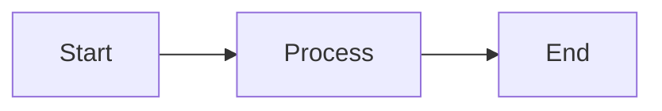
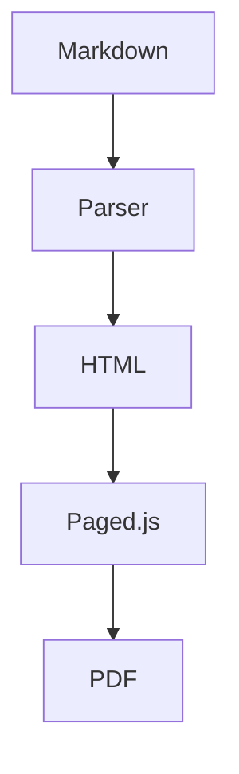
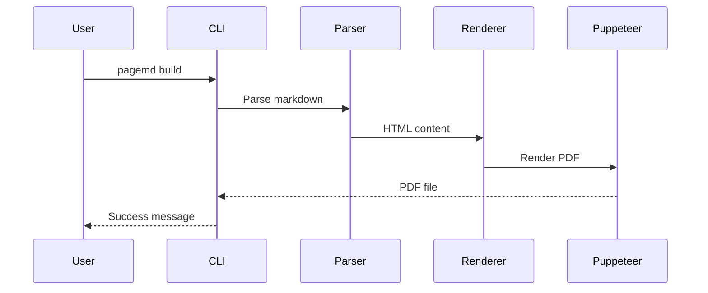

# Extended Syntax Guide

> **Section:** Styling & Syntax

PageMD extends standard Markdown with directives for TOC, Mermaid diagrams, and back-of-book index.

## Overview

Beyond standard Markdown, PageMD supports special directives that enable document features like automatic table of contents, diagrams, and indexing.

## Table of Contents

Generate an automatic table of contents from your document headings.

### Basic TOC

Add this directive where you want the TOC to appear:

```markdown
<!-- ::TOC -->
```

**What it generates:** A linked list of all headings in your document.

### TOC with Options

Control which headings appear and how:

```markdown
<!-- ::TOC levels="2-3" -->
```

| Parameter | Description | Default | Example |
|-----------|-------------|---------|---------|
| `levels` | Heading levels to include | `"2-6"` | `"2-3"` |
| `pages` | Show page numbers (PDF only) | `true` | `"false"` |
| `pageLevels` | Which levels get page numbers | `"2-3"` | `"2"` |

### Frontmatter Configuration

Set TOC defaults in frontmatter:

```yaml
---
title: My Document
toc: true
toc_levels: 4
toc_title: "Contents"
toc_page_numbers: true
toc_page_levels: 3
---
```

**Note:** Frontmatter `toc_levels` and `toc_page_levels` are numbers (max heading depth), while the directive `levels` parameter supports ranges like `"2-4"`.

### Example Output

```markdown
## Contents

- [Introduction](#introduction) .............. 1
  - [Background](#background) ................ 1
  - [Scope](#scope) .......................... 2
- [Implementation](#implementation) .......... 3
```

**Note:** Page numbers only appear in PDF output. HTML shows links only.

---

## Fancy Lists

Enable advanced list numbering with letters and Roman numerals (opt-in feature).

### Overview

Fancy lists extend standard ordered lists with:
- Letter numbering (A, B, C or a, b, c)
- Roman numerals (I, II, III or i, ii, iii)
- Custom start values
- Automatic continuation with `#`

**Disabled by default.** Must be enabled via frontmatter, profile, or environment variable.

### Enable via Frontmatter

```yaml
---
fancy_lists: true
---
```

### Quick Examples

```markdown
A.  First item (uppercase needs TWO spaces)
B.  Second item

i. Legal clause one (lowercase needs one space)
ii. Legal clause two

I.  Introduction (uppercase Roman needs TWO spaces)
II.  Background
```

**Full documentation:** See [Fancy Lists](Fancy-Lists.md) for complete syntax reference and use cases.

---

## Mermaid Diagrams

Create diagrams using Mermaid syntax, rendered to SVG at build time.

### Basic Diagram

````markdown

````

**What you'll see:** An SVG flowchart embedded in your document.

### Supported Diagram Types

| Type | Syntax | Use For |
|------|--------|---------|
| Flowchart | `graph LR` | Process flows, decisions |
| Sequence | `sequenceDiagram` | Interactions over time |
| Class | `classDiagram` | Object relationships |
| State | `stateDiagram-v2` | State machines |
| ER | `erDiagram` | Database schemas |
| Gantt | `gantt` | Project timelines |
| Pie | `pie` | Proportions |

### Flowchart Example

````markdown

````

### Sequence Diagram Example

````markdown

````

### Disabling Mermaid

If Mermaid causes issues, disable it:

```bash
PAGEMD_MERMAID=0 pagemd build document.md -o pdf
```

---

## Back-of-Book Index

Create an alphabetized index with page references (PDF only).

### Marking Index Terms

Add markers where terms appear in your document:

```markdown
The <!-- ::INDEX term="authentication" --> process validates user credentials.

Users must <!-- ::INDEX term="login" --> before accessing the dashboard.
```

### Generating the Index

Add this directive where you want the index to appear (usually at the end):

```markdown
## Index

<!-- ::INDEX -->
```

### Index Output

```markdown
## Index

**A**
- authentication .............. 3, 7, 12

**L**
- login ....................... 4, 8
```

### Frontmatter Configuration

```yaml
---
title: Technical Manual
index: true
index_title: "Subject Index"
---
```

### Index Best Practices

- Mark terms on first significant use
- Use consistent term names (case-sensitive)
- Place index section at document end
- Index appears only in PDF (not HTML)

---

## Layout Directives

Control page layout within your document.

### Page Break

Force a new page:

```markdown
<!-- ::BREAK -->
```

### Named Page Layouts

Switch to a different page layout:

```markdown
<!-- ::LAYOUT(landscape) -->

[Wide content here]

<!-- ::LAYOUT(default) -->
```

**Note:** Landscape orientation has [known limitations](https://github.com/pagedjs/pagedjs/issues/6) in browser preview. Works best in final PDF output.

---

## Callout Blocks

Create highlighted callout boxes:

```markdown
[[NOTE]]
This is important information the reader should notice.
[[/NOTE]]

[[WARNING]]
Be careful when performing this action.
[[/WARNING]]

[[TIP]]
Here's a helpful suggestion.
[[/TIP]]
```

### Available Callout Types

| Type | Use For |
|------|---------|
| `NOTE` | General important information |
| `WARNING` | Cautions and potential issues |
| `TIP` | Helpful suggestions |
| `INFO` | Additional context |
| `CAUTION` | Safety-related warnings |

---

## Annotated Images

Overlay numbered markers on screenshots for UI documentation without image editing.

### Basic Syntax

```markdown
::: annotated-image ./assets/dashboard.png
- { id: 1, x: 10, y: 20, label: "Navigation menu" }
- { id: 2, x: 85, y: 10, label: "Settings button" }
- { id: 3, x: 50, y: 90, label: "Status bar" }
:::
```

**Output:** Screenshot with numbered circles at specified coordinates, plus auto-generated legend below.

### With Options

```markdown
::: annotated-image ./assets/workpackage.png
options:
  caption: "APN 58 Interface"
  markerColor: "#0066cc"
  legendColumns: 4
  id: "fig-workpackage"
markers:
  - { id: 1, x: 10, y: 20, label: "Save button" }
  - { id: 2, x: 85, y: 10, label: "Settings menu" }
:::
```

### Marker Parameters

| Parameter | Type | Required | Description |
|-----------|------|----------|-------------|
| `id` | number/string | Yes | Marker number (displayed in circle) |
| `x` | number | Yes | Horizontal position (0-100, percentage from left) |
| `y` | number | Yes | Vertical position (0-100, percentage from top) |
| `label` | string | Yes | Description shown in legend |

### Block Options

| Option | Default | Description |
|--------|---------|-------------|
| `caption` | (none) | Figure caption (enables figure numbering) |
| `id` | (none) | HTML id for cross-references |
| `markerColor` | `#cc0000` | Marker circle background color |
| `legendColumns` | `3` | Number of columns in legend grid |

### Coordinate System

Coordinates use percentages from top-left corner:
- `x: 0, y: 0` = Top-left corner
- `x: 100, y: 0` = Top-right corner
- `x: 50, y: 50` = Center of image
- `x: 100, y: 100` = Bottom-right corner

**Finding coordinates:** Open image in any viewer, note cursor position as percentage of width/height.

### Figure Numbering

Add `caption` to include in document figure numbering:

```markdown
::: annotated-image ./assets/main-screen.png
options:
  caption: "Main Application Interface"
markers:
  - { id: 1, x: 10, y: 20, label: "Navigation" }
:::
```

- **Without caption:** No figure number
- **With caption:** Numbered as "Figure X: Caption" (shares counter with `<!-- ::FIGURE -->`)

### Color Schemes

```markdown
options:
  markerColor: "#0066cc"   # Blue for informational
  markerColor: "#28a745"   # Green for success
  markerColor: "#fd7e14"   # Orange for warnings
```

---

## Inline Attributes

Beyond directives, PageMD supports **inline attributes** for applying CSS classes, IDs, and HTML attributes directly to markdown elements.

### Quick Examples

```markdown
This paragraph is highlighted. {.highlight}

## Section Title {#custom-id .accent}

[Link](url){target="_blank"}

| Table |
|-------|
| Data  |
{.bordered .striped}
```

### Common Uses

| Purpose | Syntax |
|---------|--------|
| Apply CSS class | `{.classname}` |
| Add HTML ID | `{#element-id}` |
| Control page breaks | `{style="page-break-inside: avoid;"}` |
| Multiple attributes | `{.class1 .class2 #id}` |

### Use Cases for Extended Syntax

Inline attributes complement directives:

- **Page breaks:** Use `{style="page-break-inside: avoid;"}` to keep a specific table together; use `<!-- ::BREAK -->` for standalone breaks
- **Styling:** Use `{.class}` to apply custom CSS to individual elements; use profile CSS for document-wide styling
- **IDs:** Use `{#section-name}` for TOC anchoring and internal linking

**Full documentation:** See [[reference/Inline-Attributes|Inline Attributes Reference]] for complete syntax, supported elements, and advanced examples.

---

## Troubleshooting

### TOC not appearing

**Check:** Directive is `<!-- ::TOC -->` (note the double colons).

### Mermaid diagram shows as code

**Check:** Mermaid is enabled (`PAGEMD_MERMAID` not set to `0`).

### Index page numbers wrong

**Check:** Index markers are placed correctly in content, not in headings.

## See Also

- [[reference/Inline-Attributes|Inline Attributes]] - Apply CSS classes and HTML attributes in markdown
- [[guides/Style-Guide|Style Guide]] - CSS customization
- [[guides/Profiles|Working with Profiles]] - Profile configuration
- [[reference/Settings|Settings]] - Environment variables
