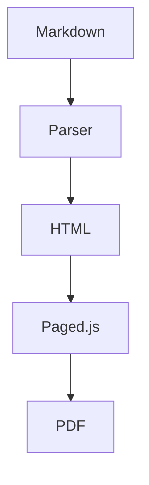
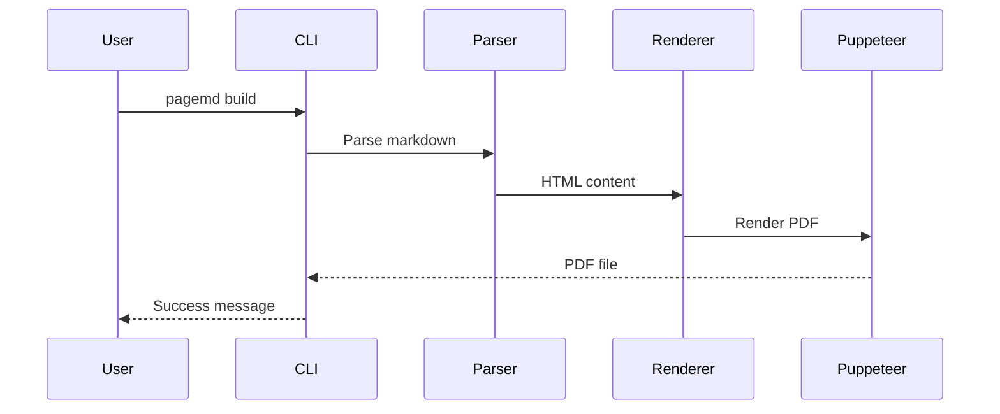

# Extended Syntax Guide

> **Section:** Styling & Syntax

PageMD extends standard Markdown with directives for TOC, Mermaid diagrams, and back-of-book index.

## Overview

Beyond standard Markdown, PageMD supports special directives that enable document features like automatic table of contents, diagrams, and indexing.

## Table of Contents

Generate an automatic table of contents from your document headings.

### Basic TOC

Add this directive where you want the TOC to appear:

```markdown
<!-- ::TOC -->
```

**What it generates:** A linked list of all headings in your document.

### TOC with Options

Control which headings appear and how:

```markdown
<!-- ::TOC levels="2-3" -->
```

| Parameter | Description | Default | Example |
|-----------|-------------|---------|---------|
| `levels` | Heading levels to include | `"2-6"` | `"2-3"` |
| `pages` | Show page numbers (PDF only) | `true` | `"false"` |
| `pageLevels` | Which levels get page numbers | `"2-3"` | `"2"` |

### Frontmatter Configuration

Set TOC defaults in frontmatter:

```yaml
---
title: My Document
toc: true
toc_levels: 4
toc_title: "Contents"
toc_page_numbers: true
toc_page_levels: 3
---
```

**Note:** Frontmatter `toc_levels` and `toc_page_levels` are numbers (max heading depth), while the directive `levels` parameter supports ranges like `"2-4"`.

### Example Output

```markdown
## Contents

- [Introduction](#introduction) .............. 1
  - [Background](#background) ................ 1
  - [Scope](#scope) .......................... 2
- [Implementation](#implementation) .......... 3
```

**Note:** Page numbers only appear in PDF output. HTML shows links only.

---

## Fancy Lists

Enable advanced list numbering with letters and Roman numerals (opt-in feature).

### Overview

Fancy lists extend standard ordered lists with:
- Letter numbering (A, B, C or a, b, c)
- Roman numerals (I, II, III or i, ii, iii)
- Custom start values
- Automatic continuation with `#`

**Disabled by default.** Must be enabled via frontmatter, profile, or environment variable.

### Enable via Frontmatter

```yaml
---
fancy_lists: true
---
```

### Quick Examples

```markdown
A.  First item (uppercase needs TWO spaces)
B.  Second item

i. Legal clause one (lowercase needs one space)
ii. Legal clause two

I.  Introduction (uppercase Roman needs TWO spaces)
II.  Background
```

**Full documentation:** See [Fancy Lists](Fancy-Lists.md) for complete syntax reference and use cases.

---

## Mermaid Diagrams

Create diagrams using Mermaid syntax, rendered to SVG at build time.

### Basic Diagram

````markdown

````

**What you'll see:** An SVG flowchart embedded in your document.

### Supported Diagram Types

| Type | Syntax | Use For |
|------|--------|---------|
| Flowchart | `graph LR` | Process flows, decisions |
| Sequence | `sequenceDiagram` | Interactions over time |
| Class | `classDiagram` | Object relationships |
| State | `stateDiagram-v2` | State machines |
| ER | `erDiagram` | Database schemas |
| Gantt | `gantt` | Project timelines |
| Pie | `pie` | Proportions |

### Flowchart Example

````markdown

````

### Sequence Diagram Example

````markdown

````

### Disabling Mermaid

If Mermaid causes issues, disable it:

```bash
PAGEMD_MERMAID=0 pagemd build document.md -o pdf
```

---

## Back-of-Book Index

Create an alphabetized index with page references (PDF only).

### Marking Index Terms

Add markers where terms appear in your document:

```markdown
The <!-- ::INDEX term="authentication" --> process validates user credentials.

Users must <!-- ::INDEX term="login" --> before accessing the dashboard.
```

### Generating the Index

Add this directive where you want the index to appear (usually at the end):

```markdown
## Index

<!-- ::INDEX -->
```

### Index Output

```markdown
## Index

**A**
- authentication .............. 3, 7, 12

**L**
- login ....................... 4, 8
```

### Frontmatter Configuration

```yaml
---
title: Technical Manual
index: true
index_title: "Subject Index"
---
```

### Index Best Practices

- Mark terms on first significant use
- Use consistent term names (case-sensitive)
- Place index section at document end
- Index appears only in PDF (not HTML)

---

## Layout Directives

Control page layout within your document.

### Page Break

Force a new page:

```markdown
<!-- ::BREAK -->
```

**Tip:** `<!-- ::BREAK -->` also restarts list numbering. Use it to break a list and start fresh:

```markdown
a. First item
b. Second item

<!-- ::BREAK -->

a. New list starts at a
```

See [Fancy Lists - Restarting List Numbering](Fancy-Lists.md#restarting-list-numbering) for more details.

### Named Page Layouts

Switch to a different page layout:

```markdown
<!-- ::LAYOUT(landscape) -->

[Wide content here]

<!-- ::LAYOUT(default) -->
```

**Note:** Landscape orientation has [known limitations](https://github.com/pagedjs/pagedjs/issues/6) in browser preview. Works best in final PDF output.

---

## Figure Directives

Insert images with automatic figure numbering, captions, and sizing options.

### Basic Syntax

```markdown
<!-- ::FIGURE src="image.png" caption="Figure caption text" -->
```

**Output:** A `<figure>` element with the image, caption, and auto-generated figure number.

### Available Parameters

| Parameter | Type | Required | Description | Values | Example |
|-----------|------|----------|-------------|--------|---------|
| `src` | string | No* | Image file path | Any relative or absolute path | `src="./images/diagram.png"` |
| `caption` | string | No** | Figure caption text | Any text (newlines not supported) | `caption="System Architecture"` |
| `id` | string | No | HTML id for cross-references | Valid HTML id | `id="fig-architecture"` |
| `width` | string | No | Figure width sizing | `full`, `half`, `third`, `quarter` | `width="half"` |

***Note on src:** If omitted, PageMD expects an image on the next line using standard markdown syntax: ``

****Note on caption:** While optional for basic figures, the caption is required for figures to receive automatic numbering in the output.

### Width Parameter

Control how the figure displays within the page layout:

| Width Value | CSS Width | Layout | Use Case |
|-------------|-----------|--------|----------|
| `full` | 100% | Full-width | Wide diagrams, flowcharts, large screenshots |
| `half` | 50% (centered) | Medium, inset | Regular photos, medium diagrams |
| `third` | 33.333% (centered) | Narrow, inset | Small supporting images |
| `quarter` | 25% (centered) | Thumbnail | Tiny reference images |
| *(omitted)* | auto (inline) | Inline sizing | Use image's natural dimensions |

### Figure Numbering

Figures are **automatically numbered sequentially** (Figure 1, Figure 2, etc.) when they have a caption.

- Numbering counter resets when you render/build
- Numbering includes both `<!-- ::FIGURE -->` directives AND `::: annotated-image :::` containers
- Figures without captions do not receive numbers

**Shared Counter Example:**
```markdown
<!-- ::FIGURE src="fig1.png" caption="Architecture" -->     <!-- → Figure 1 -->

Some text here.

::: annotated-image ./screenshot.png
options:
  caption: "Main Interface"
:::                                                          <!-- → Figure 2 -->

<!-- ::FIGURE src="fig3.png" caption="Process Flow" -->     <!-- → Figure 3 -->
```

### Examples

**Example 1: Basic Figure with Inline Image**
```markdown
<!-- ::FIGURE src="./assets/diagram.png" caption="System Architecture" -->
```

**Output:**
```
Figure 1: System Architecture
[diagram image]
```

**Example 2: Half-Width with ID**
```markdown
<!-- ::FIGURE src="dashboard.png" caption="Dashboard Overview" id="fig-dashboard" width="half" -->
```

Creates a 50%-width, centered figure that can be referenced as `#fig-dashboard`.

**Example 3: Legacy Syntax (Image on Next Line)**
```markdown
<!-- ::FIGURE caption="Process Flow Diagram" -->

```

If no `src` attribute, the image markdown on the **immediately following line** is used. Alt text from the markdown becomes the figure's alt attribute.

**Example 4: Full Document with Multiple Figures**
```markdown
# Report

## Section 1

<!-- ::FIGURE src="chart1.png" caption="Q1 Revenue" id="fig-q1" width="full" -->

Text describing the chart.

## Section 2

<!-- ::FIGURE src="chart2.png" caption="Q2 Revenue" id="fig-q2" width="half" -->

More analysis here.
```

Both figures are auto-numbered (Figure 1, Figure 2) and can be referenced by ID in cross-links.

### HTML Output

**Directive Input:**
```markdown
<!-- ::FIGURE src="arch.png" caption="System Design" id="fig-arch" width="full" -->
```

**Generated HTML:**
```html
<figure id="fig-arch" class="width-full">
  
  <figcaption>Figure <span class="fig-num">1</span>: System Design</figcaption>
</figure>
```

### Styling Hooks

Apply custom CSS to figures via classes or inline styles:

**Built-in Classes:**
- `.width-full` - Full-width (100%) sizing
- `.width-half` - Half-width (50%) centered
- `.width-third` - Third-width (33%) centered
- `.width-quarter` - Quarter-width (25%) centered
- `.fig-num` - Span containing the figure number (inside `<figcaption>`)

**Custom Styling Example:**

Define in `.pagemd/styles/custom.css`:
```css
figure {
  border: 1px solid #ccc;
  padding: 1rem;
  border-radius: 8px;
}

figure img {
  box-shadow: 0 2px 8px rgba(0,0,0,0.1);
}

figcaption {
  font-weight: 500;
  margin-top: 1rem;
  text-align: left;
}

.fig-num {
  background-color: #f0f0f0;
  padding: 2px 6px;
  border-radius: 3px;
}
```

Then reference in frontmatter:
```yaml
---
title: My Document
styles:
  - custom.css
---
```

### Print Behavior (PDF)

Figures are optimized for print output:

- **Never split across pages** - `break-inside: avoid` prevents figures from breaking
- **Centered by default** - Full and partial-width figures are centered
- **Proportional scaling** - Images scale to fit figure width while maintaining aspect ratio
- **Caption always visible** - Figure captions appear on the same page as the image

### Limitations

1. **Caption Text Only** - Captions are treated as plain text, not markdown
   - ✅ Works: `caption="Bold text: here"`
   - ❌ Doesn't work: `caption="**Bold** text"`

2. **Width Values are Fixed** - Only four preset widths are supported
   - ✅ Works: `width="half"`
   - ❌ Doesn't work: `width="70%"` or `width="500px"`
   - If you need custom width, use inline attributes on the following line or apply custom CSS classes

3. **Single Image Per Directive** - One figure per `<!-- ::FIGURE -->` block

4. **src and Legacy Syntax are Mutually Exclusive** - You can't have both:
   - ✅ `<!-- ::FIGURE src="img.png" caption="..." -->`
   - ✅ Legacy: `<!-- ::FIGURE caption="..." -->\n`
   - ❌ Mixed: `<!-- ::FIGURE src="img.png" -->` with image on next line

### Comparison: FIGURE vs Annotated Images

| Feature | FIGURE | Annotated Image |
|---------|--------|-----------------|
| **Syntax** | `<!-- ::FIGURE ... -->` | `::: annotated-image path :::` |
| **Simple images** | ✅ Ideal | Overkill |
| **Overlay annotations** | ❌ Not supported | ✅ Overlays with markers |
| **Marker legend** | ❌ None | ✅ Auto-legend |
| **Figure numbering** | ✅ Auto-numbered | ✅ Shares same counter |
| **Configuration** | Simple attributes | YAML-based |
| **Use case** | General figures, charts, diagrams | Screenshots with callouts |

---

## GFM Alerts (GitHub Flavored Markdown)

Create standard alert boxes using GitHub Flavored Markdown syntax. This is the standard Markdown syntax used by GitHub, GitLab, and other platforms.

### Basic Syntax

```markdown
> [!NOTE]
> This is a note.

> [!WARNING]
> Be careful with this.

> [!TIP]
> Here's a helpful tip.

> [!IMPORTANT]
> This is critically important.

> [!CAUTION]
> Exercise caution here.
```

### Available Alert Types

| Type | Icon | Use For | CSS Class |
|------|------|---------|-----------|
| `NOTE` | ℹ️ | General information | `.markdown-alert-note` |
| `TIP` | 💡 | Helpful suggestions | `.markdown-alert-tip` |
| `IMPORTANT` | ⚠️ | Critical information | `.markdown-alert-important` |
| `WARNING` | ⚠️ | Potential problems | `.markdown-alert-warning` |
| `CAUTION` | 🛑 | Safety-related warnings | `.markdown-alert-caution` |

### Examples

**Example 1: Simple NOTE**

```markdown
> [!NOTE]
> This is important information the reader should notice.
```

**HTML Output:**
```html
<div class="markdown-alert markdown-alert-note">
  <p class="markdown-alert-title">
    <svg><!-- GitHub icon --></svg> Note
  </p>
  <p>This is important information the reader should notice.</p>
</div>
```

**Example 2: Multi-paragraph WARNING**

```markdown
> [!WARNING]
> **Be careful!** This action cannot be undone.
>
> Make sure you have a backup before proceeding with this step.
>
> See [backup guide](./backup.md) for instructions.
```

**Example 3: Complex Content with Lists**

```markdown
> [!IMPORTANT]
> Follow these steps in order:
>
> 1. Read the documentation
> 2. Set up your environment
> 3. Run the initialization script
> 4. Verify the installation
```

**Example 4: CAUTION with Emphasis**

```markdown
> [!CAUTION]
> **Risk of data loss!**
>
> This operation will delete all unsaved changes. Make backups first.
```

**Example 5: TIP with Code**

```markdown
> [!TIP]
> You can optimize this with:
>
> ```bash
> npm install --save-dev package-name
> ```
```

### HTML Output Structure

All GFM alerts generate a consistent structure:

```html
<div class="markdown-alert markdown-alert-{TYPE}">
  <p class="markdown-alert-title">
    <svg class="octicon octicon-{icon}"><!-- GitHub SVG icon --></svg>
    {Type Name}
  </p>
  <!-- Alert content -->
</div>
```

**CSS Classes Generated:**
- `.markdown-alert` - Applied to all alerts
- `.markdown-alert-note` - NOTE alerts
- `.markdown-alert-warning` - WARNING alerts
- `.markdown-alert-tip` - TIP alerts
- `.markdown-alert-important` - IMPORTANT alerts
- `.markdown-alert-caution` - CAUTION alerts

### Styling Hooks

Apply custom styling to alerts:

```css
/* All alerts */
.markdown-alert {
  padding: 1rem;
  margin: 1rem 0;
  border-left: 4px solid;
}

/* Specific alert types */
.markdown-alert-note {
  border-left-color: #0969da;
  background-color: #f6f8fa;
}

.markdown-alert-tip {
  border-left-color: #1a7f37;
  background-color: #f0f9f4;
}

.markdown-alert-warning {
  border-left-color: #d1343b;
  background-color: #fef2f2;
}

.markdown-alert-important {
  border-left-color: #8250df;
  background-color: #f6f3ff;
}

.markdown-alert-caution {
  border-left-color: #9e6a03;
  background-color: #fff8f3;
}
```

### Print Behavior (PDF)

- ✅ Alerts render as styled divs in PDF
- ✅ Border and background colors are preserved
- ✅ SVG icons are embedded in the PDF
- ✅ Multi-paragraph content breaks appropriately
- ✅ Works with page breaks

### Common Mistakes

**❌ Forgetting `>` on continuation lines:**
```markdown
> [!NOTE]
This won't render as an alert - missing >
```

**✅ Correct - every line needs `>`:**
```markdown
> [!NOTE]
> This renders as an alert.
```

**❌ Missing `>` on empty lines:**
```markdown
> [!NOTE]
> Paragraph 1

> Paragraph 2 - this breaks the alert
```

**✅ Correct - empty lines need `> `:**
```markdown
> [!NOTE]
> Paragraph 1
>
> Paragraph 2 - now it works
```

**❌ Invalid alert type:**
```markdown
> [!INFO]
> This type doesn't exist - uses only NOTE, TIP, IMPORTANT, WARNING, CAUTION
```

### Use Cases

- **Documentation:** Highlight important notes, warnings, and tips
- **Release notes:** Call out breaking changes with `[!IMPORTANT]`
- **API docs:** Warn about deprecated features with `[!WARNING]`
- **Installation guides:** Provide tips with `[!TIP]` and safety warnings with `[!CAUTION]`
- **Changelogs:** Highlight critical updates with `[!IMPORTANT]`

### Comparison: GFM Alerts vs Custom Callouts

| Feature | GFM Alerts `> [!NOTE]` | Custom Callouts `[[NOTE]]` | Named Containers `::: note :::` |
|---------|----------------------|---------------------------|--------------------------------|
| **Standard** | ✅ GitHub Flavored Markdown | ❌ PageMD proprietary | ❌ Proprietary |
| **Syntax** | Blockquote-based | Block wrapper | Container block |
| **Built-in icons** | ✅ GitHub-style SVG icons | ❌ No icons | ❌ No icons |
| **Cross-platform** | ✅ Works everywhere | ❌ PageMD only | ❌ PageMD only |
| **Best for** | Standard alerts | Custom styling | Flexible containers |
| **CSS classes** | `.markdown-alert-*` | `.container-*` | `.container-*` |

### Limitations

1. **Blockquote syntax required** - Every line must start with `> `
2. **Type names are restricted** - Only the 5 standard types are recognized
3. **Cannot be nested** - Alerts cannot contain other alerts
4. **Icons are always included** - Cannot be disabled per-document
5. **Inline usage not supported** - Must be block-level

---

## Callout Blocks

Create highlighted callout boxes:

```markdown
[[NOTE]]
This is important information the reader should notice.
[[/NOTE]]

[[WARNING]]
Be careful when performing this action.
[[/WARNING]]

[[TIP]]
Here's a helpful suggestion.
[[/TIP]]
```

### Available Callout Types

| Type | Use For |
|------|---------|
| `NOTE` | General important information |
| `WARNING` | Cautions and potential issues |
| `TIP` | Helpful suggestions |
| `INFO` | Additional context |
| `CAUTION` | Safety-related warnings |

---

## Annotated Images

Overlay numbered markers on screenshots for UI documentation without image editing.

### Basic Syntax

```markdown
::: annotated-image ./assets/dashboard.png
- { id: 1, x: 10, y: 20, label: "Navigation menu" }
- { id: 2, x: 85, y: 10, label: "Settings button" }
- { id: 3, x: 50, y: 90, label: "Status bar" }
:::
```

**Output:** Screenshot with numbered circles at specified coordinates, plus auto-generated legend below.

### With Options

```markdown
::: annotated-image ./assets/workpackage.png
options:
  caption: "APN 58 Interface"
  markerColor: "#0066cc"
  legendColumns: 4
  id: "fig-workpackage"
markers:
  - { id: 1, x: 10, y: 20, label: "Save button" }
  - { id: 2, x: 85, y: 10, label: "Settings menu" }
:::
```

### Marker Parameters

| Parameter | Type | Required | Description |
|-----------|------|----------|-------------|
| `id` | number/string | Yes | Marker number (displayed in circle) |
| `x` | number | Yes | Horizontal position (0-100, percentage from left) |
| `y` | number | Yes | Vertical position (0-100, percentage from top) |
| `label` | string | Yes | Description shown in legend |

### Block Options

| Option | Default | Description |
|--------|---------|-------------|
| `caption` | (none) | Figure caption (enables figure numbering) |
| `id` | (none) | HTML id for cross-references |
| `markerColor` | `#cc0000` | Marker circle background color |
| `legendColumns` | `3` | Number of columns in legend grid |

### Coordinate System

Coordinates use percentages from top-left corner:
- `x: 0, y: 0` = Top-left corner
- `x: 100, y: 0` = Top-right corner
- `x: 50, y: 50` = Center of image
- `x: 100, y: 100` = Bottom-right corner

**Finding coordinates:** Open image in any viewer, note cursor position as percentage of width/height.

### Figure Numbering

Add `caption` to include in document figure numbering:

```markdown
::: annotated-image ./assets/main-screen.png
options:
  caption: "Main Application Interface"
markers:
  - { id: 1, x: 10, y: 20, label: "Navigation" }
:::
```

- **Without caption:** No figure number
- **With caption:** Numbered as "Figure X: Caption" (shares counter with `<!-- ::FIGURE -->`)

### Color Schemes

```markdown
options:
  markerColor: "#0066cc"   # Blue for informational
  markerColor: "#28a745"   # Green for success
  markerColor: "#fd7e14"   # Orange for warnings
```

---

## Wikilinks (Obsidian-style Links)

Create internal links and embed images using Obsidian-style wiki syntax - ideal for knowledge bases and wiki-style documentation.

### Basic Syntax

```markdown
[[Page Name]]
[[Page Name|Display Text]]
![[image.png]]
![[path/to/image.jpg]]
```

### Available Options

| Option | Type | Default | Description | Example |
|--------|------|---------|-------------|---------|
| `baseUrl` | string | `''` | URL prefix for links | `/docs`, `/wiki` |
| `linkClass` | string | `'wikilink'` | CSS class for links | `'internal-link'` |
| `imageBaseUrl` | string | `''` | URL prefix for images | `/assets`, `/images` |
| `imageClass` | string | `'embedded-image'` | CSS class for images | `'embedded'` |

### Examples

**Example 1: Simple Wikilink**

```markdown
See [[Getting Started]] for instructions.
```

**HTML Output:**
```html
<p>See <a href="Getting Started" class="wikilink">Getting Started</a> for instructions.</p>
```

**Example 2: Wikilink with Display Text**

```markdown
Check [[Documentation|our docs]] for more details.
```

**HTML Output:**
```html
<p>Check <a href="Documentation" class="wikilink">our docs</a> for more details.</p>
```

**Example 3: Multiple Links**

```markdown
Topics: [[Basics]], [[Intermediate]], [[Advanced]]
```

**Example 4: Embedded Image**

```markdown
# Architecture

![[system-architecture.png]]

See [[System Design]] for details.
```

**HTML Output:**
```html
<h1>Architecture</h1>
<p></p>
<p>See <a href="System Design" class="wikilink">System Design</a> for details.</p>
```

**Example 5: Image with Path**

```markdown
![[assets/diagrams/api-flow.png]]
```

**HTML Output:**
```html
<p></p>
```

**Example 6: Knowledge Base Structure**

```markdown
# Python Basics

Related topics:
- [[Python Data Types]]
- [[Python Functions]]
- [[Python Modules]]

See the reference diagram:

![[python-reference.png]]
```

### HTML Output Structure

**Wikilink:**
```html
<a href="PAGE_NAME" class="wikilink">DISPLAY_TEXT</a>
```

**Image Embed:**
```html

```

### CSS Classes Generated

- `.wikilink` - Applied to all wikilinks (customizable)
- `.embedded-image` - Applied to all embedded images (customizable)

### Styling Hooks

```css
/* Style wikilinks */
a.wikilink {
  color: #0969da;
  text-decoration: none;
}

a.wikilink:hover {
  text-decoration: underline;
}

/* Style embedded images */
img.embedded-image {
  max-width: 100%;
  height: auto;
  border: 1px solid #ddd;
}
```

### Print Behavior (PDF)

- ✅ Links render as standard `<a>` elements with href
- ✅ Images render as standard `` elements
- ✅ PDF readers can click links to navigate (if supported)
- ✅ Images embedded in PDF with alt text

### Common Mistakes

**❌ Single Brackets (don't work):**
```markdown
[Page]  # This is NOT a wikilink
```

**✅ Double Brackets (correct):**
```markdown
[[Page]]  # This IS a wikilink
```

**❌ Nested Brackets (don't work):**
```markdown
[[Page [with] brackets]]
```

**✅ Use display text instead:**
```markdown
[[PageName|Page [with] brackets]]
```

**❌ Missing exclamation for images:**
```markdown
[[image.png]]  # This is a link, not an image embed
```

**✅ Use exclamation for images:**
```markdown
![[image.png]]  # This embeds the image
```

### Use Cases

- **Knowledge bases** - Link between related topics
- **Documentation systems** - Internal cross-references
- **Wiki-style content** - Non-linear, interconnected documents
- **Personal wikis** - Note-taking with backlinks
- **Research repositories** - Citation networks

### Comparison: Wikilinks vs Standard Markdown

| Feature | Wikilinks | Standard Markdown |
|---------|-----------|-------------------|
| **Link Syntax** | `[[Page]]` | `[Text](url)` |
| **Display Text** | `[[Page\|Text]]` | `[Text](url)` |
| **Image Syntax** | `![[image]]` | `` |
| **Best For** | Internal links | External URLs |
| **Knowledge Bases** | ✅ Ideal | ❌ Verbose |
| **User-friendly** | ✅ No URL needed | ❌ URL required |

### Limitations

1. **No nested brackets** - Cannot include brackets in page names (use display text instead)
2. **Single pipe only** - Only one `|` allowed (first is used for display text)
3. **No URL fragments** - Cannot link to `#sections`
4. **No custom alt text for images** - Alt text always uses filename
5. **Case sensitive** - `[[Page]]` and `[[page]]` are different links

---

## Inline Attributes

Beyond directives, PageMD supports **inline attributes** for applying CSS classes, IDs, and HTML attributes directly to markdown elements.

### Quick Examples

```markdown
This paragraph is highlighted. {.highlight}

## Section Title {#custom-id .accent}

[Link](url){target="_blank"}

| Table |
|-------|
| Data  |
{.bordered .striped}
```

### Common Uses

| Purpose | Syntax |
|---------|--------|
| Apply CSS class | `{.classname}` |
| Add HTML ID | `{#element-id}` |
| Control page breaks | `{style="page-break-inside: avoid;"}` |
| Multiple attributes | `{.class1 .class2 #id}` |

### Use Cases for Extended Syntax

Inline attributes complement directives:

- **Page breaks:** Use `{style="page-break-inside: avoid;"}` to keep a specific table together; use `<!-- ::BREAK -->` for standalone breaks
- **Styling:** Use `{.class}` to apply custom CSS to individual elements; use profile CSS for document-wide styling
- **IDs:** Use `{#section-name}` for TOC anchoring and internal linking

**Full documentation:** See [[reference/Inline-Attributes|Inline Attributes Reference]] for complete syntax, supported elements, and advanced examples.

---

## Troubleshooting

### TOC not appearing

**Check:** Directive is `<!-- ::TOC -->` (note the double colons).

### Mermaid diagram shows as code

**Check:** Mermaid is enabled (`PAGEMD_MERMAID` not set to `0`).

### Index page numbers wrong

**Check:** Index markers are placed correctly in content, not in headings.

## See Also

- [[reference/Inline-Attributes|Inline Attributes]] - Apply CSS classes and HTML attributes in markdown
- [[guides/Style-Guide|Style Guide]] - CSS customization
- [[guides/Profiles|Working with Profiles]] - Profile configuration
- [[reference/Settings|Settings]] - Environment variables
