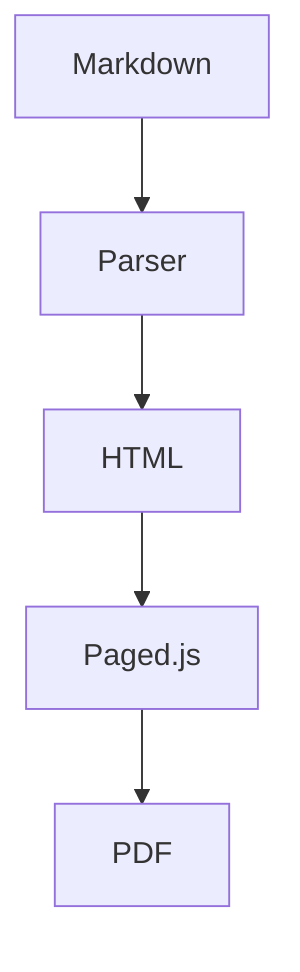
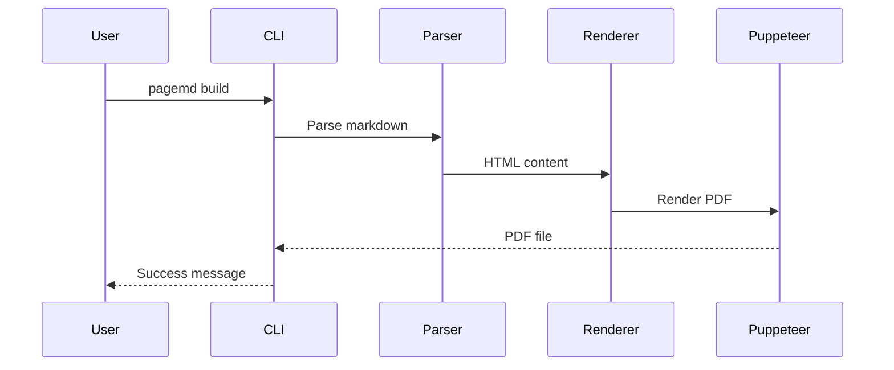

# Extended Syntax Guide

> **Section:** Styling & Syntax

PageMD extends standard Markdown with directives for TOC, Mermaid diagrams, and back-of-book index.

## Overview

Beyond standard Markdown, PageMD supports special directives that enable document features like automatic table of contents, diagrams, and indexing.

## Table of Contents

Generate an automatic table of contents from your document headings.

### Basic TOC

Add this directive where you want the TOC to appear:

```markdown
<!-- ::TOC -->
```

**What it generates:** A linked list of all headings in your document.

### TOC with Options

Control which headings appear and how:

```markdown
<!-- ::TOC levels="2-3" -->
```

| Parameter | Description | Default | Example |
|-----------|-------------|---------|---------|
| `levels` | Heading levels to include | `"2-6"` | `"2-3"` |
| `pages` | Show page numbers (PDF only) | `true` | `"false"` |
| `pageLevels` | Which levels get page numbers | `"2-3"` | `"2"` |

### Frontmatter Configuration

Set TOC defaults in frontmatter:

```yaml
---
title: My Document
toc: true
toc_levels: 4
toc_title: "Contents"
toc_page_numbers: true
toc_page_levels: 3
---
```

**Note:** Frontmatter `toc_levels` and `toc_page_levels` are numbers (max heading depth), while the directive `levels` parameter supports ranges like `"2-4"`.

### Example Output

```markdown
## Contents

- [Introduction](#introduction) .............. 1
  - [Background](#background) ................ 1
  - [Scope](#scope) .......................... 2
- [Implementation](#implementation) .......... 3
```

**Note:** Page numbers only appear in PDF output. HTML shows links only.

---

## Fancy Lists

Enable advanced list numbering with letters and Roman numerals (opt-in feature).

### Overview

Fancy lists extend standard ordered lists with:
- Letter numbering (A, B, C or a, b, c)
- Roman numerals (I, II, III or i, ii, iii)
- Custom start values
- Automatic continuation with `#`

**Disabled by default.** Must be enabled via frontmatter, profile, or environment variable.

### Enable via Frontmatter

```yaml
---
fancy_lists: true
---
```

### Quick Examples

```markdown
A.  First item (uppercase needs TWO spaces)
B.  Second item

i. Legal clause one (lowercase needs one space)
ii. Legal clause two

I.  Introduction (uppercase Roman needs TWO spaces)
II.  Background
```

**Full documentation:** See [Fancy Lists](Fancy-Lists.md) for complete syntax reference and use cases.

---

## Mermaid Diagrams

Create diagrams using Mermaid syntax, rendered to SVG at build time.

### Basic Diagram

````markdown

````

**What you'll see:** An SVG flowchart embedded in your document.

### Supported Diagram Types

| Type | Syntax | Use For |
|------|--------|---------|
| Flowchart | `graph LR` | Process flows, decisions |
| Sequence | `sequenceDiagram` | Interactions over time |
| Class | `classDiagram` | Object relationships |
| State | `stateDiagram-v2` | State machines |
| ER | `erDiagram` | Database schemas |
| Gantt | `gantt` | Project timelines |
| Pie | `pie` | Proportions |

### Flowchart Example

````markdown

````

### Sequence Diagram Example

````markdown

````

### Disabling Mermaid

If Mermaid causes issues, disable it:

```bash
PAGEMD_MERMAID=0 pagemd build document.md -o pdf
```

---

## Back-of-Book Index

Create an alphabetized index with page references (PDF only).

### Marking Index Terms

Add markers where terms appear in your document:

```markdown
The <!-- ::INDEX term="authentication" --> process validates user credentials.

Users must <!-- ::INDEX term="login" --> before accessing the dashboard.
```

### Generating the Index

Add this directive where you want the index to appear (usually at the end):

```markdown
## Index

<!-- ::INDEX -->
```

### Index Output

```markdown
## Index

**A**
- authentication .............. 3, 7, 12

**L**
- login ....................... 4, 8
```

### Frontmatter Configuration

```yaml
---
title: Technical Manual
index: true
index_title: "Subject Index"
---
```

### Index Best Practices

- Mark terms on first significant use
- Use consistent term names (case-sensitive)
- Place index section at document end
- Index appears only in PDF (not HTML)

---

## Layout Directives

Control page layout within your document.

### Page Break

Force a new page:

```markdown
<!-- ::BREAK -->
```

**Tip:** `<!-- ::BREAK -->` also restarts list numbering. Use it to break a list and start fresh:

```markdown
a. First item
b. Second item

<!-- ::BREAK -->

a. New list starts at a
```

See [Fancy Lists - Restarting List Numbering](Fancy-Lists.md#restarting-list-numbering) for more details.

### Named Page Layouts

Switch to a different page layout:

```markdown
<!-- ::LAYOUT(landscape) -->

[Wide content here]

<!-- ::LAYOUT(default) -->
```

**Note:** Landscape orientation has [known limitations](https://github.com/pagedjs/pagedjs/issues/6) in browser preview. Works best in final PDF output.

---

## Figure Directives

Insert images with automatic figure numbering, captions, and sizing options.

### Basic Syntax

```markdown
<!-- ::FIGURE src="image.png" caption="Figure caption text" -->
```

**Output:** A `<figure>` element with the image, caption, and auto-generated figure number.

### Available Parameters

| Parameter | Type | Required | Description | Values | Example |
|-----------|------|----------|-------------|--------|---------|
| `src` | string | No* | Image file path | Any relative or absolute path | `src="./images/diagram.png"` |
| `caption` | string | No** | Figure caption text | Any text (newlines not supported) | `caption="System Architecture"` |
| `id` | string | No | HTML id for cross-references | Valid HTML id | `id="fig-architecture"` |
| `width` | string | No | Figure width sizing | `full`, `half`, `third`, `quarter` | `width="half"` |

***Note on src:** If omitted, PageMD expects an image on the next line using standard markdown syntax: ``

****Note on caption:** While optional for basic figures, the caption is required for figures to receive automatic numbering in the output.

### Width Parameter

Control how the figure displays within the page layout:

| Width Value | CSS Width | Layout | Use Case |
|-------------|-----------|--------|----------|
| `full` | 100% | Full-width | Wide diagrams, flowcharts, large screenshots |
| `half` | 50% (centered) | Medium, inset | Regular photos, medium diagrams |
| `third` | 33.333% (centered) | Narrow, inset | Small supporting images |
| `quarter` | 25% (centered) | Thumbnail | Tiny reference images |
| *(omitted)* | auto (inline) | Inline sizing | Use image's natural dimensions |

### Figure Numbering

Figures are **automatically numbered sequentially** (Figure 1, Figure 2, etc.) when they have a caption.

- Numbering counter resets when you render/build
- Numbering includes both `<!-- ::FIGURE -->` directives AND `::: annotated-image :::` containers
- Figures without captions do not receive numbers

**Shared Counter Example:**
```markdown
<!-- ::FIGURE src="fig1.png" caption="Architecture" -->     <!-- → Figure 1 -->

Some text here.

::: annotated-image ./screenshot.png
options:
  caption: "Main Interface"
:::                                                          <!-- → Figure 2 -->

<!-- ::FIGURE src="fig3.png" caption="Process Flow" -->     <!-- → Figure 3 -->
```

### Examples

**Example 1: Basic Figure with Inline Image**
```markdown
<!-- ::FIGURE src="./assets/diagram.png" caption="System Architecture" -->
```

**Output:**
```
Figure 1: System Architecture
[diagram image]
```

**Example 2: Half-Width with ID**
```markdown
<!-- ::FIGURE src="dashboard.png" caption="Dashboard Overview" id="fig-dashboard" width="half" -->
```

Creates a 50%-width, centered figure that can be referenced as `#fig-dashboard`.

**Example 3: Legacy Syntax (Image on Next Line)**
```markdown
<!-- ::FIGURE caption="Process Flow Diagram" -->

```

If no `src` attribute, the image markdown on the **immediately following line** is used. Alt text from the markdown becomes the figure's alt attribute.

**Example 4: Full Document with Multiple Figures**
```markdown
# Report

## Section 1

<!-- ::FIGURE src="chart1.png" caption="Q1 Revenue" id="fig-q1" width="full" -->

Text describing the chart.

## Section 2

<!-- ::FIGURE src="chart2.png" caption="Q2 Revenue" id="fig-q2" width="half" -->

More analysis here.
```

Both figures are auto-numbered (Figure 1, Figure 2) and can be referenced by ID in cross-links.

### HTML Output

**Directive Input:**
```markdown
<!-- ::FIGURE src="arch.png" caption="System Design" id="fig-arch" width="full" -->
```

**Generated HTML:**
```html
<figure id="fig-arch" class="width-full">
  
  <figcaption>Figure <span class="fig-num">1</span>: System Design</figcaption>
</figure>
```

### Styling Hooks

Apply custom CSS to figures via classes or inline styles:

**Built-in Classes:**
- `.width-full` - Full-width (100%) sizing
- `.width-half` - Half-width (50%) centered
- `.width-third` - Third-width (33%) centered
- `.width-quarter` - Quarter-width (25%) centered
- `.fig-num` - Span containing the figure number (inside `<figcaption>`)

**Custom Styling Example:**

Define in `.pagemd/styles/custom.css`:
```css
figure {
  border: 1px solid #ccc;
  padding: 1rem;
  border-radius: 8px;
}

figure img {
  box-shadow: 0 2px 8px rgba(0,0,0,0.1);
}

figcaption {
  font-weight: 500;
  margin-top: 1rem;
  text-align: left;
}

.fig-num {
  background-color: #f0f0f0;
  padding: 2px 6px;
  border-radius: 3px;
}
```

Then reference in frontmatter:
```yaml
---
title: My Document
styles:
  - custom.css
---
```

### Print Behavior (PDF)

Figures are optimized for print output:

- **Never split across pages** - `break-inside: avoid` prevents figures from breaking
- **Centered by default** - Full and partial-width figures are centered
- **Proportional scaling** - Images scale to fit figure width while maintaining aspect ratio
- **Caption always visible** - Figure captions appear on the same page as the image

### Limitations

1. **Caption Text Only** - Captions are treated as plain text, not markdown
   - ✅ Works: `caption="Bold text: here"`
   - ❌ Doesn't work: `caption="**Bold** text"`

2. **Width Values are Fixed** - Only four preset widths are supported
   - ✅ Works: `width="half"`
   - ❌ Doesn't work: `width="70%"` or `width="500px"`
   - If you need custom width, use inline attributes on the following line or apply custom CSS classes

3. **Single Image Per Directive** - One figure per `<!-- ::FIGURE -->` block

4. **src and Legacy Syntax are Mutually Exclusive** - You can't have both:
   - ✅ `<!-- ::FIGURE src="img.png" caption="..." -->`
   - ✅ Legacy: `<!-- ::FIGURE caption="..." -->\n`
   - ❌ Mixed: `<!-- ::FIGURE src="img.png" -->` with image on next line

### Comparison: FIGURE vs Annotated Images

| Feature | FIGURE | Annotated Image |
|---------|--------|-----------------|
| **Syntax** | `<!-- ::FIGURE ... -->` | `::: annotated-image path :::` |
| **Simple images** | ✅ Ideal | Overkill |
| **Overlay annotations** | ❌ Not supported | ✅ Overlays with markers |
| **Marker legend** | ❌ None | ✅ Auto-legend |
| **Figure numbering** | ✅ Auto-numbered | ✅ Shares same counter |
| **Configuration** | Simple attributes | YAML-based |
| **Use case** | General figures, charts, diagrams | Screenshots with callouts |

---

## GFM Alerts (GitHub Flavored Markdown)

Create standard alert boxes using GitHub Flavored Markdown syntax. This is the standard Markdown syntax used by GitHub, GitLab, and other platforms.

### Basic Syntax

```markdown
> [!NOTE]
> This is a note.

> [!WARNING]
> Be careful with this.

> [!TIP]
> Here's a helpful tip.

> [!IMPORTANT]
> This is critically important.

> [!CAUTION]
> Exercise caution here.
```

### Available Alert Types

| Type | Icon | Use For | CSS Class |
|------|------|---------|-----------|
| `NOTE` | ℹ️ | General information | `.markdown-alert-note` |
| `TIP` | 💡 | Helpful suggestions | `.markdown-alert-tip` |
| `IMPORTANT` | ⚠️ | Critical information | `.markdown-alert-important` |
| `WARNING` | ⚠️ | Potential problems | `.markdown-alert-warning` |
| `CAUTION` | 🛑 | Safety-related warnings | `.markdown-alert-caution` |

### Examples

**Example 1: Simple NOTE**

```markdown
> [!NOTE]
> This is important information the reader should notice.
```

**HTML Output:**
```html
<div class="markdown-alert markdown-alert-note">
  <p class="markdown-alert-title">
    <svg><!-- GitHub icon --></svg> Note
  </p>
  <p>This is important information the reader should notice.</p>
</div>
```

**Example 2: Multi-paragraph WARNING**

```markdown
> [!WARNING]
> **Be careful!** This action cannot be undone.
>
> Make sure you have a backup before proceeding with this step.
>
> See [backup guide](./backup.md) for instructions.
```

**Example 3: Complex Content with Lists**

```markdown
> [!IMPORTANT]
> Follow these steps in order:
>
> 1. Read the documentation
> 2. Set up your environment
> 3. Run the initialization script
> 4. Verify the installation
```

**Example 4: CAUTION with Emphasis**

```markdown
> [!CAUTION]
> **Risk of data loss!**
>
> This operation will delete all unsaved changes. Make backups first.
```

**Example 5: TIP with Code**

```markdown
> [!TIP]
> You can optimize this with:
>
> ```bash
> npm install --save-dev package-name
> ```
```

### HTML Output Structure

All GFM alerts generate a consistent structure:

```html
<div class="markdown-alert markdown-alert-{TYPE}">
  <p class="markdown-alert-title">
    <svg class="octicon octicon-{icon}"><!-- GitHub SVG icon --></svg>
    {Type Name}
  </p>
  <!-- Alert content -->
</div>
```

**CSS Classes Generated:**
- `.markdown-alert` - Applied to all alerts
- `.markdown-alert-note` - NOTE alerts
- `.markdown-alert-warning` - WARNING alerts
- `.markdown-alert-tip` - TIP alerts
- `.markdown-alert-important` - IMPORTANT alerts
- `.markdown-alert-caution` - CAUTION alerts

### Styling Hooks

Apply custom styling to alerts:

```css
/* All alerts */
.markdown-alert {
  padding: 1rem;
  margin: 1rem 0;
  border-left: 4px solid;
}

/* Specific alert types */
.markdown-alert-note {
  border-left-color: #0969da;
  background-color: #f6f8fa;
}

.markdown-alert-tip {
  border-left-color: #1a7f37;
  background-color: #f0f9f4;
}

.markdown-alert-warning {
  border-left-color: #d1343b;
  background-color: #fef2f2;
}

.markdown-alert-important {
  border-left-color: #8250df;
  background-color: #f6f3ff;
}

.markdown-alert-caution {
  border-left-color: #9e6a03;
  background-color: #fff8f3;
}
```

### Print Behavior (PDF)

- ✅ Alerts render as styled divs in PDF
- ✅ Border and background colors are preserved
- ✅ SVG icons are embedded in the PDF
- ✅ Multi-paragraph content breaks appropriately
- ✅ Works with page breaks

### Common Mistakes

**❌ Forgetting `>` on continuation lines:**
```markdown
> [!NOTE]
This won't render as an alert - missing >
```

**✅ Correct - every line needs `>`:**
```markdown
> [!NOTE]
> This renders as an alert.
```

**❌ Missing `>` on empty lines:**
```markdown
> [!NOTE]
> Paragraph 1

> Paragraph 2 - this breaks the alert
```

**✅ Correct - empty lines need `> `:**
```markdown
> [!NOTE]
> Paragraph 1
>
> Paragraph 2 - now it works
```

**❌ Invalid alert type:**
```markdown
> [!INFO]
> This type doesn't exist - uses only NOTE, TIP, IMPORTANT, WARNING, CAUTION
```

### Use Cases

- **Documentation:** Highlight important notes, warnings, and tips
- **Release notes:** Call out breaking changes with `[!IMPORTANT]`
- **API docs:** Warn about deprecated features with `[!WARNING]`
- **Installation guides:** Provide tips with `[!TIP]` and safety warnings with `[!CAUTION]`
- **Changelogs:** Highlight critical updates with `[!IMPORTANT]`

### Comparison: GFM Alerts vs Custom Callouts

| Feature | GFM Alerts `> [!NOTE]` | Custom Callouts `[[NOTE]]` | Named Containers `::: note :::` |
|---------|----------------------|---------------------------|--------------------------------|
| **Standard** | ✅ GitHub Flavored Markdown | ❌ PageMD proprietary | ❌ Proprietary |
| **Syntax** | Blockquote-based | Block wrapper | Container block |
| **Built-in icons** | ✅ GitHub-style SVG icons | ❌ No icons | ❌ No icons |
| **Cross-platform** | ✅ Works everywhere | ❌ PageMD only | ❌ PageMD only |
| **Best for** | Standard alerts | Custom styling | Flexible containers |
| **CSS classes** | `.markdown-alert-*` | `.container-*` | `.container-*` |

### Limitations

1. **Blockquote syntax required** - Every line must start with `> `
2. **Type names are restricted** - Only the 5 standard types are recognized
3. **Cannot be nested** - Alerts cannot contain other alerts
4. **Icons are always included** - Cannot be disabled per-document
5. **Inline usage not supported** - Must be block-level

---

## Callout Blocks

Create highlighted callout boxes:

```markdown
[[NOTE]]
This is important information the reader should notice.
[[/NOTE]]

[[WARNING]]
Be careful when performing this action.
[[/WARNING]]

[[TIP]]
Here's a helpful suggestion.
[[/TIP]]
```

### Available Callout Types

| Type | Use For |
|------|---------|
| `NOTE` | General important information |
| `WARNING` | Cautions and potential issues |
| `TIP` | Helpful suggestions |
| `INFO` | Additional context |
| `CAUTION` | Safety-related warnings |

---

## Annotated Images

Overlay numbered markers on screenshots for UI documentation without image editing.

### Basic Syntax

```markdown
::: annotated-image ./assets/dashboard.png
- { id: 1, x: 10, y: 20, label: "Navigation menu" }
- { id: 2, x: 85, y: 10, label: "Settings button" }
- { id: 3, x: 50, y: 90, label: "Status bar" }
:::
```

**Output:** Screenshot with numbered circles at specified coordinates, plus auto-generated legend below.

### With Options

```markdown
::: annotated-image ./assets/workpackage.png
options:
  caption: "APN 58 Interface"
  markerColor: "#0066cc"
  legendColumns: 4
  id: "fig-workpackage"
markers:
  - { id: 1, x: 10, y: 20, label: "Save button" }
  - { id: 2, x: 85, y: 10, label: "Settings menu" }
:::
```

### Marker Parameters

| Parameter | Type | Required | Description |
|-----------|------|----------|-------------|
| `id` | number/string | Yes | Marker number (displayed in circle) |
| `x` | number | Yes | Horizontal position (0-100, percentage from left) |
| `y` | number | Yes | Vertical position (0-100, percentage from top) |
| `label` | string | Yes | Description shown in legend |

### Block Options

| Option | Default | Description |
|--------|---------|-------------|
| `caption` | (none) | Figure caption (enables figure numbering) |
| `id` | (none) | HTML id for cross-references |
| `markerColor` | `#cc0000` | Marker circle background color |
| `legendColumns` | `3` | Number of columns in legend grid |

### Coordinate System

Coordinates use percentages from top-left corner:
- `x: 0, y: 0` = Top-left corner
- `x: 100, y: 0` = Top-right corner
- `x: 50, y: 50` = Center of image
- `x: 100, y: 100` = Bottom-right corner

**Finding coordinates:** Open image in any viewer, note cursor position as percentage of width/height.

### Figure Numbering

Add `caption` to include in document figure numbering:

```markdown
::: annotated-image ./assets/main-screen.png
options:
  caption: "Main Application Interface"
markers:
  - { id: 1, x: 10, y: 20, label: "Navigation" }
:::
```

- **Without caption:** No figure number
- **With caption:** Numbered as "Figure X: Caption" (shares counter with `<!-- ::FIGURE -->`)

### Color Schemes

```markdown
options:
  markerColor: "#0066cc"   # Blue for informational
  markerColor: "#28a745"   # Green for success
  markerColor: "#fd7e14"   # Orange for warnings
```

---

## Wikilinks (Obsidian-style Links)

Create internal links and embed images using Obsidian-style wiki syntax - ideal for knowledge bases and wiki-style documentation.

### Basic Syntax

```markdown
[[Page Name]]
[[Page Name|Display Text]]
![[image.png]]
![[path/to/image.jpg]]
```

### Available Options

| Option | Type | Default | Description | Example |
|--------|------|---------|-------------|---------|
| `baseUrl` | string | `''` | URL prefix for links | `/docs`, `/wiki` |
| `linkClass` | string | `'wikilink'` | CSS class for links | `'internal-link'` |
| `imageBaseUrl` | string | `''` | URL prefix for images | `/assets`, `/images` |
| `imageClass` | string | `'embedded-image'` | CSS class for images | `'embedded'` |

### Examples

**Example 1: Simple Wikilink**

```markdown
See [[Getting Started]] for instructions.
```

**HTML Output:**
```html
<p>See <a href="Getting Started" class="wikilink">Getting Started</a> for instructions.</p>
```

**Example 2: Wikilink with Display Text**

```markdown
Check [[Documentation|our docs]] for more details.
```

**HTML Output:**
```html
<p>Check <a href="Documentation" class="wikilink">our docs</a> for more details.</p>
```

**Example 3: Multiple Links**

```markdown
Topics: [[Basics]], [[Intermediate]], [[Advanced]]
```

**Example 4: Embedded Image**

```markdown
# Architecture

![[system-architecture.png]]

See [[System Design]] for details.
```

**HTML Output:**
```html
<h1>Architecture</h1>
<p></p>
<p>See <a href="System Design" class="wikilink">System Design</a> for details.</p>
```

**Example 5: Image with Path**

```markdown
![[assets/diagrams/api-flow.png]]
```

**HTML Output:**
```html
<p></p>
```

**Example 6: Knowledge Base Structure**

```markdown
# Python Basics

Related topics:
- [[Python Data Types]]
- [[Python Functions]]
- [[Python Modules]]

See the reference diagram:

![[python-reference.png]]
```

### HTML Output Structure

**Wikilink:**
```html
<a href="PAGE_NAME" class="wikilink">DISPLAY_TEXT</a>
```

**Image Embed:**
```html

```

### CSS Classes Generated

- `.wikilink` - Applied to all wikilinks (customizable)
- `.embedded-image` - Applied to all embedded images (customizable)

### Styling Hooks

```css
/* Style wikilinks */
a.wikilink {
  color: #0969da;
  text-decoration: none;
}

a.wikilink:hover {
  text-decoration: underline;
}

/* Style embedded images */
img.embedded-image {
  max-width: 100%;
  height: auto;
  border: 1px solid #ddd;
}
```

### Print Behavior (PDF)

- ✅ Links render as standard `<a>` elements with href
- ✅ Images render as standard `` elements
- ✅ PDF readers can click links to navigate (if supported)
- ✅ Images embedded in PDF with alt text

### Common Mistakes

**❌ Single Brackets (don't work):**
```markdown
[Page]  # This is NOT a wikilink
```

**✅ Double Brackets (correct):**
```markdown
[[Page]]  # This IS a wikilink
```

**❌ Nested Brackets (don't work):**
```markdown
[[Page [with] brackets]]
```

**✅ Use display text instead:**
```markdown
[[PageName|Page [with] brackets]]
```

**❌ Missing exclamation for images:**
```markdown
[[image.png]]  # This is a link, not an image embed
```

**✅ Use exclamation for images:**
```markdown
![[image.png]]  # This embeds the image
```

### Use Cases

- **Knowledge bases** - Link between related topics
- **Documentation systems** - Internal cross-references
- **Wiki-style content** - Non-linear, interconnected documents
- **Personal wikis** - Note-taking with backlinks
- **Research repositories** - Citation networks

### Comparison: Wikilinks vs Standard Markdown

| Feature | Wikilinks | Standard Markdown |
|---------|-----------|-------------------|
| **Link Syntax** | `[[Page]]` | `[Text](url)` |
| **Display Text** | `[[Page\|Text]]` | `[Text](url)` |
| **Image Syntax** | `![[image]]` | `` |
| **Best For** | Internal links | External URLs |
| **Knowledge Bases** | ✅ Ideal | ❌ Verbose |
| **User-friendly** | ✅ No URL needed | ❌ URL required |

### Limitations

1. **No nested brackets** - Cannot include brackets in page names (use display text instead)
2. **Single pipe only** - Only one `|` allowed (first is used for display text)
3. **No URL fragments** - Cannot link to `#sections`
4. **No custom alt text for images** - Alt text always uses filename
5. **Case sensitive** - `[[Page]]` and `[[page]]` are different links

---

## File Inclusion Directive

Include external markdown files to reuse content across documents - ideal for shared headers, footers, disclaimers, and DRY documentation.

### Basic Syntax

```markdown
!!!include(./path/to/file.md)!!!
```

**Three exclamation marks** on each side, with file path in parentheses.

### Configuration Option

| Option | Type | Default | Description | Example |
|--------|------|---------|-------------|---------|
| `includeRoot` | string | `'.'` | Root directory for path resolution | `'./docs/shared'` |

### How It Works

1. Parser encounters `!!!include(path)!!!`
2. Resolves path relative to `includeRoot`
3. Reads file from filesystem
4. Renders content as markdown (inline with document)

### Examples

**Example 1: Shared Header and Footer**

Directory structure:
```
docs/
  ├─ guide.md
  └─ shared/
      ├─ header.md
      └─ footer.md
```

**guide.md:**
```markdown
!!!include(./shared/header.md)!!!

# Main Content

This is the main documentation.

!!!include(./shared/footer.md)!!!
```

**shared/header.md:**
```markdown
> **Document Version:** 1.0
> **Last Updated:** 2026-01-12
```

**Result:**
```html
<blockquote>
  <p><strong>Document Version:</strong> 1.0<br />
  <strong>Last Updated:</strong> 2026-01-12</p>
</blockquote>
<h1>Main Content</h1>
<p>This is the main documentation.</p>
<!-- footer content -->
```

**Example 2: Reusable Disclaimer**

**shared/disclaimer.md:**
```markdown
⚠️ **DISCLAIMER**

This software is provided "as-is" without warranty.
See LICENSE for full terms.
```

**Any document:**
```markdown
# API Documentation

!!!include(./shared/disclaimer.md)!!!

## Getting Started

[Documentation content...]
```

**Example 3: Documentation Assembly**

Combine multiple chapters into one document:

```markdown
# Complete Guide

!!!include(./chapters/01-introduction.md)!!!

!!!include(./chapters/02-getting-started.md)!!!

!!!include(./chapters/03-core-concepts.md)!!!

!!!include(./chapters/04-advanced-topics.md)!!!

!!!include(./appendix/glossary.md)!!!
```

**Example 4: Release Notes from Templates**

```markdown
# Version 2.0 Release Notes

!!!include(./releases/v2.0-summary.md)!!!

## New Features

!!!include(./releases/v2.0-features.md)!!!

## Bug Fixes

!!!include(./releases/v2.0-bugfixes.md)!!!

## Breaking Changes

!!!include(./releases/v2.0-breaking.md)!!!
```

**Example 5: Legal Documents**

```markdown
# Terms of Service

!!!include(./legal/intro.md)!!!

## Usage Terms

!!!include(./legal/usage.md)!!!

!!!include(./legal/liability.md)!!!

!!!include(./legal/dispute-resolution.md)!!!
```

**Example 6: Nested Includes**

Included files can themselves contain includes:

**chapters/chapter1.md:**
```markdown
## Chapter 1: Basics

!!!include(./section1.md)!!!

!!!include(./section2.md)!!!
```

When chapter1.md is included, its nested includes are also processed.

### Path Resolution

Paths are resolved **relative to `includeRoot`** option:

**Configuration:**
```javascript
const md = createParser({
  includeRoot: './docs/shared'  // Base directory
});
```

**Path Examples:**

| Include Syntax | Resolves To |
|----------------|-------------|
| `!!!include(./header.md)!!!` | `./docs/shared/header.md` |
| `!!!include(./footer.md)!!!` | `./docs/shared/footer.md` |
| `!!!include(../legal/tos.md)!!!` | `./docs/legal/tos.md` |

**Default (includeRoot = '.'):**
```javascript
const md = createParser();
// !!!include(./file.md)!!! resolves to ./file.md
```

### File Requirements

Included files must be:
- ✅ **Markdown format** (.md files)
- ✅ **UTF-8 encoded**
- ✅ **Valid markdown syntax**
- ✅ **Readable** by the application

**Content can include:**
- ✅ Any markdown elements (headings, paragraphs, lists, tables, code blocks)
- ✅ PageMD extended syntax (other directives, figures, etc.)
- ✅ Nested includes (file A includes B, B includes C)

### Print Behavior (PDF)

- ✅ Included content renders as regular PDF content
- ✅ No visual indicators of included sections
- ✅ Works seamlessly in multi-page documents
- ✅ Nested includes fully supported in PDF

### Common Mistakes

**❌ Wrong Syntax (only 2 exclamation marks):**
```markdown
!!include(./file.md)!!
```

**✅ Correct (exactly 3 on each side):**
```markdown
!!!include(./file.md)!!!
```

**❌ File doesn't exist:**
```markdown
!!!include(./missing.md)!!!  # Will cause error or placeholder
```

**✅ Verify file exists:**
```markdown
!!!include(./existing-file.md)!!!
```

**❌ Path outside includeRoot:**
```markdown
# If includeRoot is './docs'
!!!include(/etc/passwd)!!!  # Security boundary - won't work
```

**✅ Use relative paths within includeRoot:**
```markdown
# If includeRoot is './docs'
!!!include(./shared/file.md)!!!  # ✅ Resolves to ./docs/shared/file.md
```

### Use Cases

- **Shared Headers/Footers** - Common to multiple documents
- **Reusable Disclaimers** - Legal notices, safety warnings
- **Documentation Assembly** - Build books from chapter files
- **Release Notes** - Templated version notes
- **API Documentation** - Endpoint docs from templates
- **DRY Principle** - Single source of truth for repeated content
- **Keeping Examples Fresh** - Pull code examples from actual source files

### Comparison: Includes vs Alternatives

| Feature | Include | Wikilink | External Link |
|---------|---------|----------|----------------|
| **Embed Content** | ✅ Content merged | ❌ Link only | ❌ Link only |
| **Single File Build** | ✅ Combined | ❌ Separate | ❌ Separate |
| **Reusable Content** | ✅ Perfect | ⚠️ Okay | ❌ No |
| **Shared Content** | ✅ Ideal | ❌ Not ideal | ❌ Not ideal |
| **DRY Principle** | ✅ Yes | ❌ No | ❌ No |
| **URL Needed** | ❌ No | ❌ No | ✅ Yes |

### Limitations

1. **Entire file included** - Cannot select portions (include all or none)
2. **No parameters** - Cannot pass arguments to included content
3. **Static resolution** - Includes resolved at render time, not dynamically
4. **File must exist** - Missing files cause errors/placeholders
5. **Circular includes** - Avoid file A including B while B includes A
6. **No encoding options** - Files must be UTF-8

### Best Practices

1. **Organize in dedicated directory:**
   ```
   project/
     ├─ docs/
     │  ├─ pages/
     │  └─ shared/
     │      ├─ header.md
     │      ├─ footer.md
     │      └─ disclaimer.md
   ```

2. **Set includeRoot in configuration:**
   ```javascript
   includeRoot: './docs/shared'
   ```

3. **Use simple relative paths:**
   ```markdown
   !!!include(./header.md)!!!
   ```

4. **Document your includes with comments:**
   ```markdown
   <!-- Includes shared header from docs/shared/header.md -->
   !!!include(./header.md)!!!
   ```

5. **Use meaningful filenames:**
   - ✅ `header.md`, `footer.md`, `disclaimer.md`
   - ❌ `file1.md`, `tmp.md`

---

## Sections Wrapper Directive

Wrap content in semantic `<div>` containers with optional CSS classes and HTML IDs for styling and layout control.

### Basic Syntax

```markdown
<!-- ::SECTION_START class="container" id="main" -->

Content here...

<!-- ::SECTION_END -->
```

### Available Parameters

| Parameter | Type | Required | Description | Example |
|-----------|------|----------|-------------|---------|
| `class` | string | No | CSS class for div | `class="highlight"` |
| `id` | string | No | HTML ID for div | `id="section-1"` |

### Examples

**Example 1: Section with CSS Class**

```markdown
<!-- ::SECTION_START class="highlight" -->

This section is highlighted with CSS.

<!-- ::SECTION_END -->
```

**HTML Output:**
```html
<div class="highlight">
  <p>This section is highlighted with CSS.</p>
</div>
```

**Example 2: Section with ID for Linking**

```markdown
<!-- ::SECTION_START id="installation" -->

## Installation Instructions

Follow these steps to install...

<!-- ::SECTION_END -->
```

**HTML Output:**
```html
<div id="installation">
  <h2>Installation Instructions</h2>
  <p>Follow these steps to install...</p>
</div>
```

**Example 3: Section with Class and ID**

```markdown
<!-- ::SECTION_START class="important-section" id="important" -->

⚠️ **Important Note**

This is critical information.

<!-- ::SECTION_END -->
```

**Example 4: Multiple Sections**

```markdown
<!-- ::SECTION_START class="intro" id="intro" -->

## Introduction

Context and overview here.

<!-- ::SECTION_END -->

<!-- ::SECTION_START class="main-content" id="content" -->

## Main Content

Detailed information here.

<!-- ::SECTION_END -->

<!-- ::SECTION_START class="conclusion" id="conclusion" -->

## Conclusion

Summary here.

<!-- ::SECTION_END -->
```

**Example 5: Nested Sections**

```markdown
<!-- ::SECTION_START class="outer-box" -->

Outer section content.

<!-- ::SECTION_START class="inner-box" -->

Inner section content (nested).

<!-- ::SECTION_END -->

More outer content.

<!-- ::SECTION_END -->
```

**HTML Output:**
```html
<div class="outer-box">
  <p>Outer section content.</p>
  <div class="inner-box">
    <p>Inner section content (nested).</p>
  </div>
  <p>More outer content.</p>
</div>
```

**Example 6: Document Layout Structure**

```markdown
<!-- ::SECTION_START class="document-header" id="header" -->

# Document Title

**Version:** 1.0
**Date:** 2026-01-12

<!-- ::SECTION_END -->

<!-- ::SECTION_START class="document-body" id="main" -->

## Chapter 1

Content here...

## Chapter 2

More content...

<!-- ::SECTION_END -->

<!-- ::SECTION_START class="document-footer" id="footer" -->

---

**Footer Information**

Copyright and legal notices...

<!-- ::SECTION_END -->
```

### HTML Output Structure

**Input:**
```markdown
<!-- ::SECTION_START class="my-section" id="sec-1" -->

Content here

<!-- ::SECTION_END -->
```

**Output:**
```html
<div class="my-section" id="sec-1">
  <p>Content here</p>
</div>
```

### CSS Classes Generated

CSS classes are user-defined through the `class` parameter:
- Any valid CSS class name can be used
- Multiple classes supported (space-separated)
- Example: `class="highlight important"`

### Styling Hooks

```css
/* Style sections with specific classes */
.highlight {
  background-color: #fff8dc;
  padding: 1rem;
  border-left: 4px solid #ff9800;
}

.important-section {
  background-color: #ffe0e0;
  border: 2px solid #d32f2f;
  padding: 1rem;
}

.document-header {
  text-align: center;
  padding: 2rem;
  border-bottom: 2px solid #ddd;
}

.document-footer {
  text-align: center;
  border-top: 2px solid #ddd;
  padding: 1rem;
  font-size: 0.9em;
  color: #666;
}

/* Page breaks for PDF */
.page-break-after {
  page-break-after: always;
}
```

### Print Behavior (PDF)

- ✅ Sections render as regular divs in PDF
- ✅ CSS classes and styling applied
- ✅ IDs preserved for PDF navigation
- ✅ Nesting works in PDF
- ✅ Can use CSS `page-break-after` for PDF page breaks

**Example: Page Breaks in PDF**

```markdown
<!-- ::SECTION_START class="page-break-after" -->

Content for first page.

<!-- ::SECTION_END -->

<!-- ::SECTION_START -->

Content for next page.

<!-- ::SECTION_END -->
```

### Common Mistakes

**❌ Wrong opening syntax:**
```markdown
<!-- ::SECTION class="bad" -->  # Missing _START
```

**✅ Correct:**
```markdown
<!-- ::SECTION_START class="good" -->
```

**❌ Missing closing tag:**
```markdown
<!-- ::SECTION_START -->

Content...

<!-- Missing the ::SECTION_END -->
```

**✅ Complete:**
```markdown
<!-- ::SECTION_START -->

Content...

<!-- ::SECTION_END -->
```

**❌ Wrong parameter syntax:**
```markdown
<!-- ::SECTION_START "classname" -->  # Wrong format
```

**✅ Correct parameter syntax:**
```markdown
<!-- ::SECTION_START class="classname" -->
```

### Use Cases

- **Document Layout** - Separate document into header, body, footer sections
- **Visual Styling** - Apply CSS classes to content groups
- **Linking** - Use IDs for table of contents anchors
- **Semantic Structure** - Wrap related content logically
- **PDF Control** - Use CSS for page breaks and layout
- **Multi-column Layouts** - With flexbox/grid CSS

### Comparison: SECTIONS vs Other Wrappers

| Feature | Sections | Wikilinks | Containers |
|---------|----------|-----------|-----------|
| **Wraps Content** | ✅ Yes | ❌ No | ✅ Yes |
| **CSS Classes** | ✅ Yes | ❌ No | ✅ Yes |
| **HTML IDs** | ✅ Yes | ❌ No | ✅ Yes |
| **Block Syntax** | Comment | Bracket | Marker |
| **Best For** | Layout control | Internal links | Named containers |

### Limitations

1. **Parameters only in opening tag** - Cannot set params on closing tag
2. **Comment-based syntax** - Cannot contain comment markers inside
3. **Requires proper closing** - Must close with matching `::SECTION_END`
4. **Nesting limit** - Theoretically unlimited but practically limited by HTML depth
5. **No inline nesting** - Sections are block-level only

---

## Cover Pages Directive

Create title pages or cover pages for documents - perfect for reports, books, theses, and formal documents.

### Basic Syntax

```markdown
<!-- ::COVER_START -->

# Document Title

**Author:** Name

<!-- ::COVER_END -->
```

### How It Works

The COVER_START/COVER_END directives:
- Create a semantic `<div class="cover-page">` container
- Automatically styled as centered, full-height page
- Perfect for PDF title pages with built-in page break
- Renders all markdown content inside

### Examples

**Example 1: Simple Title Page**

```markdown
<!-- ::COVER_START -->

# My Document

**Date:** January 12, 2026

<!-- ::COVER_END -->
```

**HTML Output:**
```html
<div class="cover-page">
  <h1>My Document</h1>
  <p><strong>Date:</strong> January 12, 2026</p>
</div>
```

**Example 2: Book Cover**

```markdown
<!-- ::COVER_START -->

# The Complete Guide

## To Advanced Topics

**By John Smith**

**Publisher:** Knowledge Press

**Year:** 2026

<!-- ::COVER_END -->
```

**Example 3: Academic Thesis**

```markdown
<!-- ::COVER_START -->

# Machine Learning in Healthcare

A Thesis Submitted to the Graduate Faculty

**University of Technology**

**In Partial Fulfillment of Requirements**

**Master of Science in Computer Science**

**By**

**Jane Doe**

**May 2026**

<!-- ::COVER_END -->

# Abstract

[Thesis content begins...]
```

**Example 4: Annual Report**

```markdown
<!-- ::COVER_START -->

# Annual Report 2026

**Acme Corporation**

Financial Performance & Strategic Overview

**Fiscal Year Ending December 31, 2026**

<!-- ::COVER_END -->

# Letter to Shareholders

[Report content...]
```

**Example 5: Product Documentation**

```markdown
<!-- ::COVER_START -->

# Product Installation Guide

**SoftwareX v2.0**

Quick Start & Technical Reference

**© 2026 Company Name**

All Rights Reserved

<!-- ::COVER_END -->

# Getting Started

[Installation instructions...]
```

**Example 6: Legal Document**

```markdown
<!-- ::COVER_START -->

# Terms of Service

**Effective Date:** January 1, 2026

**Last Updated:** January 12, 2026

**Company:** Acme Inc.

<!-- ::COVER_END -->

# 1. Definitions

[Legal content...]
```

### HTML Output Structure

**Input:**
```markdown
<!-- ::COVER_START -->

# Title

**Subtitle**

<!-- ::COVER_END -->
```

**Output:**
```html
<div class="cover-page">
  <h1>Title</h1>
  <p><strong>Subtitle</strong></p>
</div>
```

### CSS Class Generated

- `.cover-page` - Applied automatically to cover wrapper

### Default Styling

The `.cover-page` class provides:
- Flexbox centering (vertical and horizontal)
- Full viewport height (`min-height: 100vh`)
- Centered text alignment
- Page break after (for PDF)

### Styling Hooks

```css
/* Override default cover styling */
.cover-page {
  display: flex;
  flex-direction: column;
  justify-content: center;
  align-items: center;
  text-align: center;
  min-height: 100vh;
  padding: 2rem;
  page-break-after: always;  /* New page after cover */
}

/* Custom cover styling example */
.cover-page {
  background: linear-gradient(135deg, #667eea 0%, #764ba2 100%);
  color: white;
  font-family: Georgia, serif;
}

.cover-page h1 {
  font-size: 3em;
  margin-bottom: 1rem;
  font-weight: bold;
}

.cover-page h2 {
  font-size: 1.5em;
  font-weight: normal;
  margin-bottom: 2rem;
}

.cover-page p {
  font-size: 1.1em;
  margin: 0.5rem 0;
  line-height: 1.6;
}
```

### Print Behavior (PDF)

- ✅ Cover page renders on its own page
- ✅ `page-break-after: always` separates cover from content
- ✅ Centering and styling preserved
- ✅ Images embedded in PDF
- ✅ Fonts and colors applied
- ✅ Perfect for professional documents

**Example: PDF with Cover**

```markdown
<!-- ::COVER_START -->

# Annual Report 2026

Company Name

<!-- ::COVER_END -->

# Contents

- Financial Summary
- Strategic Overview

# Financial Summary

[Content on page 2...]
```

**Result in PDF:**
- Page 1: Cover page (centered, styled)
- Page 2+: Document content

### Common Mistakes

**❌ Wrong opening syntax:**
```markdown
<!-- ::COVER -->  # Missing _START
```

**✅ Correct:**
```markdown
<!-- ::COVER_START -->
```

**❌ Missing closing tag:**
```markdown
<!-- ::COVER_START -->

Cover content...

<!-- Missing ::COVER_END -->
```

**✅ Complete:**
```markdown
<!-- ::COVER_START -->

Cover content...

<!-- ::COVER_END -->
```

**❌ Not forcing page break:**
```markdown
<!-- ::COVER_START -->

Cover...

<!-- ::COVER_END -->
Main content on same page  # Might appear on same page without CSS
```

**✅ With page break CSS:**
```css
.cover-page {
  page-break-after: always;  /* Forces new page in PDF */
}
```

### Use Cases

- **Reports** - Annual reports, quarterly reports, white papers
- **Books** - Cover page, title page for ebooks/PDFs
- **Academic** - Thesis cover pages, research paper title pages
- **Formal Documents** - Contracts, proposals, official letters
- **Manuals** - Product guides, technical documentation
- **Marketing** - Product launches, promotional documents

### Content Support

Cover pages can contain:
- ✅ Headings (H1-H6)
- ✅ Paragraphs and text
- ✅ Lists (bullet and numbered)
- ✅ Bold, italic, code formatting
- ✅ Images (with  syntax)
- ✅ Horizontal rules
- ✅ Tables

### Comparison: COVER PAGES vs Other Directives

| Feature | Cover Pages | Sections | Layout |
|---------|------------|----------|--------|
| **Purpose** | Title/cover page | Content wrapping | Page structure |
| **CSS Class** | `.cover-page` (auto) | Custom (user-defined) | Custom |
| **Centering** | Built-in | Manual (CSS) | Manual (CSS) |
| **Page Break** | Built-in (PDF) | Manual (CSS) | Manual (CSS) |
| **Best For** | Title pages | Content organization | Layout control |
| **Parameters** | None | class, id | Various |

### Limitations

1. **No parameters** - Cannot customize class name (always `.cover-page`)
2. **Requires closing tag** - Must properly close with `::COVER_END`
3. **Block-level only** - Cannot use inline with text
4. **Styling via CSS only** - Must use CSS for customization
5. **Single purpose** - Designed specifically for cover pages

### Best Practices

1. **Place at document start:**
   ```markdown
   <!-- ::COVER_START -->
   # Title Page
   <!-- ::COVER_END -->

   # Main Content
   ```

2. **Use for formal documents:**
   - Reports ✅
   - Books ✅
   - Theses ✅
   - Manuals ✅

3. **Add CSS page break:**
   ```css
   .cover-page {
     page-break-after: always;
   }
   ```

4. **Style appropriately:**
   ```css
   .cover-page {
     background-color: #f5f5f5;
     color: #333;
   }
   ```

5. **Include relevant information:**
   - Document title
   - Author/organization
   - Date
   - Version
   - Any legal notices

---

## Inline Callouts (Badge Alerts)

Add quick inline alert badges to text for brief notifications - different from block-level alerts.

### Basic Syntax

```markdown
This is important [!IMPORTANT] and needs attention.

Be careful [!WARNING] when doing this.

Use this [!TIP] for better performance.
```

### Available Alert Types

| Type | Syntax | Use For | Badge Display |
|------|--------|---------|----------------|
| NOTE | `[!NOTE]` | General information | Info badge |
| TIP | `[!TIP]` | Helpful suggestions | Tip badge |
| IMPORTANT | `[!IMPORTANT]` | Critical information | Alert badge |
| WARNING | `[!WARNING]` | Potential problems | Warning badge |
| CAUTION | `[!CAUTION]` | Safety-related warnings | Danger badge |

### How It Works

Inline callouts:
- Appear inline with surrounding text
- Render as styled badge elements
- Cannot contain markdown formatting
- Short, impactful visual indicators

### Examples

**Example 1: Simple Inline Badge**

```markdown
This feature is experimental [!WARNING] and may change.
```

**HTML Output:**
```html
<p>This feature is experimental <span class="markdown-callout markdown-callout-warning">Warning</span> and may change.</p>
```

**Example 2: Multiple Badges in Sentence**

```markdown
Always [!IMPORTANT] back up data [!WARNING] before upgrading.
```

**Example 3: Documentation Style**

```markdown
Use the new API [!TIP] for better performance [!IMPORTANT].
The old API [!WARNING] is deprecated [!NOTE] as of v2.0.
```

**Example 4: Safety Warnings**

```markdown
Do not modify system files [!CAUTION] without admin rights [!WARNING].
```

**Example 5: API Documentation**

```markdown
This endpoint is slow [!WARNING] on large datasets.
Consider using [!TIP] pagination [!IMPORTANT] for production.
Breaking change [!CAUTION] in v2.0 - see migration guide.
```

**Example 6: README Installation**

```markdown
This project requires Node 18+ [!IMPORTANT].
Linux and macOS are tested [!NOTE].
Windows support is experimental [!WARNING].
Use the latest npm [!TIP] to avoid issues.
```

### HTML Output Structure

**Input:**
```markdown
This is critical [!IMPORTANT] information.
```

**Output:**
```html
<p>This is critical <span class="markdown-callout markdown-callout-important">Important</span> information.</p>
```

**Input (multiple):**
```markdown
Read docs [!IMPORTANT] and test [!WARNING].
```

**Output:**
```html
<p>Read docs <span class="markdown-callout markdown-callout-important">Important</span> and test <span class="markdown-callout markdown-callout-warning">Warning</span>.</p>
```

### CSS Classes Generated

- `.markdown-callout` - Applied to all callout badges
- `.markdown-callout-note` - NOTE type
- `.markdown-callout-tip` - TIP type
- `.markdown-callout-important` - IMPORTANT type
- `.markdown-callout-warning` - WARNING type
- `.markdown-callout-caution` - CAUTION type

### Styling Hooks

```css
/* Default badge styling */
.markdown-callout {
  display: inline-block;
  padding: 0.25em 0.5em;
  border-radius: 0.25em;
  font-weight: bold;
  font-size: 0.85em;
  margin: 0 0.25em;
  line-height: 1.2;
}

/* Specific badge colors */
.markdown-callout-note {
  background-color: #e7f3ff;
  color: #0969da;
  border: 1px solid #0969da;
}

.markdown-callout-tip {
  background-color: #f6f8fa;
  color: #1f6feb;
  border: 1px solid #1f6feb;
}

.markdown-callout-important {
  background-color: #fff8c5;
  color: #9a6700;
  border: 1px solid #d4af37;
}

.markdown-callout-warning {
  background-color: #fff0f6;
  color: #d1343b;
  border: 1px solid #d1343b;
}

.markdown-callout-caution {
  background-color: #fff8c5;
  color: #9e6a03;
  border: 1px solid #d4af37;
}
```

### Print Behavior (PDF)

- ✅ Badges render with styling in PDF
- ✅ Colors and borders preserved
- ✅ Inline layout maintained
- ✅ Text wraps normally around badges
- ✅ Scaling adjusted for print

### Common Mistakes

**❌ Missing exclamation mark:**
```markdown
This is important [WARNING]  # Wrong - no !
```

**✅ Correct:**
```markdown
This is important [!WARNING]  # Correct - has !
```

**❌ Wrong case:**
```markdown
This is important [!warning]  # Wrong - lowercase
```

**✅ Correct case:**
```markdown
This is important [!WARNING]  # Correct - uppercase
```

**❌ Invalid type:**
```markdown
This is [!INFO] not a valid type
```

**✅ Valid types only:**
```markdown
[!NOTE]      # ✓
[!TIP]       # ✓
[!IMPORTANT] # ✓
[!WARNING]   # ✓
[!CAUTION]   # ✓
```

### Use Cases

- **Documentation** - Mark deprecated features, experimental APIs
- **Instructions** - Highlight important steps, warnings
- **README** - Note requirements, compatibility information
- **API Docs** - Flag slow endpoints, breaking changes
- **Tutorials** - Quick tips, safety warnings
- **Release Notes** - Call out breaking changes

### Comparison: Inline Callouts vs Block Callouts

| Feature | Inline Callouts | Block Alerts (GFM) | Custom Callouts |
|---------|-----------------|-------------------|-----------------|
| **Syntax** | `[!TYPE]` in text | `> [!TYPE]` block | `[[TYPE]]...[[/TYPE]]` |
| **Display** | Inline badge | Full block | Custom box |
| **Space** | Minimal | Full block | Full block |
| **Content** | Single keyword | Multi-paragraph | Custom content |
| **Use** | Quick badges | Important alerts | Styled containers |
| **Best For** | Quick visual cues | Prominent messages | Custom styling |

### Limitations

1. **No markdown** - Cannot contain bold, italic, or other formatting
2. **Single line** - Cannot span multiple lines
3. **Inline only** - Must be within text flow
4. **Fixed types** - Only the 5 standard types (NOTE, TIP, IMPORTANT, WARNING, CAUTION)
5. **No nesting** - Cannot nest callouts within each other

### Best Practices

1. **Use sparingly** - Too many badges is distracting
2. **Consistent placement** - Typically at sentence end
3. **Choose right type** - Match badge to importance level
4. **Avoid stacking** - One or two per line maximum
5. **Support readability** - Don't use for main content, only emphasis

**Good:**
```markdown
This feature is experimental [!WARNING] in v1.0.
```

**Avoid:**
```markdown
[!WARNING] [!IMPORTANT] [!CAUTION] Too many badges!
```

---

## Inline Attributes

Beyond directives, PageMD supports **inline attributes** for applying CSS classes, IDs, and HTML attributes directly to markdown elements.

### Quick Examples

```markdown
This paragraph is highlighted. {.highlight}

## Section Title {#custom-id .accent}

[Link](url){target="_blank"}

| Table |
|-------|
| Data  |
{.bordered .striped}
```

### Common Uses

| Purpose | Syntax |
|---------|--------|
| Apply CSS class | `{.classname}` |
| Add HTML ID | `{#element-id}` |
| Control page breaks | `{style="page-break-inside: avoid;"}` |
| Multiple attributes | `{.class1 .class2 #id}` |

### Use Cases for Extended Syntax

Inline attributes complement directives:

- **Page breaks:** Use `{style="page-break-inside: avoid;"}` to keep a specific table together; use `<!-- ::BREAK -->` for standalone breaks
- **Styling:** Use `{.class}` to apply custom CSS to individual elements; use profile CSS for document-wide styling
- **IDs:** Use `{#section-name}` for TOC anchoring and internal linking

**Full documentation:** See [[reference/Inline-Attributes|Inline Attributes Reference]] for complete syntax, supported elements, and advanced examples.

---

## Troubleshooting

### TOC not appearing

**Check:** Directive is `<!-- ::TOC -->` (note the double colons).

### Mermaid diagram shows as code

**Check:** Mermaid is enabled (`PAGEMD_MERMAID` not set to `0`).

### Index page numbers wrong

**Check:** Index markers are placed correctly in content, not in headings.

## See Also

- [[reference/Inline-Attributes|Inline Attributes]] - Apply CSS classes and HTML attributes in markdown
- [[guides/Style-Guide|Style Guide]] - CSS customization
- [[guides/Profiles|Working with Profiles]] - Profile configuration
- [[reference/Settings|Settings]] - Environment variables
