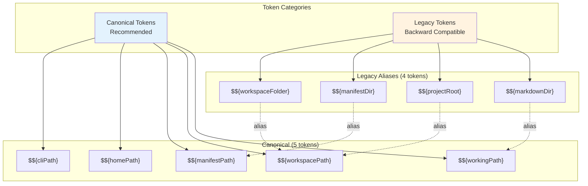
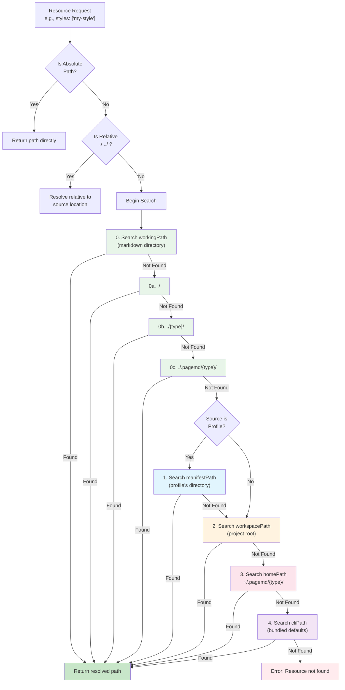
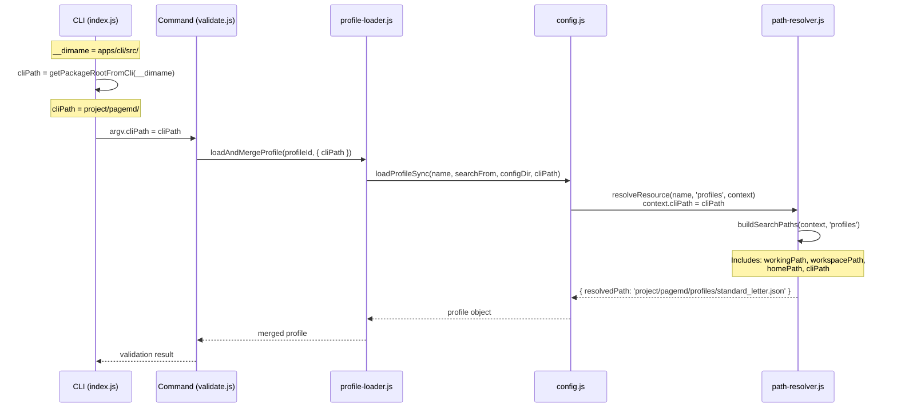

# Path Resolution

**PageMD's resource path resolution system with token expansion and priority-based lookup**

---

## Overview

PageMD needs to locate resources (profiles, templates, layouts, styles) from various locations. The path resolution system provides:

1. **Token expansion** - Variables like `${workingPath}` in paths
2. **Multi-location search** - Automatic searching across 5 priority tiers
3. **Extension inference** - Auto-adding `.css`, `.json`, etc.
4. **Duplicate detection** - Errors when same resource exists in multiple locations

---

## Token System

### Token Categories



### Token Definitions

| Token | Definition | Example Value |
|-------|------------|---------------|
| `${workingPath}` | Directory containing the source Markdown file being processed | `/home/user/docs/` |
| `${workspacePath}` | Project or workspace root directory (detected by `package.json`, `.git`, or `.pagemdrc`) | `/home/user/my-project/` |
| `${manifestPath}` | Directory containing the profile manifest (JSON/YAML) currently in use | `/home/user/my-project/profiles/` |
| `${homePath}` | User's home directory | `/home/user/` (Linux) or `C:\Users\User\` (Windows) |
| `${cliPath}` | Directory where PageMD CLI is installed/bundled | `/usr/local/lib/node_modules/pagemd/` |

**Legacy aliases** (for backward compatibility with existing profiles):

| Legacy Token | Maps To |
|--------------|---------|
| `${markdownDir}` | `${workingPath}` |
| `${projectRoot}` | `${workspacePath}` |
| `${manifestDir}` | `${manifestPath}` |
| `${workspaceFolder}` | `${workspacePath}` |

### Usage in Profiles

Tokens can be used in any resource path within a profile:

```json
{
  "id": "my-profile",
  "resources": {
    "template": "${cliPath}/templates/standard_letter.html",
    "layout": "${workspacePath}/.pagemd/layouts/custom.css",
    "css": [
      "${manifestPath}/styles/profile-specific.css",
      "${workingPath}/local-overrides.css"
    ]
  }
}
```

---

## Resolution Order

When PageMD needs to find a resource (profile, template, layout, style), it searches multiple locations in priority order. **The first match wins.**

### Flow Diagram



### 5-Tier Priority System

| Priority | Location | Subdirectories Searched | When to Use |
|----------|----------|-------------------------|-------------|
| **0** | `workingPath` | `./`, `./{type}/`, `./.pagemd/{type}/` | Document-local overrides (per-document customization) |
| **1** | `manifestPath` | `./`, `./{type}/`, `./.pagemd/{type}/` | Profile-internal resources (CSS bundled with profile) |
| **2** | `workspacePath` | `./`, `./{type}/`, `./.pagemd/{type}/` | Project-level resources (shared across documents) |
| **3** | `homePath` | `~/.pagemd/{type}/` | User-level resources (shared across all projects) |
| **4** | `cliPath` | `{type}/` | Built-in defaults (bundled with PageMD) |

**Note:** `{type}` is the resource type: `profiles`, `templates`, `layouts`, `styles`, or `assets`

### Subdirectory Patterns

For tiers 0, 1, and 2, PageMD searches **three subdirectories** at each location:

```
./                          # Root of location
./{type}/                   # Type-specific directory
./.pagemd/{type}/           # Hidden PageMD directory (override)
```

**Example:** Searching for `my-style.css` in `workingPath = /home/user/docs/`:

1. `/home/user/docs/my-style.css`
2. `/home/user/docs/styles/my-style.css`
3. `/home/user/docs/.pagemd/styles/my-style.css`

### Styles Subdirectory Search

For the **`styles` resource type only**, PageMD also searches known subdirectories:

| Subdirectory | Purpose |
|--------------|---------|
| `presets/` | Pre-configured style themes (e.g., `modern-clean.css`) |
| `syntax/` | Syntax highlighting themes |
| `vendor/` | Third-party CSS libraries |

**Example:** Searching for `modern-clean.css` in styles:

```
styles/modern-clean.css           # Direct match
styles/presets/modern-clean.css   # Subdirectory match (also checked)
styles/syntax/modern-clean.css    # Subdirectory match (also checked)
styles/vendor/modern-clean.css    # Subdirectory match (also checked)
```

This allows you to use `styles: ["modern-clean"]` in frontmatter without specifying the full `presets/modern-clean` path.

**Note:** Other resource types (profiles, templates, layouts) do NOT search subdirectories.

---

## Extension Inference

When a resource name is provided **without an extension**, PageMD tries common extensions:

| Resource Type | Extensions Tried |
|---------------|------------------|
| `profiles` | `.json`, `.yaml`, `.yml` |
| `templates` | `.html`, `.htm` |
| `layouts` | `.css` |
| `styles` | `.css` |
| `assets` | *(none - exact name required)* |

### Example

Profile specifies:
```json
{
  "resources": {
    "css": ["primary"]
  }
}
```

PageMD will search for:
1. `primary` (exact match)
2. `primary.css` (inferred extension)

At each of the 5 priority tiers.

---

## Duplicate Detection

If the **same resource name exists in multiple search locations**, PageMD will **error** rather than silently picking one:

```
Error: Duplicate resource found for "my-style":
  - /home/user/project/styles/my-style.css
  - /home/user/project/.pagemd/styles/my-style.css

Use unique names or specify the full path.
```

This prevents ambiguity and ensures you know exactly which resource is being used.

---

## Practical Example

### Scenario

User runs:
```bash
cd ~/Downloads/test/
pagemd build document.md -p standard_letter
```

**Directory structure:**
```
~/Downloads/test/
  document.md                                    # Markdown file
  styles/
    local.css
~/.pagemd/
  styles/
    user-global.css
~/my-project/                                     # Detected workspace root
  .pagemd/
    styles/
      my-style.css                               # ← Will be found here
/usr/local/lib/node_modules/pagemd/              # CLI installation
  profiles/
    standard_letter.json
  styles/
    base.css
```

### Profile Manifest

`/usr/local/lib/node_modules/pagemd/profiles/standard_letter.json`:
```json
{
  "id": "standard_letter",
  "resources": {
    "css": ["my-style.css"]
  }
}
```

### Search Sequence for `my-style.css`

| Priority | Location Searched | Result |
|----------|-------------------|--------|
| 0 | `/usr/local/lib/node_modules/pagemd/profiles/my-style.css` | Not found (manifest location, not a styles directory) |
| 1a | `~/Downloads/test/my-style.css` | Not found |
| 1b | `~/Downloads/test/.pagemd/styles/my-style.css` | Not found |
| 1c | `~/Downloads/test/styles/my-style.css` | Not found |
| 2a | `~/my-project/my-style.css` | Not found |
| 2b | `~/my-project/.pagemd/styles/my-style.css` | **FOUND ✓** |

**Result:** PageMD uses `~/my-project/.pagemd/styles/my-style.css`

---

## Data Flow Diagram

This diagram shows how `cliPath` flows from CLI initialization through the call chain to path resolution:



---

## Project Root Detection

PageMD automatically detects the project/workspace root by searching **upward** from the markdown file's directory for marker files:

**Marker files:**
- `package.json`
- `.git`
- `.pagemdrc`

**Logic:**
1. Start from the markdown file's directory
2. Walk up parent directories until reaching filesystem root
3. Return the first directory containing any marker file
4. Return `null` if no markers found

**Example:**
```
/home/user/my-project/
  package.json                    # ← Project root detected here
  docs/
    guide/
      installation.md             # Processing this file
```

PageMD detects `/home/user/my-project/` as the workspace root.

---

## CLI Package Detection

The CLI automatically detects its own package root to find bundled resources (profiles, templates, layouts, styles).

**Detection logic:**
1. **Bundled mode check:** Look for `profiles/` directory at the same level as CLI executable
2. **Source mode fallback:** Go up 3 levels from `apps/cli/src/` to reach `project/`

**Why this matters:**

| Deployment Mode | CLI Location | `__dirname` | Package Root |
|-----------------|--------------|-------------|--------------|
| **Source** (development) | `apps/cli/src/` | `apps/cli/src/` | Go up 3 levels → `project/` |
| **Bundled** (VS Code extension) | `bin/` | `bin/` | Check `./profiles/` exists → `bin/` |

This allows PageMD to work correctly in both development (npm workspace) and production (bundled with extension) environments.

---

## Cross-Platform Compatibility

PageMD handles cross-platform path resolution automatically:

- **Path separators:** Internally uses forward slashes (`/`), but accepts backslashes (`\`) on Windows
- **Path construction:** Always uses `path.join()` or `path.resolve()` (never hardcoded separators)
- **Home directory:** Auto-detects via `os.homedir()` (works on Windows, Linux, macOS)

**Example:**

| Platform | `workingPath` | `homePath` |
|----------|---------------|------------|
| Linux | `/home/user/docs/` | `/home/user/` |
| macOS | `/Users/user/docs/` | `/Users/user/` |
| Windows | `C:\Users\User\docs\` | `C:\Users\User\` |

All paths are automatically normalized for the current platform.

---

## Common Scenarios

### Scenario 1: Built-in Profile

```bash
pagemd build document.md -p standard_letter
```

- Profile not found in working directory
- Profile not found in workspace
- Profile not found in home directory
- **Profile found in CLI installation** (`cliPath/profiles/standard_letter.json`)

### Scenario 2: Workspace Override

```
my-project/
  .pagemd/
    profiles/
      standard_letter.json        # Custom version
  docs/
    report.md
```

```bash
cd my-project/docs/
pagemd build report.md -p standard_letter
```

- Profile not found in working directory (`docs/`)
- **Profile found in workspace** (`.pagemd/profiles/standard_letter.json`)
- Built-in profile never checked (workspace takes precedence)

### Scenario 3: Document-Local Style

```
docs/
  report.md                        # frontmatter: styles: ["custom"]
  styles/
    custom.css
```

```bash
pagemd build report.md
```

- Style not found at manifest path
- **Style found in working directory** (`./styles/custom.css`)
- Workspace, home, and CLI paths never checked

### Scenario 4: Token Expansion

Profile:
```json
{
  "resources": {
    "css": ["${workingPath}/overrides.css", "${cliPath}/styles/base.css"]
  }
}
```

Processing `/home/user/docs/report.md`:

1. `${workingPath}` expands to `/home/user/docs/`
   - Resolves to `/home/user/docs/overrides.css`
2. `${cliPath}` expands to `/usr/local/lib/node_modules/pagemd/`
   - Resolves to `/usr/local/lib/node_modules/pagemd/styles/base.css`

---

## Troubleshooting

### Error: Profile not found

**Symptom:**
```
Error: Profile not found: standard_letter
searchPaths: ["/path/to/working/.pagemd/profiles", "/path/to/working/profiles"]
```

**Cause:** `cliPath` is not being passed through the call chain, so built-in profiles aren't searched.

**Solution:** Ensure you're using PageMD CLI version with the fix (2026-01-08 or later). Run:
```bash
pagemd --version
```

### Error: Duplicate resource found

**Symptom:**
```
Error: Duplicate resource found for "my-style":
  - /home/user/project/styles/my-style.css
  - /home/user/project/.pagemd/styles/my-style.css
```

**Cause:** Same resource exists in multiple search locations.

**Solutions:**
1. **Rename one:** Use unique names (`my-style-1.css`, `my-style-2.css`)
2. **Specify full path:** Use absolute or relative path in profile:
   ```json
   {
     "resources": {
       "css": ["./styles/my-style.css"]  // Relative, skips search
     }
   }
   ```
3. **Remove duplicate:** Delete the one you don't want

### Resource not loading (no error)

**Debugging steps:**

1. **Enable debug logging:**
   ```bash
   PAGEMD_LOG_LEVEL=DEBUG pagemd build document.md
   ```

2. **Check search paths:** Look for `Searching for resource: ...` messages

3. **Verify extension:** Try explicit extension:
   ```json
   {
     "resources": {
       "css": ["my-style.css"]  // Instead of "my-style"
     }
   }
   ```

4. **Use absolute path:** Test with full path:
   ```json
   {
     "resources": {
       "css": ["/absolute/path/to/my-style.css"]
     }
   }
   ```

---

## See Also

- [Settings](./Settings.md) - Profile configuration options
- [Profiles](./Profiles.md) - Profile manifest structure
- [CLI](./CLI.md) - Command-line reference
- [Troubleshooting](../Troubleshooting.md) - Common issues and solutions
