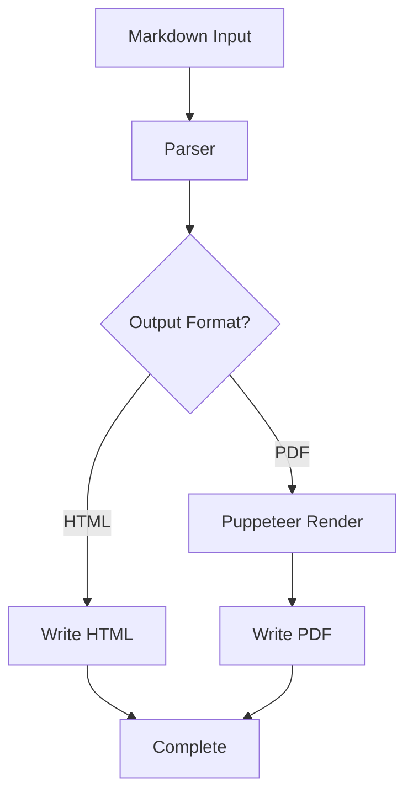
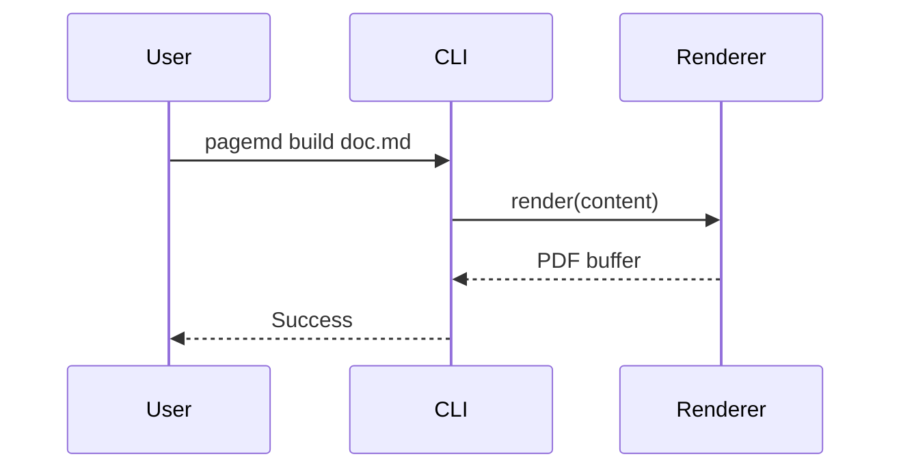

---
# =============================================================================
# COMPREHENSIVE STRESS TEST - All PageMD Features
# =============================================================================

# Document Identity
title: "PageMD Comprehensive Feature Demonstration"
profile: "../profiles/creative.json"
subtitle: "All Features in One Document"
short_title: "Feature Demo"
author: "PageMD Development Team"
author_title: "Technical Documentation"
co_authors:
  - name: "Dr. Alice Chen"
    title: "Lead Architect"
  - name: "Robert Martinez"
    title: "Senior Developer"
organization: "PageMD Project"
division: "Engineering Division"

# Document Control
document_type: "Technical Demonstration"
document_number: "PMD-DEMO-2026-001"
revision: "1.0"
revision_date: "2026-01-09"
version: "1.0.0"
date: "2026-01-09"

# Classification and Distribution
classification: "Public"
distribution: "Unrestricted - Open Source"
copyright_year: 2026
copyright_holder: "PageMD Contributors"

# TOC and Index
toc: true
toc_depth: 3
index: true
index_title: "Subject Index"

# Header/Footer (odd/even)
header:
  odd:
    left: "${short_title}"
    right: "${document_number}"
  even:
    left: "${document_number}"
    right: "${short_title}"
footer:
  odd:
    left: "${organization}"
    center: "Page ${page} of ${pages}"
    right: "Rev. ${revision}"
  even:
    left: "Rev. ${revision}"
    center: "Page ${page} of ${pages}"
    right: "${organization}"

# Typography and Colors
typography:
  font_family: "Georgia, serif"
  font_size: "11pt"
  line_height: 1.5
colors:
  primary: "#2563eb"
  accent: "#059669"
  warning: "#d97706"

# PDF Metadata
pdf:
  title: "PageMD Comprehensive Feature Demonstration"
  author: "PageMD Development Team"
  subject: "Feature demonstration and stress test"
  keywords: [pagemd, markdown, pdf, stress-test]

# Layout
fancy_lists: true

# Approvers
approvers:
  - name: "Technical Review Board"
    title: "Architecture Committee"
    date: "2026-01-08"
  - name: "Documentation Lead"
    title: "Quality Assurance"
    date: "2026-01-09"
---

<!-- Title Page -->

::: {.title-page}

::: {.classification-banner}
**PUBLIC DOCUMENT** - Open Source Distribution
:::

::: {.document-header}
| | |
|:--|--:|
| **Document Type:** Technical Demonstration | **Doc No:** PMD-DEMO-2026-001 |
| **Revision:** 1.0 | **Date:** January 9, 2026 |
:::

::: {.title-block}
# PageMD Comprehensive Feature Demonstration
## All Features in One Document
**Version 1.0.0**
:::

::: {.author-block}
**Prepared by:** PageMD Development Team

**Contributing Authors:**
- Dr. Alice Chen, Lead Architect
- Robert Martinez, Senior Developer
:::

::: {.approval-block}
| Role | Name | Date | Signature |
|:-----|:-----|:-----|:----------|
| Architecture Committee | Technical Review Board | 2026-01-08 | ______________ |
| Quality Assurance | Documentation Lead | 2026-01-09 | ______________ |
:::

::: {.legal-notice}
Copyright 2026 PageMD Contributors. All Rights Reserved.
:::


<!-- ::TOC levels=3 -->

# Chapter 1: Introduction {#chapter-1}

This document tests all <!-- ::INDEX term="PageMD" -->PageMD features including <!-- ::INDEX term="frontmatter" -->frontmatter, <!-- ::INDEX term="extended syntax" -->extended syntax, and <!-- ::INDEX term="rendering" -->rendering capabilities.

## 1.1 Document Organization

| Chapter | Focus Area |
|:--------|:-----------|
| 1 | Introduction |
| 2 | Text and Tables |
| 3 | Callouts |
| 4 | Code and Diagrams |
| 5 | Lists and Advanced |

> [!TIP]
> Review the frontmatter at the top of this file for all configuration options.

<!-- ::BREAK -->

# Chapter 2: Text Elements and Tables {#chapter-2}

## 2.1 Inline Formatting

Standard formatting: **bold**, *italic*, ***bold italic***, ~~strikethrough~~, `inline code`, [links](https://example.com), subscript H~2~O, superscript E=mc^2^.

## 2.2 Blockquotes {#blockquotes}

> Standard blockquote with multiple paragraphs.
>
> > Nested blockquote for emphasis.
>
> — Attribution

## 2.3 Inline Attributes {#inline-attrs}

This paragraph has custom attributes applied. {.highlight #demo-para data-section="2"}

### Custom Styled Heading {.accent-heading #custom-heading}

{.rounded .shadow #hero-image}

[External Link](https://pagemd.dev){.external target="_blank"}

## 2.4 Simple Table

| Name | Type | Description |
|------|------|-------------|
| pagemd | CLI | Command-line interface |
| core | Package | Shared utilities |
| parser | Package | Markdown processing |

## 2.5 Complex Table {#complex-table}

| Component | Version | Status | Dependencies |
|:----------|:--------|:------:|:-------------|
| @pagemd/core | 1.0.0 | Active | winston, yaml |
| @pagemd/parser | 1.0.0 | Active | markdown-it, shiki |
| @pagemd/renderer-pdf | 1.0.0 | Active | puppeteer, paged.js |
{.feature-table #component-matrix}

<!-- ::BREAK -->

# Chapter 3: Callouts and Alerts {#chapter-3}

## 3.1 GFM Alerts

> [!NOTE]
> Supplementary information that adds context.

> [!TIP]
> Helpful suggestions to improve workflow.

> [!IMPORTANT]
> Key information users need to succeed.

> [!WARNING]
> Potential issues that could cause problems.

> [!CAUTION]
> Dangerous actions with serious consequences.

## 3.2 Container Callouts

::: {.note}
**NOTE**
Container-style note block with flexibility for nested content.
:::

::: {.warning}
**WARNING**
Container-style warning with multiple elements:
- Bullet point one
- Bullet point two
:::

## 3.3 Block and Inline Callouts

[[WARNING]]
Block warning using double-bracket syntax for important cautionary notes.
[[/WARNING]]

[[DANGER]]
Critical safety information. **This action cannot be undone!**
[[/DANGER]]

Inline usage: Rate limits apply [!WARNING] and may block access [!DANGER].

[[TIP]] Quick tip: Use `--verbose` for detailed output. [[/TIP]]

<!-- ::BREAK -->

# Chapter 4: Code and Diagrams {#chapter-4}

## 4.1 JavaScript

```javascript
import { parse, parseFile } from '@pagemd/parser';

async function processDocument(inputPath) {
  const result = await parseFile(inputPath);
  return { html: result.html, metadata: result.metadata };
}
```

## 4.2 TypeScript

```typescript
interface ParseResult {
  html: string;
  metadata: DocumentMetadata;
  toc: TableOfContents;
}
```

## 4.3 Shell Commands

```bash
# Install and build
npm install -g pagemd
pagemd build document.md -o pdf,html -p standard_letter
```

## 4.4 Code with Attributes

```javascript {.line-numbers data-filename="example.js" #code-sample}
const greeting = (name) => `Hello, ${name}!`;
```

## 4.5 Mermaid Flowchart



## 4.6 Mermaid Sequence Diagram



<!-- ::BREAK -->

# Chapter 5: Lists and Advanced Features {#chapter-5}

## 5.1 Fancy Lists

### Uppercase Letters

A.  First major requirement
B.  Second major requirement
C.  Third major requirement

### Lowercase Roman Numerals

i. First clause provision
ii. Second clause provision
iii. Third clause provision

### Mixed Nested Lists

I.  System Requirements
    A.  Hardware Specifications
        1. Minimum 8GB RAM
        2. 256GB SSD storage
    B.  Software Dependencies
        i. Node.js 20+
        ii. Chrome browser
II.  Installation Steps
    A.  Download Package
    B.  Configure Environment

## 5.2 Procedure Steps

**Step 1.** Review document requirements.

**Step 2.** Create frontmatter configuration.

**Step 3.** Write content using appropriate syntax.

**HOLD POINT** - Quality review required.

**Step 4.** Build and distribute final documents.

## 5.3 Hash Continuation

1. First item
2. Second item

Intervening text.

#. Continues as 3
#. Continues as 4

## 5.4 Container Blocks

:::details Technical Details
Collapsible content with nested elements:
- Bullet point
- Code: `example()`
:::

:::aside
**Sidebar Note**
Supplementary information in an aside container.
:::

:::summary
**Key Takeaways:**
- Containers use `:::name` syntax
- Full markdown supported inside
:::

## 5.5 Figures

<!-- ::FIGURE src="images/architecture.png" caption="Architecture Overview" id="fig-arch" -->

Reference [Figure 1](#fig-arch) for the architecture diagram.

## 5.6 Section Wrappers

<!-- ::SECTION_START class="highlight-section" id="important-section" -->

### Highlighted Section

Custom section with targeted CSS styling.

> [!IMPORTANT]
> Alert inside custom section.

<!-- ::SECTION_END -->

## 5.7 Additional Index Terms

Testing <!-- ::INDEX term="PDF generation" -->PDF generation, <!-- ::INDEX term="CSS layers" -->CSS layers, <!-- ::INDEX term="Paged.js" -->Paged.js, <!-- ::INDEX term="profiles" -->profiles, and <!-- ::INDEX term="templates" -->templates.

<!-- ::BREAK -->

# Appendix A: Reference {#appendix-a .appendix}

## Environment Variables

| Variable | Purpose | Default |
|:---------|:--------|:--------|
| `PAGEMD_PROFILE` | Default profile | `standard_letter` |
| `PAGEMD_OUTPUT_FORMAT` | Output formats | `pdf` |
| `PAGEMD_LOG_LEVEL` | Logging level | `INFO` |

## Syntax Quick Reference

| Feature | Syntax |
|:--------|:-------|
| Page break | `<!-- ::BREAK -->` |
| TOC | `<!-- ::TOC levels=3 -->` |
| Index marker | `<!-- ::INDEX term="..." -->` |
| Index generate | `<!-- ::INDEX -->` |
| Note alert | `> [!NOTE]` |
| Container | `:::name ... :::` |
| Attributes | `{.class #id}` |

<!-- ::BREAK -->

# Index {#index .appendix}

<!-- ::INDEX -->

---

::: {.footer-notice}
**PageMD Project** | https://github.com/gh4-io/pagemd
:::
