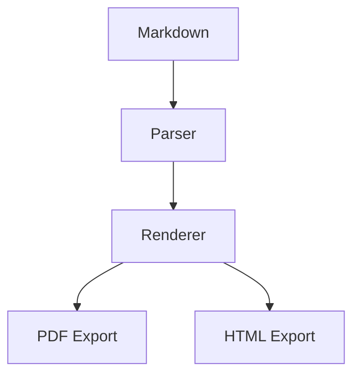

# Contents {.toc}

1. [Introduction](#introduction)
2. [Multi-Column Layouts](#multi-column-layouts)
3. [Landscape Content](#landscape-content)
4. [Technical Diagrams](#technical-diagrams)
5. [Reference Material](#reference-material)
6. [Appendix](#appendix)

# Introduction

This document serves as a comprehensive stress test for the PageMD rendering pipeline.

## Purpose

- Layout fidelity across page boundaries
- CSS cascade through all six layers
- Named page transitions
- Multi-column content flow

> [!WARNING]
> Some features demonstrated here are marked as FUTURE and require implementation.

---

# Multi-Column Layouts {.break-before}

<div class="two-column">

## Left Column

Multi-column layouts are useful for reference material and dense content.

### Features

- Automatic text flow
- Balanced column heights
- Configurable gap width

## Right Column

Complex documents often require side-by-side comparisons.

### Use Cases

1. Glossary entries
2. Index listings
3. Quick reference cards

</div>

---

# Landscape Content {.landscape .break-before}

## Wide Data Table

| Metric | Q1 | Q2 | Q3 | Q4 | Total | Change |
|:-------|---:|---:|---:|---:|------:|-------:|
| Documents | 1,234 | 1,456 | 1,678 | 1,890 | 6,258 | +23% |
| Processing Time | 2.3s | 2.1s | 1.9s | 1.7s | 2.0s | -26% |
| Error Rate | 0.5% | 0.4% | 0.3% | 0.2% | 0.35% | -60% |

---

# Technical Diagrams {.break-before}

## Architecture Overview

<!-- FUTURE: Mermaid diagram rendering not yet implemented -->



> [!NOTE]
> Mermaid diagram rendering is a planned enhancement. Currently displays as code blocks.

---

# Reference Material {.reference-page .break-before}

## Command Reference

### build

```
pagemd build <files...> [options]

Options:
  -o, --output <formats>   Output formats
  -p, --profile <id>       Profile ID
  -d, --output-dir <path>  Output directory
```

## Environment Variables

| Variable | Default | Description |
|:---------|:--------|:------------|
| `PAGEMD_PROFILE` | `standard_letter` | Default profile |
| `PAGEMD_DEBUG` | `false` | Enable debug mode |
| `PAGEMD_TIMEOUT` | `30000` | Render timeout (ms) |

---

# Appendix {.appendix .break-before}

## A. CSS Layer Model

1. **base** - CSS reset
2. **primary** - Project overrides
3. **layout** - Paged.js structural rules
4. **syntax** - Code highlighting
5. **profile** - Visual styling
6. **frontmatter** - Document-specific

## B. Error Codes

| Code | Description |
|:-----|:------------|
| E001 | Invalid frontmatter |
| E002 | Missing required field |
| E003 | Profile not found |

---

*Document ID: STRESS-001 | Generated with PageMD*
